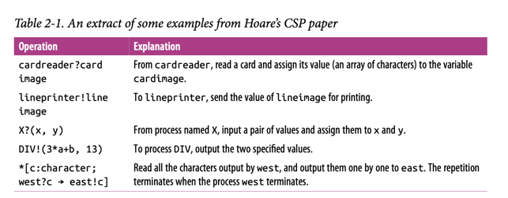
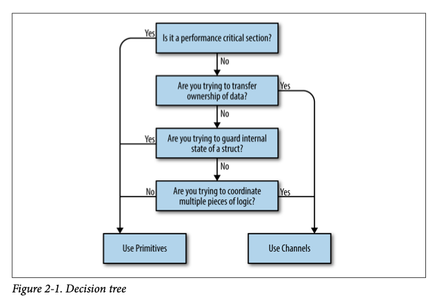
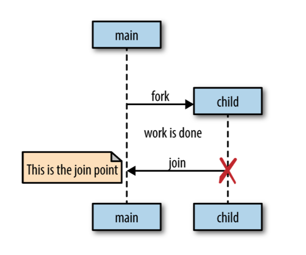
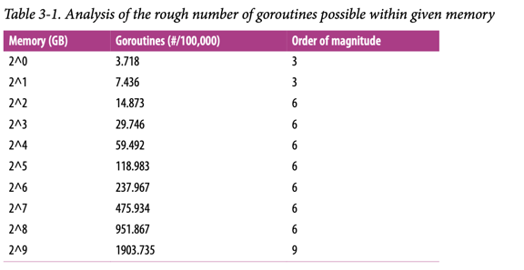
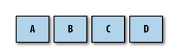
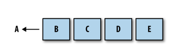
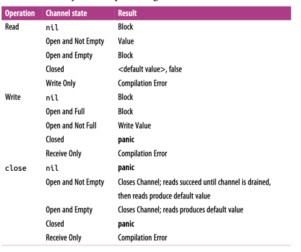

# Глава 1. Введение в конкурентность

---

Конкурентность — интересное понятие, потому что в нашей сфере оно означает разное для разных людей. Помимо слова «конкурентность», вы могли слышать термины «асинхронность», «параллелизм» или «многопоточность». Некоторые считают их синонимами, другие же строго разграничивают их значения. Поскольку мы посвятим конкурентности целую книгу, полезно сначала разобраться, что именно мы подразумеваем под этим термином.

В главе 2 мы подробнее рассмотрим философию конкурентности, но пока примем практическое определение, которое станет основой для нашего понимания.

Когда большинство людей говорят о «конкурентности», они обычно имеют в виду процесс, выполняемый одновременно с одним или несколькими другими процессами. При этом подразумевается, что все эти процессы продвигаются примерно в одно и то же время. Простой аналогией могут быть люди: прямо сейчас вы читаете это предложение, а другие в мире одновременно живут своей жизнью. Они существуют конкурентно по отношению к вам.

Конкурентность — обширная тема в компьютерных науках, и из этого определения вытекает множество аспектов: теория, моделирование конкурентности, корректность логики, практические проблемы и даже теоретическая физика! В книге мы затронем некоторые смежные темы, но сосредоточимся в основном на практических вопросах, связанных с конкурентностью в контексте Go. А именно: как Go моделирует конкурентность, какие проблемы возникают из этой модели и как можно комбинировать её примитивы для решения задач.

В этой главе мы в общих чертах рассмотрим, почему конкурентность стала столь важной темой в компьютерных науках, почему она сложна и требует тщательного изучения, а главное — как, несмотря на эти трудности, Go позволяет делать программы понятнее и быстрее благодаря своим примитивам конкурентности.

Как и в любом исследовании, начнём с истории. Давайте сначала разберёмся, почему конкурентность приобрела такое важное значение.

## Закон Мура, веб-масштабируемость и проблемы, в которых мы оказались

В 1965 году Гордон Мур опубликовал трёхстраничную статью, в которой предсказал консолидацию рынка электроники вокруг интегральных схем и удвоение количества компонентов в схемах каждый год на протяжении как минимум десятилетия. В 1975 году он скорректировал своё предсказание, утверждая, что количество компонентов на интегральной схеме будет удваиваться каждые два года. Это предсказание оставалось верным вплоть до недавнего времени — примерно до 2012 года.

Несколько компаний предвидели замедление темпов роста, предусмотренного законом Мура, и начали исследовать альтернативные способы повышения вычислительной мощности. Как говорится, необходимость — мать изобретений, и именно таким образом были созданы многоядерные процессоры.

Это выглядело как умное решение проблемы ограничения закона Мура, однако вскоре компьютерные учёные столкнулись с ограничениями другого закона: закона Амдала, названного в честь архитектора компьютеров Джина Амдала.

Закон Амдала описывает потенциальный прирост производительности при параллельном решении задачи. Проще говоря, он утверждает, что этот прирост ограничен скоростью работы программы, которую нельзя распараллелить

### Пример 1: Программа с графическим интерфейсом

Представьте приложение с GUI: пользователь видит интерфейс, нажимает кнопки, и что-то происходит. Здесь критическая часть конвейера — взаимодействие с человеком — строго последовательна. Сколько бы ядер вы ни добавили, программа всё равно будет ограничена скоростью реакции пользователя.

### Пример 2: Вычисление цифр числа π

Благодаря spigot-алгоритмам, эта задача относится к «заведомо параллельным» (англ. embarrassingly parallel). Это технический термин (да, звучит странно), означающий, что задачу легко разбить на независимые подзадачи. Здесь добавление ядер значительно ускорит вычисления, а сложность сместится к агрегации результатов.

Закон Амдала помогает понять разницу между такими задачами и решить, стоит ли распараллеливание усилий.

Для заведомо параллельных задач рекомендуется горизонтальное масштабирование: запуск копий программы на дополнительных CPU или машинах для сокращения времени выполнения. Такие задачи идеально подходят для этого подхода, так как их легко разбить на части для распределённой обработки.

В начале 2000-х горизонтальное масштабирование упростилось благодаря облачным вычислениям. Хотя термин появился ещё в 1970-х, именно тогда он стал мейнстримом. Облака предложили новый масштаб: вместо ручного управления серверами разработчики получили доступ к пулам ресурсов, которые динамически выделялись под задачи. Машины стали «эфемерными», настраиваемыми под конкретные нагрузки и задачи, и часто размещались в дата-центрах сторонних компаний.

Это породило новую парадигму мышления: теперь у разработчиков был дешёвый доступ к огромным вычислительным мощностям. Решения могли охватывать сотни машин и географических регионов, делая технологии, ранее доступные только гигантам вроде Google, достоянием всех.

Однако облака принесли и проблемы:

- Оркестрация ресурсов
- Обмен данными между инстансами
- Агрегация и хранение результатов.

Но сложнее всего оказалось правильно смоделировать конкурентный код. Распределённость системы усугубила типичные проблемы параллелизма. Успешное решение этих задач породило новый стандарт — web scale.
Web-scale-программы — это, среди прочего, заведомо параллельные системы, способные обрабатывать сотни тысяч запросов в секунду за счёт добавления инстансов. Это обеспечило:

- Бесшовные обновления,
- Гибкую масштабируемость,
- Геораспределённость.

Но также добавило сложностей в понимании кода и отказоустойчивости.

И вот мы оказываемся в этом мире — мире многоядерных процессоров, облачных вычислений, веб-масштабируемости и задач, которые могут быть как распараллелены, так и нет. Современный разработчик зачастую чувствует себя несколько подавленным. Эстафетная палочка передана нам, и теперь именно мы должны решать задачи в рамках тех аппаратных ограничений, которые имеем.

В 2005 году Херб Саттер написал знаковую статью для Dr. Dobb's под названием «Бесплатный обед закончен: фундаментальный поворот к конкурентности в программном обеспечении». Название оказалось пророческим. В конце статьи Саттер делает важное заявление:

«Нам отчаянно необходима более высокоуровневая модель конкурентности, чем та, что предлагают современные языки программирования»
Чтобы понять, почему Саттер использует такие сильные выражения, нужно разобраться, почему конкурентность так сложно реализовать правильно.

## Почему конкурентность это сложно?

Работа с конкурентным кодом печально известна своей сложностью. Обычно требуется несколько итераций, чтобы заставить его работать как задумано. Но даже тогда нередки случаи, когда ошибки остаются незамеченными годами, пока изменение условий (возросшая нагрузка на диск, больше пользователей в системе и т.д.) не вызовет проявление ранее скрытого бага. Кстати, для примеров кода в этой книге я привлек максимальное количество рецензентов, чтобы минимизировать такие проблемы.

К счастью, все разработчики сталкиваются с одинаковыми проблемами при работе с конкурентным кодом. Благодаря этому знатоки computer science смогли классифицировать типичные проблемы, что позволяет нам обсуждать причины их возникновения и способы решения.

Давайте рассмотрим основные проблемы, которые делают работу с конкурентным кодом одновременно сложной и интересной:

## Состояние гонки (Race Conditions)

Состояние гонки возникает, когда две или более операций должны выполняться в строго определённом порядке, но программа не гарантирует соблюдение этого порядка выполнения.

Чаще всего это проявляется в так называемой "гонке данных" (data race), когда одна конкурентная операция пытается прочитать переменную, в то время как в какой-то неопределённый момент времени другая конкурентная операция пытается записать значение в эту же переменную.

Приведём простой пример:
```go
var data int
go func() {
    data++
}()
if data == 0 {
    fmt.Printf("the value is %v.\n", data)
}
```

В Go для параллельного выполнения функций используется ключевое слово go, которое создает так называемую горутину (подробнее в разделе "Горутины").

Рассмотрим пример, где строки 3 и 5 пытаются получить доступ к переменной data без гарантии порядка выполнения. Возможные сценарии выполнения:

- Ничего не выводится - строка 3 выполнилась до строки 5
- Выводится "the value is 0" - строки 5-6 выполнились до строки 3
- Выводится "the value is 1" - строка 5 выполнилась до 3, но 3 выполнилась до 6

## Почему возникают гонки данных? (race conditions)

Как вы можете видеть, всего несколько строк неправильного кода могут внести огромную нестабильность
в вашу программу.

В большинстве случаев гонки данных возникают, потому что разработчики думают о
коде последовательно. Они предполагают, что поскольку строка кода находится перед другой,
она будет запущена первой. Они предполагают, что вышеприведенная горутина будет запланирована и выполнена
до того, как переменная data будет прочитана в операторе if.

При написании параллельного кода вам нужно тщательно перебирать возможные
сценарии. Если вы не используете некоторые из методов, которые мы рассмотрим далее в книге,
у вас нет гарантий, что ваш код будет запущен в том порядке, в котором он указан в исходном
коде.

Иногда я нахожу полезным представить, что между вызываемыми операциями проходит большой период.
Представьте, что между вызовом горутины и ее выполнением пройдет час. Как тогда поведет себя оставшаяся часть кода?
А что, если бы между успешным выполнением горутины и достижением программой оператора if
прошел час?
Мне помогает такой подход, потому что для компьютера масштаб может быть
другим, но смысл от этого не теряется.
Но такая мысль приводит разработчика в ловушку разбрасывания sleep по всему коду. Как им кажется, это решает проблемы с параллелизмом. Давайте попробуем это в предыдущей программе:

```go
var data int
go func() { data++ }()
time.Sleep(1*time.Second) // This is bad!
if data == 0 {
    fmt.Printf("the value is %v.\n" data)
}
```

Решили ли мы нашу гонку данных? Нет. На самом деле, все три результата все еще могут возникнуть из этой программы, просто это становится все менее вероятным. Чем дольше мы спим между вызовом нашей горутины и проверкой значения данных, тем ближе наша программа становится к достижению корректности, но эта вероятность асимптотически приближается к логической корректности; она никогда не будет логически корректной.
В дополнение к этому, мы теперь внесли неэффективность в наш алгоритм. Теперь нам нужно спать одну секунду, чтобы повысить вероятность того, что мы не увидим нашу гонку данных. Если бы мы использовали правильные инструменты, нам, возможно, вообще не пришлось бы ждать, или ожидание могло бы составлять всего
микросекунду.
Вывод здесь в том, что вы всегда должны стремиться к логической корректности. 

Внедрение time.Sleep() в ваш код может быть удобным способом отладки параллельных программ, но это не решение.

Состояние гонки — один из самых коварных типов ошибок параллелизма, потому что они
могут не проявляться до тех пор, пока код не будет запущен в производство. Они
обычно вызваны изменением среды, в которой выполняется код, или
беспрецедентным событием. В этих случаях код, кажется, ведет себя правильно,
но на самом деле существует просто очень высокая вероятность того, что операции будут выполнены в
порядке. Рано или поздно программа будет иметь непредвиденные последствия.

## Атомарность

Когда что-то считается атомарным или имеет свойство атомарности, это
означает, что в контексте, в котором оно работает, оно неделимо или непрерываемо.

Так что же это на самом деле означает, и почему это важно знать при работе с
параллельным кодом?

Первое, что очень важно, — это слово «контекст». Что-то может быть атомарным
в одном контексте, но не в другом. Операции, которые являются атомарными в контексте вашего
процесса, могут не быть атомарными в контексте операционной системы; операции, которые являются
атомарными в контексте операционной системы, могут не быть атомарными в контексте вашей
машины; и операции, которые являются атомарными в контексте вашей
машины, могут не быть атомарными в контексте вашего приложения. Другими словами,
атомарность операции может меняться в зависимости от текущей определенной области действия.
Этот факт может работать как за, так и против вас!

Когда вы думаете об атомарности, очень часто первое, что вам нужно сделать, это определить
контекст или область действия, в которой операция будет считаться атомарной. Все
следует из этого.

---
### Интересный факт

В 2006 году игровая компания Blizzard успешно подала в суд на MDY Industries на
6 000 000 долларов США за создание программы под названием «Glider», которая автоматически
играла в их игру World of Warcraft без вмешательства пользователя. Такие типы программ обычно называют «ботами» (сокращение от robots).
В то время в World of Warcraft была античит-программа под названием «Warden», которая
запускалась в любое время, когда вы играли в игру. Помимо прочего, Warden сканировал
память хост-машины и запускал эвристику для поиска программ,
которые, по-видимому, использовались для мошенничества.
Glider успешно избежал этой проверки, воспользовавшись концепцией атомарного
контекста. Warden считал сканирование памяти на машине атомарной операцией, но Glider использовал аппаратные прерывания, чтобы скрыть себя до начала этого сканирования! Сканирование памяти Уорденом было атомарным в контексте процесса, но не в контексте операционной системы.

---

Теперь давайте рассмотрим термины «неделимый» и «непрерываемый». Эти термины означают, что
в контексте, который вы определили, что-то, что является атомарным, произойдет полностью,
без того, чтобы что-либо происходило в этом контексте одновременно. Это все еще труднопроизносимо, поэтому
давайте рассмотрим пример:
```go
i++
```

Это такой простой пример, какой только можно придумать, и тем не менее он легко демонстрирует концепцию атомарности. Он может выглядеть атомарным, но краткий анализ показывает несколько операций:
- Извлечь значение i.
- Увеличить значение i.
- Сохранение значения i.

Хотя каждая из этих операций по отдельности является атомарной, комбинация этих трех может
не быть таковой, в зависимости от вашего контекста. Это раскрывает интересное свойство атомарных операций: их объединение не обязательно приводит к более крупной атомарной операции. Сделать операцию атомарной зависит от того, в каком контексте вы хотите, чтобы она была атомарной. Если ваш контекст — это программа без параллельных процессов, то этот код является
атомарным в этом контексте. Если ваш контекст — это goroutine, которая не раскрывает i
другим goroutine, то этот код является атомарным.

Так почему же нас это волнует? Атомарность важна, потому что если что-то является атомарным, то неявно
оно безопасно в параллельных контекстах. Это позволяет нам составлять логически правильные программы и, как мы увидим позже, может даже служить способом оптимизации параллельных программ.

Большинство операторов не являются атомарными, не говоря уже о функциях, методах и программах.
Если атомарность является ключом к составлению логически правильных программ, а большинство операторов не являются
атомарными, как нам согласовать эти два оператора? Мы углубимся в это позже, но
говоря короче, мы можем форсировать атомарность, используя различные методы. 
Суть данного искусства - определить, какие области вашего кода должны быть атомарными и на каком уровне
детализации. Некоторые из этих проблем мы обсудим в следующем разделе.

## Синхронизация доступа к памяти.

Допустим, у нас есть гонка данных: два параллельных процесса пытаются получить доступ к
одной и той же области памяти, и способ, которым они получают доступ к памяти, не является атомарным. Наш
предыдущий пример простой гонки данных будет работать хорошо с несколькими модификациями:

```go
var data int
go func() { data++}()
if data == 0 {
fmt.Println("the value is 0.")
} else {
fmt.Printf("the value is %v.\n", data)
}
```

Мы добавили здесь предложение else, чтобы независимо от значения данных мы всегда
получали какой-то вывод. Помните, что, как написано, есть гонка данных, и вывод программы будет полностью недетерминированным.

На самом деле, есть название для раздела вашей программы, которому нужен исключительный доступ к
общему ресурсу. Это называется критической секцией(критическим разделом). В этом примере у нас есть три критических секции:

- Наша goroutine, которая увеличивает переменные data.
- Наш оператор if, который проверяет, равно ли значение data нулю.
- Наш оператор fmt.Printf, который извлекает значение data для вывода.

Существуют различные способы защиты критических секций вашей программы, и у Go есть несколько
лучших идей, как с этим справиться, но один из способов решения этой проблемы — синхронизировать доступ к памяти между вашими критическими разделами. Давайте посмотрим, как это
выглядит. 

Следующий код не является идиоматическим Go (и я не предлагаю вам пытаться решать ваши
проблемы гонки данных таким образом), но он очень просто демонстрирует синхронизацию доступа к памяти. Если какие-либо типы, функции или методы в этом примере вам незнакомы, это нормально. Сосредоточьтесь на концепции синхронизации доступа к памяти, следуя выноскам.

```go
var memoryAccess sync.Mutex // 1
var value int
go func() {
    memoryAccess.Lock() // 2
    value++
    memoryAccess.Unlock() // 3
}()
memoryAccess.Lock() // 4
if value == 0 {
    fmt.Printf("the value is %v.\n", value)
} else {
    fmt.Printf("the value is %v.\n", value)
}
memoryAccess.Unlock() // 5
```
1) Здесь мы добавляем переменную, которая позволит нашему коду синхронизировать доступ к памяти переменной data. Мы подробно рассмотрим тип sync.Mutex в разделе «Пакет sync».
2) Здесь мы объявляем, что пока мы не объявим иное, наша goroutine должна иметь
исключительный доступ к этой памяти.
3) Здесь мы объявляем, что goroutine закончила работу с этой памятью.
4) Здесь мы снова объявляем, что следующие условные операторы должны иметь
исключительный доступ к памяти переменной data.
5) Здесь мы объявляем, что мы снова закончили работу с этой памятью.

В этом примере мы создали соглашение, которому должны следовать разработчики. В любое время, когда разработчики хотят получить доступ к памяти переменной данных, они должны сначала вызвать Lock, а когда закончат, они должны вызвать Unlock. Код между этими двумя операторами может
предположить, что у него есть исключительный доступ к данным; мы успешно синхронизировали доступ к
памяти. Также обратите внимание, что если разработчики не следуют этому соглашению, у нас нет гарантии исключительного доступа! Мы вернемся к этой идее в разделе «Ограничение».

Вы могли заметить, что хотя мы решили нашу гонку данных, мы на самом деле не решили наше состояние гонки! Порядок операций в этой программе по-прежнему недетерминирован; мы просто немного сузили область недетерминизма. В этом примере либо горутина выполнится первой, либо оба наших блока if и else. Мы по-прежнему
не знаем, что произойдет первым при любом заданном выполнении этой программы. Позже мы рассмотрим инструменты для правильного решения подобных проблем.

На первый взгляд это кажется довольно простым: если вы обнаружили, что у вас есть критические разделы, добавьте точки
для синхронизации доступа к памяти! Легко, не так ли? Ну... в некотором роде.

Это правда, что вы можете решить некоторые проблемы, синхронизировав доступ к памяти,
но, как мы только что увидели, это не решает гонки данных или логическую корректность. Кроме того, это также может создавать проблемы с обслуживанием и производительностью.

Обратите внимание, что ранее мы упоминали, что создали соглашение для объявления нам
необходимо исключительное право доступа к некоторой памяти. Соглашения хороши, но их также легко
игнорировать, особенно в разработке программного обеспечения, где требования бизнеса иногда перевешивают благоразумие. Синхронизируя доступ к памяти таким образом,
вы рассчитываете, что все другие разработчики будут следовать этому соглашению сейчас и в будущем. Это довольно сложная задача. К счастью, далее в этой книге мы также рассмотрим
некоторые способы, которыми мы можем помочь нашим коллегам добиться большего успеха.

Таким образом синхронизация доступа к памяти также имеет последствия для производительности. Мы сохраним ньюансы для дальнейшего изучения пакета синхронизации в разделе «Пакет синхронизации», но вызовы Lock, которые вы видите, могут замедлить нашу программу. Каждый раз, когда мы выполняем одну из этих операций, наша программа останавливается на некоторое время. Это поднимает два вопроса:
- Мои критические разделы входят и выходят из них повторно?
- Какого размера должны быть мои критические разделы?

Ответить на эти два вопроса в контексте вашей программы — это искусство, и это добавляет сложности в синхронизацию доступа к памяти.
Синхронизация доступа к памяти также имеет некоторые общие проблемы с другими методами моделирования параллельных задач, и мы обсудим их в следующем разделе.

## Deadlocks, Livelocks, and Starvation. Взаимоблокировки, блокировки в режиме реального времени и голодание

В предыдущих разделах обсуждалось корректное выполнение программы, поскольку, если
возникающие проблемы решаются правильно, ваша программа никогда не даст неверного ответа.

К сожалению, даже если вы успешно справитесь с этими классами проблем, есть еще один
класс проблем, с которыми нужно бороться: взаимоблокировки, блокировки в режиме реального времени и голодание. 
Все эти проблемы влияют на гарантию того, что ваша программа всегда выполняет что-то полезное. Если с ними не справиться должным образом, ваша программа может войти в состояние, в котором она вообще перестанет функционировать.

### Deadlock(Взаимоблокировка)

Взаимоблокированная программа — это программа, в которой все параллельные процессы ждут друг друга. В этом состоянии программа никогда не восстановится без внешнего вмешательства.

Если это звучит страшно, то так оно и есть! Go runtime пытается выполнить свою часть работы и
обнаружит некоторые взаимоблокировки (все горутины должны быть заблокированы или «спящими»), но это не
сильно поможет вам предотвратить взаимоблокировки.

Чтобы помочь закрепить, что такое взаимоблокировка, давайте сначала рассмотрим пример. Опять же, пока игнорируйте
любые типы, функции, методы или пакеты, которые вы не знаете, и просто следуйте
выноскам кода

```go
type value struct {
    mu sync.Mutex
    value int
}

var wg sync.WaitGroup
printSum := func(v1, v2 *value) {
    defer wg.Done()
    v1.mu.Lock() // 1
    defer v1.mu.Unlock() // 2
	
    time.Sleep(2*time.Second) //3
    v2.mu.Lock()
    defer v2.mu.Unlock()
	
    fmt.Printf("sum=%v\n", v1.value + v2.value)
}

var a, b value
wg.Add(2)
go printSum(&a, &b)
go printSum(&b, &a)
wg.Wait()
```

1) Здесь мы пытаемся войти в критическую секцию для входящего значения.
2) Здесь мы используем оператор defer для выхода из критической секции до возврата printSum.
3) Здесь мы спим в течение определенного периода времени, чтобы имитировать работу (и вызвать взаимоблокировку).

4) Если бы вы попытались запустить этот код, вы, вероятно, увидели бы:
фатальная ошибка: все горутины спят — взаимоблокировка!
Почему? Если вы посмотрите внимательно, вы увидите проблему синхронизации в этом коде. Ниже приведено графическое представление того, что происходит. Прямоугольники представляют функции, горизонтальные
линии — вызовы этих функций, а вертикальные
полосы — время жизни функции в начале
графика (рисунок 1-1).


По сути, мы создали две шестеренки, которые не могут вращаться вместе: наш первый вызов print
Sum блокирует a, а затем пытается заблокировать b, но в то же время наш второй вызов print
Sum заблокировал b и попытался заблокировать a. Обе горутины бесконечно ждут друг
друга.

---
### Irony

Чтобы упростить этот пример, я использую time.Sleep для запуска взаимоблокировки. Однако, это вводит состояние гонки! Можете ли вы его найти?
Логически «идеальная» взаимоблокировка потребует правильной синхронизации.(На самом деле у нас нет гарантии, в каком порядке будут запущены горутины или сколько времени им потребуется для запуска.
Возможно, хотя и маловероятно, что одна горутина может получить и снять обе блокировки до начала работы другой,
тем самым избежав deadlock-а!)

---

Кажется довольно очевидным, почему возникает эта взаимоблокировка, когда мы представляем ее графически,
но мы бы выиграли от более строгого определения. 

Оказывается, есть
несколько условий, которые должны присутствовать для возникновения взаимоблокировок, и в 1971 году Эдгар Коффман перечислил эти условия в своей статье. Эти условия теперь известны как
Условия Коффмана и являются основой для методов, которые помогают обнаруживать, предотвращать и
исправлять взаимоблокировки.

Условия Коффмана следующие:
- Взаимное исключение. Параллельный процесс имеет исключительные права на ресурс в любой момент времени.
- Условие ожидания. Параллельный процесс должен одновременно удерживать ресурс и ожидать
дополнительный ресурс.
- Нет вытеснения. Ресурс, удерживаемый параллельным процессом, может быть освобожден только этим процессом,
поэтому он удовлетворяет этому условию.
- Круговое ожидание. Конкурентный процесс (P1) должен ожидать цепочку других конкурентных процессов (P2), которые в свою очередь ждут его (P1), поэтому он удовлетворяет этому последнему условию

Давайте рассмотрим нашу придуманную программу и определим, соответствует ли она всем четырем условиям:
1. Функция printSum требует исключительных прав как на a, так и на b, поэтому она
   выполняет это условие.
2. Поскольку printSum удерживает либо a, либо b и ожидает второго, она
   выполняет это условие.
3. Мы не дали возможности нашим горутинам быть вытесненными.
4. Наш первый вызов printSum ожидает нашего второго вызова, и наоборот.

Да, у нас определенно есть взаимоблокировка.

Эти законы также позволяют нам предотвращать взаимоблокировки. Если мы гарантируем, что хотя бы одно из этих
условий не выполняется, мы можем предотвратить возникновение взаимоблокировок. К сожалению, на практике эти условия может быть трудно рассуждать, и, следовательно, их трудно предотвратить. Интернет усеян вопросами от разработчиков, таких как вы и я, которые задаются вопросом,
почему фрагмент кода взаимоблокируется. Обычно это довольно очевидно, когда кто-то указывает на это, но часто это требует еще одной пары глаз. Мы поговорим о том, почему это так, в разделе «Определение безопасности параллелизма».

## Livelock
Livelock — это программы, которые активно выполняют параллельные операции, но эти
операции ничего не делают для продвижения состояния программы вперед.

Вы когда-нибудь были в коридоре, идя к другому человеку? Она отходит в одну
сторону, чтобы пропустить вас, но вы только что сделали то же самое. Поэтому вы отходите в другую сторону, но
она тоже сделала то же самое. Представьте, что это продолжается вечно, и вы поймете livelock.

Давайте напишем код, который поможет продемонстрировать этот сценарий. Сначала мы настроим
несколько вспомогательных функций, которые упростят пример. Чтобы получить работающий
пример, в коде здесь используется несколько тем, которые мы еще не рассмотрели. Я не советую
пытаться понять его подробно, пока вы не освоите пакет синхронизации. Вместо этого я рекомендую следовать выноскам кода, чтобы понять основные моменты, а затем обратить внимание на второй блок кода, который содержит
суть примера.

```go
cadence := sync.NewCond(&sync.Mutex{})
go func() {
   for range time.Tick(1*time.Millisecond) {
    cadence.Broadcast()
   }
}()

takeStep := func() {
   cadence.L.Lock()
   cadence.Wait()
   cadence.L.Unlock()
}

tryDir := func(dirName string, dir *int32, out *bytes.Buffer) bool { // 1
   fmt.Fprintf(out, " %v", dirName)
   atomic.AddInt32(dir, 1) // 2
   takeStep() // 3
   if atomic.LoadInt32(dir) == 1 {
      fmt.Fprint(out, ". Success!")
      return true
   }
   takeStep()
   atomic.AddInt32(dir, -1) // 4
   return false
}

var left, right int32
tryLeft := func(out *bytes.Buffer) bool { return tryDir("left", &left, out) }
tryRight := func(out *bytes.Buffer) bool { return tryDir("right", &right, out) }
```

1) tryDir позволяет человеку попытаться двигаться в направлении и возвращает, были ли они успешными. Каждое направление представлено как количество людей, пытающихся двигаться в этом направлении, dir.
2) Сначала мы объявляем о своем намерении двигаться в направлении, увеличивая это направление на единицу. Мы подробно обсудим атомарный пакет в Главе 3. На данный момент все, что вам нужно знать, это то, что операции этого пакета являются атомарными.
3) Чтобы пример продемонстрировал оперативную блокировку, каждый человек должен двигаться с одинаковой скоростью, или каденсом. takeStep имитирует постоянный каденс между всеми участниками.
4) Здесь человек понимает, что он не может двигаться в этом направлении, и сдается. Мы указываем на это, уменьшая это направление на единицу.

```go
walk := func(walking *sync.WaitGroup, name string) {
   var out bytes.Buffer
   defer func() { fmt.Println(out.String()) }()
   defer walking.Done()
   
   fmt.Fprintf(&out, "%v is trying to scoot:", name)
   
   for i := 0; i < 5; i++ { // 1
      if tryLeft(&out) || tryRight(&out) { // 2
       return
      }
   }
   
   fmt.Fprintf(&out, "\n%v tosses her hands up in exasperation!", name)
}

var peopleInHallway sync.WaitGroup //3
peopleInHallway.Add(2)

go walk(&peopleInHallway, "Alice")
go walk(&peopleInHallway, "Barbara")

peopleInHallway.Wait()
```

1) Я установил искусственный предел на количество попыток, чтобы эта программа
завершилась. В программе, которая имеет оперативную блокировку, такого предела может не быть, поэтому
это проблема!
2) Сначала человек попытается сделать шаг влево, а если это не удается, он попытается сделать шаг
вправо.
3) Эта переменная предоставляет программе возможность ждать, пока оба человека
либо не смогут обойти друг друга, либо сдадутся.

Программа выведет:  
Alice is trying to scoot: left right left right left right left right left right   
Alice tosses her hands up in exasperation!  
Barbara is trying to scoot: left right left right left right left right
left right  
Barbara tosses her hands up in exasperation!

Вы можете видеть, что Алиса и Барбара продолжают мешать друг другу, прежде чем окончательно
сдаться.
Этот пример демонстрирует очень распространенную причину написания лайвлоков: два или более
одновременных процесса пытаются предотвратить тупик без координации. Если
люди в коридоре договорились друг с другом, что только один человек будет двигаться,
не было бы лайвлока: один человек стоял бы на месте, другой
двигался бы в другую сторону, и они продолжали бы идти.

По моему мнению, livelock сложнее обнаружить, чем deadlock, просто потому,
что может показаться, что программа выполняет работу. 

Если бы лайвлокированная программа работала на
вашей машине, и вы посмотрели на загрузку ЦП, чтобы определить, делает ли она что-нибудь, вы могли бы подумать, что это так. В зависимости от лайвлока она могла бы даже испускать другие сигналы, которые заставили бы вас думать, что она выполняет работу. И все же все это время ваша программа играла бы в вечную игру в коридорную перетасовку.
Livelocks — это подмножество более обширного набора проблем, называемых голоданием. Мы рассмотрим это далее.

## Starvation (Голодание)

Голодание — это любая ситуация, когда параллельный процесс не может получить все ресурсы, необходимые для выполнения работы.
Когда мы обсуждали блокировки, ресурс, которого не хватало каждой горутине, был
совместной блокировкой. Блокировки требуют отдельного обсуждения от голодания, потому что при блокировке все параллельные процессы одинаково голодают, и никакая работа не выполняется.
В более широком смысле, голодание обычно подразумевает, что есть один или несколько жадных параллельных процессов, которые несправедливо мешают одному или нескольким параллельным процессам
выполнять работу максимально эффективно или, может быть, вообще.
Вот пример программы с жадной горутиной и вежливой горутиной:

```go
var wg sync.WaitGroup
var sharedLock sync.Mutex
const runtime = 1*time.Second

greedyWorker := func() {
   defer wg.Done()
   var count int
   for begin := time.Now(); time.Since(begin) <= runtime; {
      sharedLock.Lock()
      time.Sleep(3*time.Nanosecond)
      sharedLock.Unlock()
      count++
   }
   fmt.Printf("Greedy worker was able to execute %v work loops\n", count)
}

politeWorker := func() {
   defer wg.Done()
   var count int
   for begin := time.Now(); time.Since(begin) <= runtime; {
      sharedLock.Lock()
      time.Sleep(1*time.Nanosecond)
      sharedLock.Unlock()
	  
      sharedLock.Lock()
      time.Sleep(1*time.Nanosecond)
      sharedLock.Unlock()
	  
      sharedLock.Lock()
      time.Sleep(1*time.Nanosecond)
      sharedLock.Unlock()
	  
      count++
   }
   fmt.Printf("Polite worker was able to execute %v work loops.\n", count)
}

wg.Add(2)
go greedyWorker()
go politeWorker()
wg.Wait()
```

Результат выполнения данной программы:  
Polite worker was able to execute 289777 work loops.  
Greedy worker was able to execute 471287 work loops

Жадный работник жадно удерживает общую блокировку на протяжении всего своего рабочего цикла, тогда как вежливый работник пытается заблокировать только тогда, когда это необходимо. Оба работника
выполняют одинаковый объем имитируемой работы (спя в течение трех наносекунд), но, как вы
можете видеть, за одинаковое количество времени жадный работник выполнил почти вдвое больше работы!

Если мы предположим, что у обоих работников критический раздел одинакового размера, вместо того, чтобы сделать вывод, что алгоритм жадного работника более эффективен (или что вызовы Lock и Unlock медленные — это не так), мы вместо этого придем к выводу, что жадный работник без необходимости расширил свое удержание общей блокировки за пределы своего критического раздела и мешает (через голодание) goroutine вежливого работника выполнять работу
эффективно.

Обратите внимание на нашу технику здесь для определения голодания: метрику. Голод является
хорошим аргументом для записи и выборки метрик. Один из способов обнаружить и решить проблему голодания — это записывать время выполнения работы, а затем определять,
настолько ли высока ваша скорость работы, как вы ожидаете.

---
### Поиск баланса

Стоит отметить, что предыдущий пример кода также может служить примером
производительности последствий синхронизации доступа к памяти. Поскольку синхронизация доступа к памяти обходится дорого, может быть выгодно расширить нашу
блокировку за пределы наших критических разделов. С другой стороны, делая это — как мы видели — мы
рискуем лишить другие параллельные процессы возможности.
Если вы используете синхронизацию доступа к памяти, вам придется найти баланс между
предпочтением грубой синхронизации для производительности и мелкой синхронизации для справедливости. Когда придет время настраивать производительность вашего приложения,
для начала я настоятельно рекомендую вам ограничить синхронизацию доступа к памяти только
критическими разделами; если синхронизация станет проблемой производительности, вы всегда можете расширить область действия. Гораздо сложнее пойти другим путем.
---

Итак, голодание может привести к тому, что ваша программа будет вести себя неэффективно или неправильно. Предыдущий
пример демонстрирует неэффективность, но если у вас есть параллельный процесс, который настолько
жаден, что полностью мешает другому параллельному процессу выполнять
работу, у вас на руках более серьезная проблема.
Мы также должны рассмотреть случай, когда голодание происходит извне процесса Go. Имейте в виду, что голодание может также применяться к ЦП, памяти, дескрипторам файлов,
подключениям к базе данных: любой общий ресурс, является кандидатом на голодание.

## Определение безопасности параллелизма

Определение безопасности параллелизма
Наконец, мы подошли к самому сложному аспекту разработки параллельного кода, к тому,
что лежит в основе всех остальных проблем: люди.    За каждой строкой кода стоит как минимум один
человек.

Как мы обнаружили, параллельный код сложен по множеству причин. Если вы разработчик и пытаетесь решить все эти проблемы, внедряя новую функциональность или исправляя ошибки в своей программе, может быть действительно сложно определить,
что делать правильно.
Если вы начинаете с чистого листа и вам нужно создать разумный способ моделирования
проблемного пространства, и задействован параллелизм, может быть сложно найти правильный уровень
абстракции. Как вы раскрываете параллелизм вызывающим? Какие методы вы
используете для создания решения, которое легко использовать и изменять? Каков правильный уровень
параллелизма для этой проблемы? Хотя есть способы структурированного мышления об этих проблемах, это остается искусством.

Как разработчик, взаимодействующий с существующим кодом, не всегда очевидно, какой код использует параллелизм, и как безопасно использовать код. Возьмем эту сигнатуру функции:
```go
// CalculatePi вычисляет цифры числа Pi между начальной и конечной
// позицией.
func CalculatePi(begin, end int64, pi *Pi)
```
Вычисление числа Pi с большой точностью лучше всего выполнять параллельно, но
этот пример вызывает много вопросов:
- Как мне это сделать с помощью этой функции?
- Я отвечаю за создание нескольких одновременных вызовов этой функции?
- Похоже, что все экземпляры функции будут работать непосредственно с экземпляром Pi, адрес которого я передаю; отвечаю ли я за синхронизацию доступа
к этой памяти, или тип Pi справляется с этим за меня?

Одна функция поднимает все эти вопросы. Представьте себе программу любого среднего размера, и
вы можете начать понимать сложности, которые может создавать параллелизм.

Комментарии могут творить чудеса здесь. Что, если бы функция CalculatePi была бы написана так:

```go
// CalculatePi calculates digits of Pi between the begin and end
// place.
//
// Internally, CalculatePi will create FLOOR((end-begin)/2) concurrent
// processes which recursively call CalculatePi. Synchronization of
// writes to pi are handled internally by the Pi struct.
func CalculatePi(begin, end int64, pi *Pi)
```

Теперь мы понимаем, что можем вызывать функцию просто и не беспокоиться о параллелизме или синхронизации. Важно, что комментарий охватывает следующие аспекты:
- Кто отвечает за параллелизм?
- Как проблемное пространство отображается на примитивы параллелизма?
- Кто отвечает за синхронизацию?

При раскрытии функций, методов и переменных в проблемных пространствах, которые включают параллелизм, сделайте своим коллегам и себе в будущем одолжение: отвлекитесь в сторону многословных комментариев и постарайтесь охватить эти три аспекта.

Также учтите, что, возможно, неоднозначность в этой функции предполагает, что мы неправильно ее смоделировали. Может быть, вместо этого нам следует использовать функциональный подход и убедиться, что наша функция не имеет побочных эффектов:
```go
func CalculatePi(begin, end int64) []uint
```
Одна только сигнатура этой функции снимает любые вопросы синхронизации, но все еще оставляет вопрос о том, используется ли параллелизм. Мы можем изменить сигнатуру
снова, чтобы выдать еще один сигнал о том, что происходит:
```go
func CalculatePi(begin, end int64) <-chan uint
```

Здесь мы видим первое использование того, что называется каналом. По причинам, которые мы рассмотрим позже в разделе «Каналы» на странице 64, это предполагает, что CalculatePi будет иметь по крайней мере
одну горутину и что нам не следует беспокоиться о создании своей собственной.
Эти изменения затем имеют последствия для производительности, которые необходимо
учесть, и мы возвращаемся к проблеме баланса ясности и производительности.

Ясность важна, потому что мы хотим сделать так, чтобы люди, работающие с этим кодом в будущем, поступали правильно,
а производительность важна по очевидным причинам. Эти два понятия не являются взаимоисключающими, но их трудно смешивать.
Теперь рассмотрим эти трудности в общении и попытаемся масштабировать их до проектов размером с команду.

Ого, это проблема...

Хорошей новостью является то, что Go добился прогресса в упрощении решения подобных проблем. Сам язык способствует читаемости и простоте. То, как он поощряет написание вашего параллельного кода, поощряет корректность, компонуемость и масштабируемость. Фактически, то, как Go обрабатывает параллелизм, может помочь более четко выразить проблемные области! Давайте рассмотрим, почему это так.

### Простое под видом сложного

До сих пор я нарисовал довольно мрачную картину. Параллелизм, безусловно, является сложной областью в компьютерной науке, но я хочу оставить вас с надеждой: эти проблемы не являются неразрешимыми, и с примитивами параллелизма Go вы можете более безопасно и ясно выразить
ваши параллельные алгоритмы. Трудности времени выполнения и коммуникации, которые мы обсудили, никоим образом не решены Go, но они были значительно упрощены. В следующей главе мы узнаем, как был достигнут этот прогресс.

Здесь давайте потратим немного времени на изучение идеи о том, что примитивы параллелизма Go могут
фактически упростить моделирование проблемных областей и более
ясно выразить алгоритмы.

Среда выполнения Go выполняет большую часть тяжелой работы и обеспечивает основу для большинства
прелестей параллелизма Go. Мы отложим обсуждение того, как все это работает, до главы 6, а здесь обсудим, как все это облегчает вам жизнь.

Сначала обсудим параллельный сборщик мусора Go с низкой задержкой. Среди разработчиков часто возникают споры о том,
хорошо ли иметь сборщики мусора в языке. Критики предполагают, что сборщики мусора мешают работе в любой проблемной области,
требующей производительности в реальном времени или детерминированного профиля производительности, —
что приостановка всех действий в программе для очистки мусора просто неприемлема.

Хотя в этом есть некоторая заслуга, отличная работа, проделанная над сборщиком мусора Go,
резко сократила аудиторию, которой нужно беспокоиться о мелочах работы сборщика мусора Go. Начиная с версии Go 1.8, паузы при сборке мусора обычно составляют от 10 до 100 микросекунд!

Как это вам помогает? Управление памятью может быть еще одной сложной проблемой
в области компьютерных наук, и в сочетании с параллелизмом может стать
чрезвычайно сложно писать правильный код. Если вы относитесь к большинству разработчиков,
которым не нужно беспокоиться о паузах длительностью всего 10 микросекунд, Go значительно облегчил использование параллелизма в вашей программе, не заставляя вас управлять памятью, не говоря уже о параллельных процессах.

Среда выполнения Go также автоматически обрабатывает мультиплексирование параллельных операций в
потоки операционной системы. Это сложно, и мы увидим, что именно это означает, в
разделе «Горутины» на странице 37. Чтобы понять, как это
вам помогает, все, что вам нужно знать, это то, что он позволяет вам напрямую отображать параллельные проблемы в параллельные конструкции вместо того, чтобы разбираться с мелочами запуска и управления потоками, а также равномерного отображения логики по доступным потокам.

Например, вы пишете веб-сервер и хотите, чтобы каждое принятое соединение
обрабатывалось одновременно с каждым другим соединением. В некоторых языках, прежде чем ваш
веб-сервер начнет принимать соединения, вам, скорее всего, придется создать коллекцию
потоков, обычно называемую пулом потоков, а затем сопоставить входящие соединения с
потоками. Затем, в каждом созданном вами потоке, вам нужно будет перебрать все соединения в этом потоке, чтобы убедиться, что все они получают некоторое время ЦП. Кроме того, вам придется написать логику обработки соединений так, чтобы ее можно было приостановить, чтобы она
справедливо делилась с другими соединениями.

Ух ты! Напротив, в Go вы бы написали функцию, а затем добавили к ее вызову ключевое слово go. Среда выполнения автоматически обрабатывает все остальное, что мы обсуждали! Когда вы проходите процесс проектирования своей программы, в рамках какой модели, по вашему мнению, вы, скорее всего, достигнете параллелизма? Какая, по вашему мнению, скорее всего, окажется правильной?
Примитивы параллелизма Go также упрощают составление более крупных задач. Как мы увидим
в разделе «Каналы», примитив канала Go обеспечивает компонуемый,
безопасный для параллелизма способ взаимодействия между параллельными процессами.

Я умолчал о большинстве деталей того, как все это работает, но я хотел дать
вам некоторое представление о том, как Go предлагает вам использовать параллелизм в вашей программе, чтобы помочь
вам решать ваши проблемы понятным и производительным способом. В следующей главе мы обсудим философию параллелизма и то, почему Go так много правильного. Если вы хотите
перейти к коду, вы можете перейти к Главе 3.

---

# Глава 2
# Моделирование вашего кода: коммуникация. Последовательные процессы

## Разница между конкурентностью и параллелизмом

Тот факт, что конкурентность отличается от параллелизма, часто упускается из виду или неправильно понимается. В разговорах между многими разработчиками эти два термина часто используются взаимозаменяемо, чтобы обозначить «что-то, что выполняется одновременно с чем-то другим».
Иногда использование слова «параллельный» в этом контексте является правильным, но обычно, если разработчики обсуждают код, им действительно следует использовать слово «конкурентный».

Причина для различения выходит далеко за рамки педантизма. Разница между конкурентностью и параллелизмом оказывается очень мощной абстракцией при моделировании
вашего кода, и Go в полной мере использует это преимущество. Давайте рассмотрим, чем отличаются эти две концепции, чтобы мы могли понять силу этой абстракции. Начнем с очень простого утверждения:

Конкурентность — это свойство кода; параллелизм — это свойство работающей программы.

Это своего рода интересное различие. Разве мы обычно не думаем об этих двух
вещах одинаково? Мы пишем наш код так, чтобы он выполнялся параллельно. Верно?

Что ж, давайте подумаем об этом секунду. Если я пишу свой код с намерением, чтобы два
куска программы выполнялись параллельно, есть ли у меня гарантия, что это действительно
произойдет параллельно, когда программа будет запущена? Что произойдет, если я запущу код на машине с
только одним ядром? Некоторые из вас могут подумать: он будет выполняться параллельно, но это не так!
Кажется, что части нашей программы работают параллельно, но на самом деле они
выполняются последовательно быстрее, чем можно различить. Контекст ЦП
переключается, чтобы разделить время между различными программами, и на достаточно грубой гранулярности времени, задачи, по-видимому, выполняются параллельно. Если бы мы запустили тот же
двоичный файл на машине с двумя ядрами, фрагменты программы могли бы фактически выполняться
параллельно.

Это раскрывает несколько интересных и важных вещей. Во-первых, мы не пишем
параллельный код, только конкурентный код, который, как мы надеемся, будет выполняться параллельно. Еще раз,
параллелизм — это свойство среды выполнения нашей программы, а не кода.

Вторая интересная вещь заключается в том, что мы видим, что может быть, даже не желательно знать, выполняется ли наш конкурентный код на самом деле параллельно. 
Это становится возможным только благодаря слоям абстракции, которые лежат под моделью нашей программы:
примитивам конкурентности, среде выполнения программы, операционной системе, платформе, на которой работает операционная система (в случае гипервизоров, контейнеров и виртуальных
машин) и, в конечном счете, ЦП. Эти абстракции позволяют нам различать параллелизм и конкурентность, и в конечном итоге дают нам силу и гибкость для самовыражения.
Мы вернемся к этому.

Третья и последняя интересная вещь заключается в том, что параллелизм является функцией времени или контекста. Помните, в разделе «Атомарность» мы обсуждали концепцию контекста?
Там контекст определялся как границы, по которым операция считалась
атомарной. Здесь он определяется как границы, по которым две или более операций можно было
считать параллельными.

Например, если бы наш контекст был промежутком в пять секунд, и мы запустили две операции,
каждая из которых выполнялась по секунде, мы бы считали, что операции выполнялись параллельно. Если бы наш контекст длился одну секунду, мы бы считали, что операции выполнялись
последовательно.

Возможно, нам не очень поможет переопределение нашего контекста в терминах временных срезов, но помните, что контекст не ограничен временем. Мы можем определить контекст как
процесс, в котором работает наша программа, поток ее операционной системы или ее машина. Это
важно, потому что определяемый вами контекст тесно связан с концепцией конкурентности и корректности. Так же, как атомарные операции можно считать атомарными в зависимости от определяемого вами контекста, параллельные операции являются корректными в зависимости от определяемого вами контекста. Все это относительно.


Это немного абстрактно, поэтому давайте рассмотрим пример. Допустим, что контекст, который мы обсуждаем, — это
ваш компьютер. Оставив в стороне теоретическую физику, мы можем обоснованно ожидать, что процесс,
выполняющийся на моей машине, не повлияет на логику процесса на вашей машине.
Если мы оба запустим процесс калькулятора и начнем выполнять простую арифметику,
выполняемые мной вычисления не должны влиять на вычисления, выполняемые вами.
Это глупый пример, но если мы разберем его, то увидим все детали в игре: наши машины
являются контекстом, а процессы — параллельными операциями. В этом случае мы решили моделировать наши параллельные операции, думая о мире в терминах отдельных компьютеров, операционных систем и процессов. Эти абстракции позволяют нам уверенно утверждать правильность.

---

### Неужели это действительно глупый пример?

Использование отдельных компьютеров кажется надуманным примером для доказательства, но персональные компьютеры не всегда были столь распространены! До конца 1970-х годов мэйнфреймы
были нормой, и общим контекстом, который разработчики использовали при одновременном обдумывании проблем, был процесс программы.
Теперь, когда многие разработчики работают с распределенными системами, все смещается в другую сторону! Теперь мы начинаем мыслить в терминах гипервизоров, контейнеров и виртуальных машин как наших параллельных контекстов.

---

Мы можем обоснованно ожидать, что один процесс на машине останется незатронутым процессом на другой машине (предполагая, что они не являются частью одной и той же распределенной системы),
но можем ли мы ожидать, что два процесса на одной машине не повлияют на логику друг
друга? Процесс A может перезаписать некоторые файлы, которые читает процесс B, или в незащищенной
ОС процесс A может даже повредить память, которую читает процесс B. Делать это намеренно
— вот как работают многие эксплойты.

Тем не менее, на уровне процесса все остается относительно легко для размышлений. Если мы вернемся к
нашему примеру с калькулятором, все еще разумно ожидать, что два пользователя, запускающие два процесса калькулятора на одной машине, должны обоснованно ожидать, что их операции
будут логически изолированы друг от друга. К счастью, граница процесса и ОС
помогают нам думать об этих проблемах логически. Но мы можем видеть, что разработчик начинает обременяться некоторыми проблемами параллелизма, и эта проблема
только усугубляется. Что, если мы спустимся еще на один уровень ниже, к границе потока ОС? Именно здесь все
проблемы, перечисленные в разделе «Почему сложно параллелизм?» на странице 4,
действительно проявляются: состояния гонки, взаимоблокировки, блокировки в реальном времени и голодание. Если бы у нас был
один процесс калькулятора, в который все пользователи на машине имели представления, было бы
труднее правильно реализовать параллельную логику. Нам пришлось бы начать беспокоиться о
синхронизации доступа к памяти и извлечении правильных результатов для правильного
пользователя.

Происходит то, что по мере того, как мы начинаем спускаться по стеку абстракций, проблема моделирования вещей одновременно становится и более сложной для рассуждений, и более важной. И наоборот, наши абстракции становятся для нас все более и более
важными. Другими словами, чем сложнее правильно реализовать параллелизм, тем
важнее иметь доступ к примитивам параллелизма, которые легко составить. К сожалению, большая часть параллельной логики в нашей отрасли написана на одном из самых высоких уровней абстракции: потоках ОС.

До того, как Go был впервые представлен публике, на этом заканчивалась цепочка абстракций для большинства популярных языков программирования. Если вы хотели написать параллельный код, вы моделировали свою программу в терминах потоков и синхронизировали
доступ к памяти между ними. Если у вас было много вещей, которые вам нужно было моделировать
одновременно, и ваша машина не могла обработать столько потоков, вы создавали
пул потоков и мультиплексировали свои операции в пул потоков.

Go добавил еще одно звено в эту цепочку: goroutine. Кроме того, Go позаимствовал
несколько концепций из работы знаменитого ученого-компьютерщика Тони Хоара и ввел новые примитивы для использования, а именно каналы.
Если продолжить ход рассуждений, которому мы следовали, мы бы предположили, что введение еще одного уровня абстракции ниже потоков ОС принесет с собой больше трудностей, но интересно то, что это не так. На самом деле это упрощает задачу. Это
потому что мы на самом деле не добавили еще один уровень абстракции поверх потоков ОС,
мы вытеснили их.

Потоки, конечно, все еще есть, но мы обнаруживаем, что нам редко приходится думать о нашем
проблемном пространстве с точки зрения потоков ОС. Вместо этого мы моделируем вещи в горутинах и
каналах, а иногда и в общей памяти. Это приводит к некоторым интересным свойствам,
которые мы исследуем в разделе «Как это вам поможет» на странице 29. Но сначала давайте
подробнее рассмотрим, откуда Go взял многие свои идеи — статью, лежащую в основе примитивов параллелизма Go: основополагающую статью Тони Хоара «Общение последовательных процессов».

## Что такое CSP?
Когда обсуждают Go, вы часто слышите, как люди бросаются аббревиатурой CSP.
Часто на одном дыхании ее превозносят как причину успеха Go или панацею для параллельного программирования. Этого достаточно, чтобы люди, которые не знают, что такое CSP,
начали думать, что компьютерная наука открыла какую-то новую технику, которая волшебным образом делает программирование параллельных программ таким же простым, как написание процедурных.

Хотя CSP действительно упрощает вещи и делает программы более надежными, к сожалению, это
не чудо. Так что же это? Что всех так взволновало?

CSP означает «Communicating Sequential Processes» («Взаимодействующие последовательные процессы»), что является одновременно техникой и
названием статьи, в которой она была представлена. В 1978 году Чарльз Энтони Ричард Хоар
опубликовал статью в Association for Computing Machinery (более
популярно называемой ACM). В этой статье Хоар предполагает, что ввод и вывод — это два упускаемых из виду примитива программирования, особенно в параллельном коде. В то время, когда Хоар написал эту статью, исследования по структурированию программ все еще велись, но большая часть этих усилий была направлена ​​на методы последовательного кода: обсуждалось использование оператора goto, и объектно-ориентированная парадигма начала принимать главенствующее место. Параллельные операции не были предметом особого внимания. Хоар решил исправить это, и так родилась его статья и CSP.

В статье 1978 года CSP был всего лишь простым языком программирования, созданным исключительно
для демонстрации мощи передачи последовательных процессов; на самом деле, он даже
говорит в статье:

Таким образом, концепции и обозначения, введенные в этой статье, не
должны рассматриваться как
подходящие для использования в качестве языка программирования, как для абстрактного, так и для конкретного программирования.

Хоар был глубоко обеспокоен тем, что методы, которые он представлял,
ничего не сделали для дальнейшего изучения корректности программ, и что эти методы могут быть неэффективны в реальном языке, основанном на его собственном. В течение следующих шести лет идея CSP
была уточнена в формальное представление того, что называется исчислением процессов, в
попытке взять идеи передачи последовательных процессов и фактически начать
рассуждать о корректности программы. Исчисление процессов — это способ математического моделирования
конкурентных систем, а также предоставляет алгебраические законы для выполнения преобразований в
этих системах для анализа их различных свойств, например, эффективности и корректности.

Хотя исчисление процессов — интересная тема сама по себе, оно выходит за рамки
этой книги. И поскольку исходная статья о CSP и язык, который
развился из нее, в значительной степени послужили источником вдохновения для модели параллелизма Go, именно на них
мы сосредоточимся.

Чтобы поддержать его утверждение о том, что входы и выходы необходимо считать примитивами языка, язык программирования CSP Хоара содержал примитивы для правильного моделирования ввода
и вывода, или связи, между процессами (отсюда и название статьи). Хоар применил термин «процессы» к любой инкапсулированной части
логики, которая требовала ввода для работы и производила вывод, который потребляли бы другие процессы. Хоар, вероятно, мог бы использовать слово «функция», если бы не спор
о том, как структурировать программы, происходящий в сообществе, когда он писал свою статью.
Для связи между процессами Хоар создал команды ввода и вывода: ! для отправки ввода в процесс и ? для чтения вывода из процесса.
Каждая команда должна была указывать либо выходную переменную (в случае чтения переменной из процесса), либо место назначения (в случае отправки ввода в процесс).

Иногда эти два слова относились к одному и тому же, и в этом случае два процесса
считались бы соответствующими. Другими словами, вывод одного процесса
попадал бы непосредственно на ввод другого процесса. В таблице 2-1 показано несколько примеров из
статьи.



Сходство с каналами Go очевидно. Обратите внимание, как в последнем примере
выходные данные с запада были отправлены в переменную c, а входные данные с востока были получены из той же
переменной. Эти два процесса соответствуют. В первой статье Хоара по CSP процессы могли общаться только через именованные источники и пункты назначения. Он признал, что это вызовет проблемы со встраиванием кода в качестве библиотеки, поскольку потребители
кода должны будут знать имена входов и выходов. Он небрежно упомянул возможность регистрации того, что он назвал «именами портов», в которых имена
могут быть объявлены в заголовке параллельной команды, что мы, вероятно, распознаем как именованные параметры и именованные возвращаемые значения. Язык также использовал так называемую защищенную команду, которую Эдгар Дейкстра
ввел в предыдущей статье, написанной в 1974 году, «Защищенные команды, неопределенность и формальный вывод программ». Защищенная команда — это просто оператор
с левой и правой частью, разделенный знаком →. Левая часть служила условным выражением или защитой для правой части, поскольку если левая часть была ложной или, в случае
команды, возвращала ложное значение или завершалась, правая часть никогда не выполнялась.

Объединение их с командами ввода-вывода Хоара заложило основу для коммуникационных процессов Хоара и, таким образом, каналов Go.
Используя эти примитивы, Хоар рассмотрел несколько примеров и продемонстрировал,
как язык с первоклассной поддержкой моделирования коммуникации упрощает решение
проблем и делает его более понятным. Некоторые из используемых им обозначений немного
кратки (программисты Perl, вероятно, не согласятся!), но проблемы, которые он представляет,
имеют необычайно ясные решения. Аналогичные решения в Go немного длиннее, но также
несут в себе эту ясность.

История расценила предложение Хоара как правильное; однако интересно отметить,
что до того, как был выпущен Go, лишь немногие языки действительно внесли поддержку этих
примитивов в язык. Большинство популярных языков отдают предпочтение совместному использованию и синхронизации доступа к памяти в стиле передачи сообщений CSP. Есть исключения,
но, к сожалению, они ограничены языками, которые не получили широкого распространения. Go
один из первых языков, включивших принципы CSP в свое ядро ​​и принесших
этот стиль параллельного программирования в массы. Его успех побудил другие языки также попытаться добавить эти примитивы.

Синхронизация доступа к памяти сама по себе не плоха. Позже в этой главе (в разделе «Философия параллелизма Go» на стр. 31) мы увидим, что иногда совместное использование памяти
уместно в определенных ситуациях, даже в Go. Однако модель общей памяти может
быть сложной для правильного использования, особенно в больших или сложных программах. Именно по этой причине параллелизм считается одной из сильных сторон Go: он
был построен с самого начала с учетом принципов CSP, поэтому его легко читать, писать и рассуждать.

## Как это нам поможет?

Вы можете посчитать все это увлекательным или нет, но есть вероятность, что если вы читаете
эту книгу, у вас есть проблемы, которые нужно решить, и вы задаетесь вопросом, почему все это имеет значение.
Что делает Go так по-другому, что отличает его от других популярных языков,
когда дело доходит до параллелизма?

Как мы обсуждали в разделе «Разница между конкурентностью и параллелизмом» на стр. 23 для моделирования параллельных задач, языки обычно заканчивают
свою цепочку абстракций на уровне потока ОС и синхронизации доступа к памяти. Go идет другим путем и заменяет это концепцией горутин
и каналов. Если бы мы провели сравнение между концепциями в двух способах абстрагирования параллельного кода, мы, вероятно, сравнили бы горутину с потоком, а канал с мьютексом (эти примитивы имеют лишь мимолетное сходство, но, надеюсь, сравнение поможет вам сориентироваться). Что делают для нас эти разные абстракции?

Горутины освобождают нас от необходимости думать о нашем проблемном пространстве с точки зрения параллелизма и вместо этого позволяют нам моделировать проблемы ближе к их естественному уровню конкурентности. Хотя мы рассмотрели разницу между параллелизмом и конкурентностью, то, как эта разница влияет на то, как мы моделируем решения, может быть неясно. Давайте перейдем к примеру.

Допустим, мне нужно создать веб-сервер, который обрабатывает запросы на конечной точке. Оставив в стороне фреймворки на мгновение, в языке, который предлагает только абстракцию потоков, я бы, вероятно, размышлял над следующими вопросами:
- Поддерживает ли мой язык потоки естественным образом или мне придется выбирать библиотеку?
- Где должны быть границы ограничения потоков?
- Насколько тяжелы потоки в этой операционной системе?
- Как операционные системы, в которых будет работать моя программа, обрабатывают потоки
по-разному?
- Мне следует создать пул рабочих, чтобы ограничить количество создаваемых мной потоков. Как мне найти оптимальное число?
  
Все это важные вещи для рассмотрения, но ни одна из них напрямую не касается проблемы, которую вы пытаетесь решить. Вас немедленно затянуло в технические детали того, как вы собираетесь решать проблему параллелизма.
Если мы сделаем шаг назад и подумаем о естественной проблеме, мы могли бы сформулировать ее так: отдельные пользователи подключаются к моей конечной точке и открывают сеанс. Сеанс должен
отправить свой запрос и вернуть ответ. В Go мы можем почти напрямую представить естественное состояние этой проблемы в коде: мы создадим горутину для каждого
входящего соединения, отобразим запрос там (потенциально взаимодействуя с другими горутинами для данных/сервисов), а затем вернёмся из функции горутины. То, как мы
естественно думаем о проблеме, напрямую соответствует естественному способу кодирования вещей в
Go. Это достигается обещанием, которое дает нам Go: что горутины легковесны, и нам
обычно не придется беспокоиться о создании одной. Есть подходящие моменты, чтобы рассмотреть, сколько горутинов запущено в вашей системе, но делать это заранее - это, безусловно, преждевременная оптимизация. Сравните это с потоками, где было бы
мудро рассмотреть такие вопросы заранее.

То, что есть фреймворк для языка, который абстрагирует проблемы параллелизма для вас, не означает, что этот естественный способ моделирования параллельных
проблем не имеет значения! Кто-то должен написать фреймворк, и ваш код будет
сидеть поверх любой сложности, с которой пришлось иметь дело автору(ам). То, что сложность скрыта от вас, не означает, что ее нет, а сложность порождает
ошибки. В случае Go язык был разработан вокруг параллелизма, поэтому язык не несовместим с примитивами параллелизма, которые он предоставляет. Это означает меньше
трений и меньше ошибок!

Более естественное отображение в проблемное пространство — это огромное преимущество, но оно также имеет несколько
полезных побочных эффектов. Среда выполнения Go автоматически мультиплексирует горутины в потоки ОС и управляет их планированием для нас. Это означает, что оптимизацию среды выполнения можно выполнять без необходимости изменять то, как мы смоделировали нашу проблему; это классическое разделение интересов. По мере развития параллелизма
среда выполнения Go будет улучшаться, как и производительность вашей программы — все это бесплатно.
Следите за заметками о выпуске Go, и иногда вы увидите такие вещи, как:  
В Go 1.5 порядок планирования горутинов был изменен.

Авторы Go вносят улучшения за кулисами, чтобы сделать вашу программу
быстрее. Такое разделение параллелизма и конкурентности имеет еще одно преимущество: поскольку среда выполнения Go управляет планированием горутин для вас, она может анализировать вещи как горутины, заблокированные в ожидании ввода-вывода, и разумно перераспределяют потоки ОС в горутины, которые не заблокированы. Это также повышает производительность вашего кода. Мы
подробнее обсудим, что делает для вас среда выполнения Go в Главе 6.

Еще одним преимуществом более естественного сопоставления между проблемными пространствами и
кодом Go является вероятное увеличение объема проблемного пространства, смоделированного в конкурентном
образе. Поскольку проблемы, над которыми мы работаем как разработчики, по своей природе
чаще конкурентны, мы, естественно, будем писать конкурентный код на более
тонком уровне детализации, чем, возможно, в других языках; например, если мы вернемся к нашему
примеру с веб-сервером, то теперь у нас будет горутина для каждого пользователя вместо соединений,
мультиплексированных в пул потоков. Этот более тонкий уровень детализации позволяет нашей программе
динамически масштабироваться, когда она работает до возможного уровня параллелизма на хосте программы — закон Амдаля в действии! Это довольно удивительно. И горутины — это только часть головоломки. Другие концепции из CSP, каналы и операторы select, также добавляют ценность.
Например, каналы по своей сути компонуются с другими каналами. Это упрощает написание больших систем, поскольку вы можете координировать ввод из нескольких подсистем, легко компонуя вывод. Вы можете объединять входные каналы
с тайм-аутами, отменами или сообщениями для других подсистем. Координация мьютексов
— гораздо более сложная задача.

Оператор select является дополнением к каналам Go и позволяет выполнять все
сложные части компоновки каналов. Операторы select позволяют вам эффективно ожидать
событий, выбирать сообщение из конкурирующих каналов унифицированным случайным образом, продолжать, если нет ожидающих сообщений, и многое другое.
Этот замечательный гобелен примитивов, вдохновленный CSP, и среда выполнения, которая его поддерживает,
являются тем, что питает Go. Оставшуюся часть книги мы посвятим изучению того, как работают эти вещи, почему и как мы можем использовать их для написания потрясающего кода.

## Философия конкурентности в Go.

CSP был и остается большой частью того, вокруг чего был разработан Go; однако Go также поддерживает более традиционные средства написания параллельного кода с помощью синхронизации доступа к памяти и примитивов, которые следуют этой технике. Структуры и методы в пакетах sync и других позволяют вам выполнять блокировки, создавать пулы ресурсов, вытеснять горутины и многое другое.

Эта возможность выбора между примитивами CSP и синхронизацией доступа к памяти
отлично подходит для вас, поскольку она дает вам немного больше контроля над тем, какой стиль параллельного кода вы выберете для решения проблем, но это также может немного сбивать с толку. У новичков в языке часто складывается впечатление, что стиль параллелизма CSP считается единственным способом писать параллельный код в Go. Например, в
документации по пакету sync говорится:
- Пакет sync предоставляет базовые примитивы синхронизации, такие как блокировки взаимного исключения. За исключением типов Once и WaitGroup, большинство из них предназначены для использования низкоуровневыми библиотечными процедурами. Синхронизация более высокого уровня лучше осуществляется через каналы и
коммуникации.

В FAQ по языку говорится:
- Что касается мьютексов, пакет sync реализует их, но мы надеемся, что стиль программирования Go
побудит людей попробовать более высокоуровневые методы. В частности, рассмотрите возможность структурирования вашей программы таким образом, чтобы только одна горутина в каждый момент времени отвечала за определенный фрагмент данных.
- Не общайтесь через общую память. Вместо этого делитесь памятью через общение.

Существует также множество статей, лекций и интервью, в которых различные члены
основной команды Go поддерживают стиль CSP вместо примитивов, таких как sync.Mutex.

Поэтому вполне понятно, почему команда Go решила
выставить примитивы синхронизации доступа к памяти вообще. Что может быть еще более
запутанным, так это то, что вы увидите примитивы синхронизации, которые широко распространены, увидите, как люди жалуются на чрезмерное использование каналов, а также услышите, как некоторые члены команды Go утверждают, что их можно использовать. Вот цитата из Go Wiki по этому поводу:
- Один из девизов Go — «Делитесь памятью, общаясь, не общайтесь, разделяя память».
- Тем не менее, Go предоставляет традиционные механизмы блокировки в пакете синхронизации. Большинство
проблем блокировки можно решить с помощью каналов или традиционных блокировок.
- Так что же вам следует использовать?
- Используйте то, что наиболее выразительно и/или наиболее просто.
Это хороший совет, и это руководство вы часто видите при работе с Go, но оно
немного расплывчато. Как нам понять, что более выразительно и/или проще?

Какие критерии мы можем использовать? К счастью, есть некоторые ориентиры, которые мы можем использовать, чтобы помочь
нам сделать правильно. Как мы увидим, способ, которым мы можем различать, в основном исходит из того,
где мы пытаемся управлять нашим параллелизмом: внутри в узкой области или снаружи по всей нашей системе. Рисунок 2-1 перечисляет эти ориентиры в дереве решений.



Давайте рассмотрим эти точки принятия решений по одной:
- Вы пытаетесь передать право собственности на данные?  

Если у вас есть фрагмент кода, который производит результат, и вы хотите поделиться этим результатом с
другим фрагментом кода, то на самом деле вы передаете право собственности на эти
данные. Если вы знакомы с концепцией владения памятью в языках, которые
не поддерживают сборку мусора, то это та же идея: у данных есть владелец, и
один из способов сделать параллельные программы безопасными — гарантировать, что только один параллельный контекст владеет данными одновременно. Каналы помогают нам передать эту концепцию,
кодируя это намерение в тип канала.

Одним из больших преимуществ этого является то, что вы можете создавать буферизованные каналы для реализации
дешевой очереди в памяти и, таким образом, отделить вашего производителя от потребителя.
Другое заключается в том, что, используя каналы, вы неявно делаете свой параллельный код
компонуемым с другим параллельным кодом.

- Вы пытаетесь защитить внутреннее состояние структуры?  

Это отличный кандидат на примитивы синхронизации доступа к памяти и
достаточно сильный индикатор того, что вам не следует использовать каналы. Используя примитивы синхронизации доступа к памяти, вы можете скрыть детали реализации блокировки
вашей критической секции от ваших вызывающих. Вот небольшой пример типа, который является потокобезопасным, но не раскрывает эту сложность для своих вызывающих:

```go
type Counter struct {
   mu sync.Mutex
   value int
}
func (c *Counter) Increment() {
   c.mu.Lock()
   defer c.mu.Unlock()
   c.value++
}
```

Если вы помните концепцию атомарности, то можно сказать, что мы здесь
определили область атомарности для типа Counter. Вызовы Increment можно
считаь атомарными.

Помните, что ключевое слово здесь — «внутренний». Если вы обнаруживаете, что раскрываете блокировки
за пределами типа, это должно вызвать тревогу. Постарайтесь ограничить блокировки
небольшой лексической областью действия.

- Вы пытаетесь координировать несколько фрагментов логики?

Помните, что каналы по своей сути более компонуемы, чем примитивы синхронизации доступа к памяти. Наличие блокировок, разбросанных по всему объектному графу,
звучит как кошмар, но наличие каналов повсюду ожидается и
поощряется! Я могу компоновать каналы, но я не могу легко компоновать блокировки или методы,
которые возвращают значения.

Вы обнаружите, что вам будет гораздо проще контролировать возникающую сложность,
возникающую в вашем программном обеспечении, если вы используете каналы из-за оператора select в Go и их
способности служить очередями и безопасно передаваться. Если вы обнаружите, что вам трудно понять, как работает ваш параллельный код, почему возникает взаимоблокировка или гонка, и вы используете примитивы, это, вероятно, хороший показатель того, что вам следует переключиться на каналы.
- Это раздел, критически важный для производительности?

Это совершенно не означает: «Я хочу, чтобы моя программа была производительной, поэтому я
буду использовать только мьютексы». Скорее, если у вас есть раздел вашей программы, который вы
пропрофилировали, и он оказывается основным узким местом, которое на порядки медленнее остальной части программы, использование примитивов синхронизации доступа к памяти
может помочь этому критическому разделу работать под нагрузкой. Это связано с тем, что
каналы используют синхронизацию доступа к памяти для работы, поэтому они могут быть только
медленнее. Однако, прежде чем мы даже рассмотрим это, раздел, критически важный для производительности,
может намекать, что нам нужно реструктурировать нашу программу.

Надеюсь, это прояснит, следует ли использовать параллелизм в стиле CSP или синхронизацию доступа к памяти. Существуют другие шаблоны и практики, которые полезны в языках, использующих поток ОС как средство абстрагирования параллелизма. Например, часто возникают такие вещи, как пулы потоков. Поскольку большинство этих абстракций нацелены на сильные и слабые стороны потоков ОС, хорошее практическое правило при работе с Go — отказаться от этих шаблонов. Это не значит, что они бесполезны
вообще, но варианты использования, безусловно, гораздо более ограничены в Go. Придерживайтесь моделирования
проблемного пространства с помощью горутин, используйте их для представления параллельных частей
вашего рабочего процесса и не бойтесь быть либеральными при их запуске. Вам гораздо
вероятнее придется реструктурировать свою программу, чем начать сталкиваться с
верхним пределом того, сколько горутин может поддерживать ваше оборудование.

Философию Go в отношении параллелизма можно резюмировать следующим образом: стремитесь к простоте, используйте
каналы, когда это возможно, и относитесь к горутинам как к бесплатному ресурсу.

---

# Глава 3. Строительные блоки конкурентности в Go

В этой главе мы обсудим богатый набор функций Go, которые поддерживают его историю параллелизма. К концу этой главы вы должны хорошо понимать синтаксис,
функции и пакеты, доступные вам, а также их функциональность.

В этой главе мы обсудим богатый набор функций Go, которые поддерживают его историю параллелизма. К концу этой главы вы должны хорошо понимать синтаксис,
функции и пакеты, доступные вам, а также их функциональность.

## Горутины
Горутины являются одной из самых основных единиц организации в программе Go, поэтому
важно понимать, что они собой представляют и как они работают. Фактически, каждая программа Go имеет по крайней мере одну горутину: основную горутину, которая автоматически создается
и запускается при начале процесса. Почти в любой программе вы, вероятно, рано или поздно обнаружите, что обращаетесь к горутине, чтобы решить свои проблемы. Так что же они такое?

Проще говоря, горутина — это функция, которая выполняется конкурентно (помните:
не обязательно параллельно!) вместе с другим кодом. Вы можете запустить ее, просто поместив
ключевое слово go перед функцией:

```go
func main() {
   go sayHello()
   // continue doing other things
}

func sayHello() {
    fmt.Println("hello")
}
```

Анонимные функции тоже работают! Вот пример, который делает то же самое, что и
предыдущий пример; однако вместо создания горутины из функции, мы создаем
горутину из анонимной функции:

```go
go func() {
    fmt.Println("hello")
}()
// continue doing other things
```

Обратите внимание, что мы должны немедленно вызвать анонимную функцию, чтобы использовать ключевое слово go.

В качестве альтернативы вы можете присвоить функцию переменной и вызвать анонимную функцию
это можно сделать следующим образом:
```go
sayHello := func() {
    fmt.Println("hello")
}
go sayHello()
// continue doing other things
```

Как это круто! Мы можем создать параллельный блок логики с помощью функции и одного ключевого слова! Хотите верьте, хотите нет, но это все, что вам нужно знать для запуска горутин. Можно много сказать о том, как их правильно использовать, синхронизировать и организовывать, но это действительно все, что вам нужно знать, чтобы начать их использовать. Оставшаяся часть этой главы более подробно рассказывает о том, что такое горутины и как они работают. Если вас интересует только написание кода, который правильно работает с горутинами, вы можете
перейти к следующему разделу.

Итак, давайте посмотрим, что происходит за кулисами: как на самом деле работают горутины? Являются ли они потоками ОС? Зелеными потоками? Сколько их мы можем создать?

Горутины уникальны для Go (хотя в некоторых других языках есть похожий примитив параллелизма). Они не являются потоками ОС, и они не совсем зеленые
потоки — потоки, которые управляются средой выполнения языка — они представляют собой более высокий уровень
абстракции, известный как сопрограммы(корутины). Сопрограммы — это просто конкурентные подпрограммы
(функции, замыкания или методы в Go), которые являются невытесняющими — то есть их нельзя
прервать. Вместо этого сопрограммы имеют несколько точек, которые допускают
приостановку или повторный вход.

Что делает горутины уникальными для Go, так это их глубокая интеграция со средой выполнения Go.

Горутины не определяют собственные точки приостановки или повторного входа; среда выполнения Go
наблюдает за поведением горутин во время выполнения и автоматически приостанавливает их, когда они блокируются, а затем возобновляет их, когда они становятся разблокированными. В некотором смысле это делает
их вытесняемыми, но только в точках, где горутина стала заблокированной. Это
изящное партнерство между средой выполнения и логикой горутины. Таким образом, горутины
можно считать особым классом корутин.

Сопрограммы и, следовательно, горутины являются неявно конкурентными конструкциями, но конкурентность не является свойством сопрограммы: что-то должно размещать несколько сопрограмм одновременно и давать каждой возможность выполняться — в противном случае они не
были бы конкурентными! Обратите внимание, что это не означает, что сопрограммы неявно параллельны. Конечно, возможно иметь несколько сопрограмм, выполняющихся последовательно, чтобы создать иллюзию
параллелизма, и на самом деле это происходит все время в Go.

Механизм Go для размещения горутин является реализацией того, что называется планировщиком M:N, что означает, что он сопоставляет M зеленых потоков с N потоками ОС. Затем горутины
планируются на зеленые потоки. Когда у нас больше goroutines, чем зеленых потоков, планировщик обрабатывает распределение goroutines по доступным потокам и обеспечивает, что когда эти goroutines блокируются, другие goroutines могут быть запущены. Мы обсудим, как все это работает, в Главе 6, но здесь мы рассмотрим, как
Go моделирует параллелизм.

Go следует модели параллелизма, называемой моделью fork-join. Слово fork относится к тому факту, что в любой точке программы он может отделить дочернюю ветвь выполнения,
чтобы она выполнялась одновременно с ее родительской. Слово join относится к тому факту, что в какой-то момент в будущем эти параллельные ветви выполнения снова объединятся.
Точка соединения потомка с родительской называется точкой соединения. Вот графическое представление, которое поможет вам это представить:



Оператор go указывает, что Go выполняет fork, а ответвленные потоки выполнения — это горутины. Давайте вернемся к нашему простому примеру goroutine:

```go
sayHello := func() {
    fmt.Println("hello")
}
go sayHello()
// continue doing other things
```

Здесь функция sayHello будет запущена в своей собственной goroutine, в то время как остальная часть
программы продолжит выполнение. В этом примере нет точки соединения(join). goroutine,
выполняющая sayHello, просто завершит работу в неопределенное время в будущем, а остальная
часть программы уже продолжит выполнение.

Однако в этом примере есть одна проблема: в том виде, в котором она написана, не определено,
будет ли вообще когда-либо запущена функция sayHello. goroutine будет создана
и запланирована с использованием среды выполнения Go для выполнения, но на самом деле она может не получить возможности
запуститься до выхода из основной goroutine.

Действительно, поскольку мы опускаем остальную часть основной функции для простоты, когда
мы запускаем этот небольшой пример, почти наверняка программа завершит выполнение
до того, как goroutine, размещающая вызов sayHello, когда-либо будет запущена. В результате вы не увидите слово «hello», выведенное на stdout. Вы можете поместить time.Sleep после создания goroutine, но помните, что это на самом деле не создает точку соединения, а только состояние гонки. Если вы вспомните Главу 1, вы увеличите вероятность того, что goroutine
будет запущена до выхода, но вы не гарантируете этого. Точки соединения гарантируют корректность нашей
программы и устраняют состояние гонки.

Чтобы создать точку соединения, вам нужно синхронизировать основную goroutine и goroutine sayHello. Это можно сделать несколькими способами, но я буду использовать тот, о котором мы поговорим в «Пакете sync» на странице 47: sync.WaitGroup. Сейчас неважно понимать, как этот пример создает точку соединения, важно только то, что он создает ее
между двумя goroutine. Вот правильная версия нашего примера:

```go
var wg sync.WaitGroup

sayHello := func() {
   defer wg.Done()
   fmt.Println("hello")
}

wg.Add(1)
go sayHello()
wg.Wait() // 1
```

1) Точка слияния горутин (join point)

Результат выполения программы:
```hello```

Этот пример детерминированно заблокирует основную goroutine до тех пор, пока goroutine,
содержащая функцию sayHello, не завершится. Вы узнаете, как работает sync.WaitGroup в
«Пакет sync» на стр. 47, но чтобы сделать наши примеры правильными, я начну использовать его
для создания точек соединения.
Мы использовали много анонимных функций в наших примерах для создания быстрых
примеров goroutine. Давайте переключим наше внимание на замыкания. Замыкания замыкаются вокруг
лексической области, в которой они созданы, тем самым захватывая переменные. Если вы запускаете замыкание в goroutine, работает ли замыкание с копией этих переменных или исходными ссылками? Давайте попробуем и посмотрим:

```go
var wg sync.WaitGroup
salutation := "hello"
wg.Add(1)

go func() {
   defer wg.Done()
   salutation = "welcome" // 1
}()

wg.Wait()
fmt.Println(salutation)
```
1) Здесь мы видим горутину, изменяющую значение переменной salutation

Как вы думаете, какое значение будет у приветствия: «hello» или «welcome»? Давайте запустим его
и выясним:
``welcome``

Интересно! Оказывается, горутины выполняются в том же адресном пространстве(Области видимости), в котором они
были созданы, и поэтому наша программа выводит слово «welcome». Давайте попробуем другой
пример. Как вы думаете, что выведет эта программа?

```go
var wg sync.WaitGroup
for _, salutation := range []string{"hello", "greetings", "good day"} {
   wg.Add(1)
   go func() {
      defer wg.Done()
      fmt.Println(salutation)
   }()
}
wg.Wait()
```

Ответ сложнее, чем большинство людей ожидают, и это одна из немногих удивительных вещей в Go. Большинство людей интуитивно думают, что это выведет слова «hello»,
«greetings» и «good day» в каком-то неопределенном порядке, но посмотрите, что мы получим:
```
good day
good day
good day
```

Это немного удивительно! Давайте выясним, что здесь происходит. В этом примере
го-программа запускает замыкание, которое замкнуло переменную итерации salutation,
которая имеет тип string. По мере итерации нашего цикла salutation присваивается
следующему строковому значению в литерале среза. Поскольку запланированные горутины могут быть запущены
в любой момент времени в будущем, неизвестно, какие значения будут выведены из
го-программы. На моем компьютере существует высокая вероятность выхода из цикла
до начала горутины. Это означает, что переменная salutation выходит из
области действия. Что тогда произойдет? Могут ли горутины по-прежнему ссылаться на что-то, что вышло из области действия? Не будут ли горутины обращаться к памяти, которая потенциально
была удалена сборщиком мусора?

Это интересное замечание о том, как Go управляет памятью. Среда выполнения Go достаточно
наблюдательна, чтобы знать, что ссылка на переменную приветствия все еще
хранится, и поэтому перенесет память в кучу, чтобы горутины могли
продолжать к ней обращаться.

Обычно на моей машине цикл завершается до того, как начинают работать какие-либо горутины, поэтому
приветствие переносится в кучу, содержащую ссылку на последнее значение в моем
строковом фрагменте, «good day». И поэтому я обычно вижу «good day» напечатанным три раза.

Правильный способ написать этот цикл — передать копию приветствия в замыкание, чтобы к моменту запуска горутины она работала с данными из своей итерации
цикла:

```go
var wg sync.WaitGroup
for _, salutation := range []string{"hello", "greetings", "good day"} {
   wg.Add(1)
   go func(salutation string) { // 1
      defer wg.Done()
      fmt.Println(salutation)
   }(salutation) // 2
}
wg.Wait()
```
1) Здесь мы объявляем параметр, как и в любой другой функции. Мы затеняем исходную
   переменную приветствия, чтобы сделать происходящее более очевидным.
2) Здесь мы передаем переменную текущей итерации в замыкание. Копия структуры строки
   создается, тем самым гарантируя, что при запуске goroutine мы ссылаемся на правильную строку.

И как мы видим, мы получаем ожидаемый и корректный вывод:

```
good day
hello
greetings
```

Этот пример ведет себя так, как мы и ожидали, и лишь немного более многословен.

Поскольку горутины работают в одном адресном пространстве друг с другом и просто
хостят функции, использование горутин является естественным расширением для написания неконкурентного
кода. Компилятор Go прекрасно заботится о закреплении переменных в памяти, чтобы горутины случайно не обращались к освобожденной памяти, что позволяет разработчикам сосредоточиться на
своем проблемном пространстве, а не на управлении памятью; однако, это не пустой чек.

Поскольку несколько горутин могут работать с одним и тем же адресным пространством, нам все равно придется
беспокоиться о синхронизации. Как мы уже обсуждали, мы можем либо синхронизировать доступ к общей памяти, к которой обращаются горутины, либо использовать примитивы CSP для совместного использования памяти путем связи. Мы обсудим эти методы позже в главе «Каналы» на странице 64 и «Пакет синхронизации» на странице 47.

Еще одно преимущество горутин в том, что они необычайно легкие. Вот отрывок из часто задаваемых вопросов по Go:

"Новоиспеченной горутине выделяется несколько килобайт, чего почти всегда достаточно.
Когда этого не происходит, среда выполнения автоматически увеличивает (и уменьшает) память для хранения стека, позволяя многим горутинам жить в скромном объеме памяти. Накладные расходы ЦП составляют в среднем около трех дешевых инструкций на вызов функции. Практично создавать сотни тысяч горутин в одном адресном пространстве. Если бы горутины были просто потоками, системные ресурсы исчерпывались бы при гораздо меньшем количестве."

Несколько килобайт на горутину; это совсем неплохо! Давайте попробуем убедиться в этом сами. Но прежде чем мы это сделаем, нам нужно рассмотреть одну интересную вещь о горутинах: сборщик мусора ничего не делает для сбора горутин, которые были заброшены по какой-то причине. Если я напишу следующее:

```go
go func() {
// <Операция, которая заблокирует горутину навсегда>
}()
// Do work
```

Горутина здесь будет висеть до тех пор, пока процесс не завершится. Мы обсудим, как решить эту проблему в Главе 4 в разделе «Предотвращение утечек горутин» на странице 90.
Мы используем это в своих интересах в следующем примере, чтобы фактически измерить размер горутины.

В следующем примере мы объединяем тот факт, что горутины не подвергаются сборке мусора, со способностью среды выполнения проводить самоанализ и измерять объем памяти, выделенной до и после создания горутины:

```go
memConsumed := func() uint64 {
   runtime.GC()
   var s runtime.MemStats
   runtime.ReadMemStats(&s)
   return s.Sys
}

var c <-chan interface{}
var wg sync.WaitGroup
noop := func() { wg.Done(); <-c } // 1

const numGoroutines = 1e4 // 2
wg.Add(numGoroutines)
before := memConsumed() // 3
for i := numGoroutines; i > 0; i-- {
   go noop()
}

wg.Wait()
after := memConsumed() // 4
fmt.Printf("%.3fkb", float64(after-before)/numGoroutines/1000)
```

1) Нам нужна горутина, которая никогда не завершится, чтобы мы могли хранить их
   в памяти для измерения. Не беспокойтесь о том, как мы этого достигнем в данный момент; просто знайте, что эта горутина не завершится, пока процесс не будет завершен.
2) Здесь мы определяем количество создаваемых горутин. Мы будем использовать закон больших чисел, чтобы асимптотически приблизиться к размеру горутины. (Создаем большое число горутин, и потом вычисляем средний объем)
3) Здесь мы измеряем объем памяти, потребляемой до создания наших горутин.
4) И здесь мы измеряем объем памяти, потребляемой после создания наших
   горутин.

Результат наших вычислений:
``2.817kb``

Похоже, документация верна! Это просто пустые горутины, которые ничего не делают, но это все равно дает нам представление о количестве горутин, которые мы, скорее всего,
создадим. Таблица 3-1 дает некоторые грубые оценки того, сколько горутин вы, скорее всего,
создадите с 64-битным ЦП без использования swap space.



Эти цифры довольно большие! На моем ноутбуке у меня 8 ГБ оперативной памяти, что означает, что
теоретически я могу запустить миллионы горутин без необходимости подкачки. Конечно,
это игнорирует другие вещи, запущенные на моем компьютере, и фактическое содержимое
горутин, но этот быстрый расчет показывает, насколько горутины легковесны!
Что может испортить нам настроение, так это переключение контекста, когда что-то, размещающее конкурентный процесс, должно сохранить свое состояние, чтобы переключиться на выполнение другого параллельного процесса. Если у нас слишком много конкурентных процессов, мы можем потратить все время ЦП на переключение контекста между ними и так и не выполнить никакой реальной работы. На уровне ОС с потоками это может быть довольно затратно. Поток ОС должен сохранять такие вещи, как значения регистров, таблицы поиска и карты памяти, чтобы успешно переключиться обратно на текущий поток, когда придет время. Затем он должен загрузить ту же информацию
для входящего потока.

Переключение контекста в программном обеспечении сравнительно намного, намного дешевле. При программно-определяемом планировщике среда выполнения может быть более избирательной в том, что сохраняется для
извлечения, как это сохраняется и когда возникает необходимость сохранения. Давайте посмотрим на
относительную производительность переключения контекста на моем ноутбуке между потоками ОС и
горутинами. Сначала мы используем встроенный в Linux набор бенчмарков, чтобы измерить,
сколько времени требуется для отправки сообщения между двумя потоками на одном ядре:
```shell
taskset -c 0 perf bench sched pipe -T
```
Результат:
```
# Running 'sched/pipe' benchmark:
# Executed 1000000 pipe operations between two threads
Total time: 2.935 [sec]
2.935784 usecs/op
340624 ops/sec
```

Этот бенчмарк на самом деле измеряет время, необходимое для отправки и получения сообщения в потоке, поэтому мы возьмем результат и разделим его на два. Это дает нам 1,467 мкс на переключение контекста. Это не кажется слишком плохим, но давайте отложим суждение, пока не изучим переключения контекста между горутинами.
Мы построим аналогичный бенчмарк с использованием Go. Я использовал несколько вещей, которые мы еще не обсуждали, поэтому, если что-то сбивает с толку, просто следуйте выноскам и сосредоточьтесь на результате.
В следующем примере будут созданы две горутины и отправлено сообщение между ними:

```go
func BenchmarkContextSwitch(b *testing.B) {
   var wg sync.WaitGroup
   begin := make(chan struct{})
   c := make(chan struct{})
   var token struct{}
   
   sender := func() {
      defer wg.Done()
      <-begin // 1
      for i := 0; i < b.N; i++ {
       c <- token // 2
      }
   }
   
   receiver := func() {
      defer wg.Done()
      <-begin // 1
      for i := 0; i < b.N; i++ {
          <-c // 3
      }
   }
   
   wg.Add(2)
   go sender()
   go receiver()
   b.StartTimer() // 4
   close(begin) // 5
   wg.Wait()
}
```

1) Здесь мы ждем, пока нам не скажут начать. Мы не хотим, чтобы стоимость настройки и запуска каждой горутины учитывалась в измерении переключения контекста.
2) Здесь мы отправляем сообщения в горутину-получатель. Структура {}{} называется
   пустой структурой и не занимает памяти; таким образом, мы измеряем только время, необходимое для передачи сообщения.
3) Здесь мы получаем сообщение, но ничего с ним не делаем.
4) Здесь мы запускаем таймер производительности.
5) Здесь мы говорим двум горутинам начать.

Мы запускаем бенчмарк, указав, что мы хотим использовать только один процессор, чтобы это был
аналогичный тест бенчмарку Linux. Давайте посмотрим на результаты:

```go
go test -bench=. -cpu=1 \
src/gos-concurrency-building-blocks/goroutines/fig-ctx-switch_test.go
```

```
BenchmarkContextSwitch 5000000 225 ns/op  
PASS  
ok command-line-arguments 1.393s
```

225 нс на переключение контекста, вау! Это 0,225 мкс, или на 92% быстрее, чем переключение контекста ОС на моей машине, которое, если вы помните, заняло 1,467 мкс. Трудно делать какие-либо заявления о том, сколько горутин вызовет слишком много переключений контекста, но мы можем
с уверенностью сказать, что верхний предел, скорее всего, не будет каким-либо препятствием для использования
горутин.

Прочитав этот раздел, вы теперь должны понимать, как запускать горутины, и немного о том, как они работают. Вы также должны быть уверены, что можете безопасно создать
горутину в любое время, когда почувствуете, что проблемное пространство того требует. Как мы обсуждали в разделе «Разница между параллелизмом и многопоточностью» на странице 23, чем больше goroutines вы создаете, и если ваше проблемное пространство не ограничено одним параллельным сегментом по закону Амдаля, тем больше ваша программа будет масштабироваться с несколькими процессорами. Создание goroutines обходится очень дешево, и поэтому вам следует обсуждать их стоимость только в том случае, если вы доказали, что они являются основной причиной проблемы производительности.

## Пакет sync

Пакет sync содержит примитивы конкурентности, которые наиболее полезны для низкоуровневой синхронизации доступа к памяти. Если вы работали с языками, которые в первую очередь
обрабатывают параллелизм через синхронизацию доступа к памяти, эти типы, скорее всего,
уже будут вам знакомы. Разница между этими языками в Go заключается в том, что Go
создал новый набор примитивов конкурентности поверх примитивов синхронизации доступа к памяти, чтобы предоставить вам расширенный набор вещей для работы. Как мы
обсуждали в «Философии конкурентности Go» на стр. 31, эти операции
имеют свое применение — в основном в небольших областях, таких как структура. Вам придется решать,
когда синхронизация доступа к памяти уместна. С учетом сказанного,
давайте начнем рассматривать различные примитивы, которые предоставляет пакет sync. 

### WaitGroup

WaitGroup — отличный способ дождаться завершения набора конкурентных операций, когда
вам не важен результат конкретной операции или у вас есть другие
средства сбора их результатов. Если ни одно из этих условий не выполняется, я предлагаю вам
использовать каналы и оператор select. WaitGroup настолько полезен, что я представляю его
сначала, чтобы использовать его в последующих разделах. Вот простой пример использования
WaitGroup для ожидания завершения горутин:

```go
var wg sync.WaitGroup
wg.Add(1) // 1
go func() {
   defer wg.Done() // 2
   fmt.Println("1st goroutine sleeping...")
   time.Sleep(1)
}()

wg.Add(1) // 1
go func() {
   defer wg.Done() // 2
   fmt.Println("2nd goroutine sleeping...")
   time.Sleep(2)
}()

wg.Wait() // 3
fmt.Println("All goroutines complete.")
```

1) Вызов Add с аргументом 1 для индикации что одна горутина стартовала
2) Здесь мы вызываем Done, используя ключевое слово defer, чтобы гарантировать, что перед выходом из замыкания goroutine мы укажем WaitGroup, что мы вышли.
3) Здесь мы вызываем Wait, который блокирует основную горутину до тех пор, пока все горутины не сообщат, что они вышли.

Результат:
```
2nd goroutine sleeping...
1st goroutine sleeping...
All goroutines complete.
```

WaitGroup можно представить как параллельный безопасный счетчик: вызовы Add увеличивают счетчик на переданное целое число, а вызовы Done уменьшают счетчик на единицу.

Вызовы Wait блокируются, пока счетчик не станет равным нулю.

Обратите внимание, что вызовы Add выполняются вне goroutines, которые они помогают отслеживать. Если бы мы этого не сделали, мы бы ввели состояние гонки, потому что, как вы помните из раздела «Goroutines» на странице 37, у нас нет никаких гарантий, когда goroutines
будут запланированы; мы могли бы достичь вызова Wait до того, как начнется любая из goroutines. Если бы вызовы Add были помещены внутрь замыканий goroutines, вызов Wait
мог бы вернуться без блокировки вообще, потому что вызовы Add не
были бы выполнены.

Обычно вызовы Add связывают как можно ближе к goroutines, которые они
помогают отслеживать, но иногда вы можете обнаружить, что Add вызывается для отслеживания группы goroutines
всех одновременно. Я обычно делаю это перед циклами for, например так:

```go
hello := func(wg *sync.WaitGroup, id int) {
   defer wg.Done()
   fmt.Printf("Hello from %v!\n", id)
}

const numGreeters = 5
var wg sync.WaitGroup
wg.Add(numGreeters)

for i := 0; i < numGreeters; i++ {
    go hello(&wg, i+1)
}
wg.Wait()
```

Результат:
```
Hello from 5!
Hello from 4!
Hello from 3!
Hello from 2!
Hello from 1!
```

### Mutex и RWMutex

Если вы уже знакомы с языками, которые обрабатывают параллелизм посредством синхронизации доступа к памяти, то вы, вероятно, сразу узнаете Mutex. Если вы не относите себя к этой группе, не волнуйтесь, Mutex очень прост в понимании.
Mutex означает «взаимное исключение» и является способом защиты критических разделов вашей
программы. Если вы помните из Главы 1, критический раздел — это область вашей программы, которая требует исключительного доступа к общему ресурсу. Mutex предоставляет
безопасный для одновременного выполнения способ выражения исключительного доступа к этим общим ресурсам. Если заимствовать
Goism, то в то время как каналы разделяют память, общаясь, Mutex разделяет память, создавая соглашение, которому разработчики должны следовать для синхронизации доступа к
памяти. Вы несете ответственность за координацию доступа к этой памяти, защищая
доступ к ней с помощью мьютекса. Вот простой пример двух go-программ, которые пытаются увеличить и уменьшить общее значение; они используют Mutex для синхронизации
доступа:

```go
var count int
var lock sync.Mutex
increment := func() {
   lock.Lock() // 1
   defer lock.Unlock() // 2
   count++
   fmt.Printf("Incrementing: %d\n", count)
}

decrement := func() {
   lock.Lock() // 1
   defer lock.Unlock() // 2
   count--
   fmt.Printf("Decrementing: %d\n", count)
}
// Increment
var arithmetic sync.WaitGroup
for i := 0; i <= 5; i++ {
   arithmetic.Add(1)
   go func() { 
      defer arithmetic.Done()
      increment()
   }()
}
// Decrement
for i := 0; i <= 5; i++ {
   arithmetic.Add(1)
   go func() {
      defer arithmetic.Done()
      decrement()
   }()
}
arithmetic.Wait()
fmt.Println("Arithmetic complete.")
```

1) Здесь мы запрашиваем исключительное использование критической секции — в данном случае переменной count — защищенной Mutex, lock.
2) Здесь мы указываем, что мы закончили с критической секцией и выполняем unlock.

Результат:
```go
Decrementing: -1
Incrementing: 0
Decrementing: -1
Incrementing: 0
Decrementing: -1
Decrementing: -2
Decrementing: -3
Incrementing: -2
Decrementing: -3
Incrementing: -2
Incrementing: -1
Incrementing: 0
Arithmetic complete.
```

Вы заметите, что мы всегда вызываем Unlock в операторе defer. Это очень распространенная идиома при использовании Mutex, чтобы гарантировать, что вызов всегда будет выполнен, даже при панике. Невыполнение этого требования, вероятно, приведет к тупиковой ситуации в вашей программе. Критические разделы так называются, потому что они отражают узкое место в вашей программе. Вход в критический раздел и выход из него обходятся
несколько дорого, поэтому обычно люди
пытаются минимизировать время, проведенное в критических разделах.

Одной из стратегий для этого является уменьшение поперечного сечения критического раздела.
Может быть память, которую необходимо разделить между несколькими параллельными процессами, но,
возможно, не все эти процессы будут читать и писать в эту память. Если это так, вы можете воспользоваться другим типом мьютекса: sync.RWMutex.

Sync.RWMutex концептуально то же самое, что и Mutex: он защищает доступ к
памяти; Однако RWMutex дает вам немного больше контроля над памятью. Вы
можете запросить блокировку для чтения, в этом случае вам будет предоставлен доступ, если только
блокировка не удерживается для записи. Это означает, что произвольное количество читателей может
удерживать блокировку чтения, пока ничто другое не удерживает блокировку записи. Вот пример,
демонстрирующий производителя, который менее активен, чем многочисленные потребители,
создаваемые кодом:

```go
producer := func(wg *sync.WaitGroup, l sync.Locker) { // 1
   defer wg.Done()
   for i := 5; i > 0; i-- {
      l.Lock()
      l.Unlock()
      time.Sleep(1) // 2
   }
}
observer := func(wg *sync.WaitGroup, l sync.Locker) {
   defer wg.Done()
   l.Lock()
   defer l.Unlock()
}

test := func(count int, mutex, rwMutex sync.Locker) time.Duration {
   var wg sync.WaitGroup
   wg.Add(count+1)
   beginTestTime := time.Now()
   
   go producer(&wg, mutex)
   for i := count; i > 0; i-- {
    go observer(&wg, rwMutex)
   }
   wg.Wait()
   
   return time.Since(beginTestTime)
}

tw := tabwriter.NewWriter(os.Stdout, 0, 1, 2, ' ', 0)
defer tw.Flush()
var m sync.RWMutex
fmt.Fprintf(tw, "Readers\tRWMutext\tMutex\n")

for i := 0; i < 20; i++ {
   count := int(math.Pow(2, float64(i)))
   fmt.Fprintf(
      tw,
      "%d\t%v\t%v\n",
      count,
      test(count, &m, m.RLocker()),
      test(count, &m, &m),
   )
}
```
1) Второй параметр функции производителя имеет тип sync.Locker. Этот интерфейс имеет два метода, Lock и Unlock, которым удовлетворяют типы Mutex и RWMutex.
2) Здесь мы заставляем производителя спать на одну секунду, чтобы сделать его менее активным, чем
   observer горутину.

Результат:

```go
Readers RWMutext     Mutex
1       38.343µs     15.854µs
2       21.86µs      13.2µs
4       31.01µs      31.358µs
8       63.835µs     24.584µs
16      52.451µs     78.153µs
32      75.569µs     69.492µs
64      141.708µs    163.43µs
128     176.35µs     157.143µs
256     234.808µs    237.182µs
512     262.186µs    434.625µs
1024    459.349µs    850.601µs
2048    840.753µs    1.663279ms
4096    1.683672ms   2.42148ms
8192    2.167814ms   4.13665ms
16384   4.973842ms   8.197173ms
32768   9.236067ms   16.247469ms
65536   16.767161ms  30.948295ms
131072  71.457282ms  62.203475ms
262144  158.76261ms  119.634601ms
524288  303.865661ms 231.072729ms
```

Вы можете видеть на этом конкретном примере, что сокращение поперечного сечения нашей критической секции действительно начинает окупаться только около 213 читателей. Это будет зависеть от того,
что делает ваша критическая секция, но обычно рекомендуется использовать RWMutex вместо
Mutex, когда это логически имеет смысл.

## Cond
Комментарий к типу Cond действительно отлично описывает его назначение:
- ...точка встречи для горутин, ожидающих или объявляющих о возникновении
  события.

В этом определении «событие» — это любой произвольный сигнал между двумя или более горутинами,
который не несет никакой информации, кроме того факта, что он произошел. Очень часто вам
захочется дождаться одного из этих сигналов, прежде чем продолжить выполнение горутины. Если
мы посмотрим, как это сделать без типа Cond, один наивный подход к этому — использовать бесконечный цикл:

```go
for conditionTrue() == false {
}
```
Однако это потребляло бы все циклы одного ядра. Чтобы исправить это, мы могли бы ввести
time.Sleep:

```go
for conditionTrue() == false {
    time.Sleep(1*time.Millisecond)
}
```

Это лучше, но все еще неэффективно, и вам придется выяснить, как долго спать:
слишком долго, и вы искусственно ухудшаете производительность; слишком коротко, и вы без необходимости потребляете слишком много процессорного времени. Было бы лучше, если бы был какой-то способ для goroutine эффективно спать, пока она не получит сигнал проснуться и проверить свое состояние. Это именно то, что делает для нас тип Cond. Используя Cond, мы могли бы написать
предыдущие примеры так:
```go
c := sync.NewCond(&sync.Mutex{}) // 1
c.L.Lock() // 2
for conditionTrue() == false {
   c.Wait() // 3
}
c.L.Unlock() // 4
```
1) Здесь мы создаем новый Cond. Функция NewCond принимает тип, который удовлетворяет интерфейсу sync.Locker. Это то, что позволяет типу Cond облегчать
координацию с другими goroutines безопасным для одновременного выполнения способом.
2) Здесь мы блокируем Locker для этого состояния. Это необходимо, потому что вызов Wait автоматически вызывает Unlock для Locker при входе.
3) Здесь мы ждем уведомления о возникновении состояния. Это блокирующий
   вызов, и goroutine будет приостановлена.
4) Здесь мы разблокируем Locker для этого состояния. Это необходимо, потому что при выходе из Wait он вызывает Lock в Locker для состояния.

Этот подход гораздо эффективнее. Обратите внимание, что вызов Wait не просто блокирует, он
приостанавливает текущую goroutine, позволяя другим goroutine работать в потоке ОС.

При вызове Wait происходит еще несколько вещей: при входе Wait вызывается Unlock для
переменной Cond Locker, а при выходе Wait вызывается Lock для
переменной Cond Locker. По моему мнению, к этому нужно немного привыкнуть; это фактически скрытый побочный
эффект метода. Кажется, что мы удерживаем эту блокировку все время, пока ждем
выполнения условия, но на самом деле это не так. Когда вы сканируете код, вам просто нужно следить за этим шаблоном.

Давайте расширим этот пример и покажем обе стороны уравнения: goroutine, которая
ожидает сигнала, и goroutine, которая отправляет сигналы. Допустим, у нас есть очередь
фиксированной длины 2 и 10 элементов, которые мы хотим поместить в очередь. Мы хотим ставить
элементы в очередь, как только появится место, поэтому мы хотим получать уведомления, как только появится место в
очереди. Давайте попробуем использовать Cond для управления этой координацией:

```go
c := sync.NewCond(&sync.Mutex{}) // 1
queue := make([]interface{}, 0, 10) // 2

removeFromQueue := func(delay time.Duration) {
   time.Sleep(delay)
   c.L.Lock() // 8
   queue = queue[1:] // 9
   fmt.Println("Removed from queue")
   c.L.Unlock() // 10 
   c.Signal() // 11
}

for i := 0; i < 10; i++{
   c.L.Lock() // 3
   for len(queue) == 2 { // 4
    c.Wait() // 5
   }
   fmt.Println("Adding to queue")
   queue = append(queue, struct{}{})
   go removeFromQueue(1*time.Second) // 6
   c.L.Unlock() // 7
}
```

1) Сначала мы создаем наше условие, используя стандартный sync.Mutex в качестве Locker.
2) Затем мы создаем срез с длиной ноль. Поскольку мы знаем, что в конечном итоге добавим
   10 элементов, мы создаем его экземпляр с емкостью 10.
3) Мы входим в критическую секцию для условия, вызывая Lock для Locker
   условия.
4) Здесь мы проверяем длину очереди в цикле. Это важно, потому что сигнал по условию не обязательно означает, что то, чего вы ждали, произошло, — только то, что что-то произошло.
5) Мы вызываем Wait, который приостанавливает основную горутину, пока не будет отправлен сигнал по условию.
6) Здесь мы создаем новую горутину, которая будет удалять элемент из очереди через одну секунду.
7) Здесь мы выходим из критической секции условия, поскольку мы успешно поставили
   элемент в очередь.
8) Мы снова входим в критическую секцию для условия, чтобы мы могли изменить данные,
   относящиеся к условию.
9) Здесь мы имитируем удаление элемента из очереди, переназначая заголовок среза
   второму элементу.
10) Здесь мы выходим из критической секции условия, поскольку мы успешно удалили
    элемент из очереди.
11) Здесь мы даем знать goroutine, ожидающей условия, что что-то произошло.

Вывод:
```go
Adding to queue
Adding to queue
Removed from queue
Adding to queue
Removed from queue
Adding to queue
Removed from queue
Adding to queue
Removed from queue
Adding to queue
Removed from queue
Adding to queue
Removed from queue
Adding to queue
Removed from queue
Adding to queue
Removed from queue
Adding to queue
```

Как вы можете видеть, программа успешно добавляет все 10 элементов в очередь (и завершает работу,
прежде чем у нее появится возможность вывести из очереди последние два элемента). Она также всегда ждет, пока хотя бы
один элемент не будет выведен из очереди, прежде чем ставить в очередь другой.

В этом примере у нас также есть новый метод Signal. Это один из двух методов,
которые тип Cond предоставляет для уведомления goroutines, заблокированных при вызове Wait, о том, что условие было запущено. Другой метод называется Broadcast. Внутри среда выполнения поддерживает список FIFO goroutines, ожидающих сигнала; Signal находит goroutine, которая ждала дольше всего, и уведомляет об этом, тогда как Broadcast отправляет
сигнал всем goroutines, которые ждут. Broadcast,
возможно, более интересен из двух методов, поскольку он предоставляет способ общения с несколькими goroutines одновременно. Мы можем тривиально воспроизвести Signal с каналами (как мы увидим в разделе
«Каналы» на странице 64), но воспроизведение поведения повторных вызовов Broadcast
было бы сложнее. Кроме того, тип Cond гораздо более производительный, чем
использование каналов.

Чтобы почувствовать, каково это использовать Broadcast, представим, что мы создаем приложение GUI с кнопкой на нем. Мы хотим зарегистрировать произвольное количество функций,
которые будут запускаться при нажатии этой кнопки. Cond идеально подходит для этого, потому что мы можем использовать
его метод Broadcast для уведомления всех зарегистрированных обработчиков. Давайте посмотрим, как это может выглядеть:

```go
type Button struct { // 1
    Clicked *sync.Cond
}

button := Button{ Clicked: sync.NewCond(&sync.Mutex{}) }
subscribe := func(c *sync.Cond, fn func()) { // 2
   var goroutineRunning sync.WaitGroup
   goroutineRunning.Add(1)
   go func() {
      goroutineRunning.Done()
      c.L.Lock()
      defer c.L.Unlock()
      c.Wait()
      fn()
   }()
   goroutineRunning.Wait()
}

var clickRegistered sync.WaitGroup // 3
clickRegistered.Add(3)

subscribe(button.Clicked, func() { // 4
   fmt.Println("Maximizing window.")
   clickRegistered.Done()
})
subscribe(button.Clicked, func() { // 5
   fmt.Println("Displaying annoying dialog box!")
   clickRegistered.Done()
})
subscribe(button.Clicked, func() { // 6
   fmt.Println("Mouse clicked.")
   clickRegistered.Done()
})

button.Clicked.Broadcast() // 7
clickRegistered.Wait()
```
1) Мы определяем тип Button, который содержит условие Clicked.
2) Здесь мы определяем удобную функцию, которая позволит нам регистрировать функции для обработки сигналов из условия. Каждый обработчик запускается в своей собственной goroutine, и
   subscribe не выйдет, пока не будет подтверждено, что эта goroutine запущена.
3) Здесь мы устанавливаем обработчик для момента, когда кнопка мыши поднята. Он, в свою очередь, вызывает Broadcast для Clicked Cond, чтобы сообщить всем обработчикам, что кнопка мыши
   была нажата (более надежная реализация сначала проверит, что она
   была нажата).
4) Здесь мы создаем WaitGroup. Это делается только для того, чтобы гарантировать, что наша программа не завершится,
   прежде чем произойдут наши записи в stdout.
5) Здесь мы регистрируем обработчик, который имитирует максимизацию окна кнопки при нажатии кнопки.
6) Здесь мы регистрируем обработчик, который имитирует отображение диалогового окна при щелчке мыши.
7) Затем мы имитируем пользователя, который отпустил кнопку мыши после щелчка кнопки приложения.

Результат:
```
Mouse clicked.
Maximizing window.
Displaying annoying dialog box!
```

Вы можете видеть, что при одном вызове Broadcast для Clicked Cond запускаются все три обработчика. Если бы не clickRegistered WaitGroup, мы могли бы вызывать button.Clicked.Broadcast() несколько раз, и каждый раз все три обработчика
были бы вызваны. Это то, что каналы не могут сделать легко, и поэтому это одна из
главных причин использовать тип Cond.

Как и большинство других вещей в пакете синхронизации, использование Cond работает лучше всего, когда ограничено узкой областью действия или представлено более широкой области действия через тип, который его инкапсулирует.

## Once
Как вы думаете, что напечатает этот код?

```go
var count int
increment := func() {
    count++
}

var once sync.Once
var increments sync.WaitGroup
increments.Add(100)
for i := 0; i < 100; i++ {
   go func() {
      defer increments.Done()
      once.Do(increment)
   }()
}

increments.Wait()
fmt.Printf("Count is %d\n", count)
```

Возникает соблазн сказать, что результатом будет Count is 100, но я уверен, что вы заметили переменную sync.Once, и что мы каким-то образом оборачиваем вызов инкремента в метод Do once. Фактически, этот код выведет следующее:

```Count is 1```

Как следует из названия, sync.Once — это тип, который использует некоторые примитивы синхронизации внутри
чтобы гарантировать, что только один вызов Do когда-либо вызовет переданную функцию — даже в разных
goroutines. Это действительно потому, что мы оборачиваем вызов инкремента в метод sync. Once.Do
Может показаться, что возможность вызывать функцию только один раз — странная вещь для инкапсуляции и помещения в стандартный пакет, но оказывается, что потребность в этом шаблоне возникает довольно часто. Просто ради забавы давайте проверим стандартную библиотеку Go и посмотрим,
как часто сам Go использует этот примитив. Вот команда grep, которая выполнит
поиск:

```shell
grep -ir sync.Once $(go env GOROOT)/src |wc -l
```

Результат: 
```70```

Есть несколько вещей, которые следует отметить при использовании sync.Once. Давайте рассмотрим еще один
пример; как вы думаете, что он напечатает?

```go
var count int
increment := func() { count++ }
decrement := func() { count-- }

var once sync.Once

once.Do(increment)
once.Do(decrement)

fmt.Printf("Count: %d\n", count)
```

Результат:
```Count: 1```

Удивительно ли, что вывод отображает 1, а не 0? Это потому, что sync.Once учитывает только
количество вызовов Do, а не то, сколько раз вызываются уникальные функции,
переданные в Do. Таким образом, копии sync.Once тесно связаны с функциями, для вызова которых они предназначены; мы снова видим, как использование типов в пакете sync работает лучше всего в узкой области действия. Я рекомендую вам формализовать эту связь, обернув любое использование sync.Once в небольшой лексический блок:
либо небольшую функцию, либо обернув оба в тип. А как насчет этого примера?
Как вы думаете, что произойдет?

```go
var onceA, onceB sync.Once
var initB func()
initA := func() { onceB.Do(initB) }
initB = func() { onceA.Do(initA) } // 1
onceA.Do(initA) // 2
```
1) Этот вызов не может быть продолжен, пока не вернется вызов.

Эта программа зайдет в тупик, потому что вызов Do at не будет продолжен, пока вызов Do at не завершится — классический пример тупика. Для некоторых это может показаться немного нелогичным, поскольку кажется, что мы используем sync.Once как предназначено для защиты от множественной инициализации, но единственное, что гарантирует sync.Once, — это то, что ваши
функции вызываются только один раз. Иногда это делается путем захода в тупик вашей программы
и выявления изъяна в вашей логике — в данном случае циклической ссылки.

## Pool

Pool — это безопасная для одновременного выполнения реализация шаблона пула объектов. Полное
объяснение шаблона пула объектов лучше всего оставить в литературе по шаблонам проектирования;(Рекомендация от Автора: Head First Паттерны проектирования)
однако, поскольку Pool находится в пакете синхронизации, мы кратко обсудим, почему вам может быть интересно его использовать.

На высоком уровне шаблон пула — это способ создания и предоставления фиксированного количества или пула вещей для использования. Он обычно используется для ограничения создания вещей,
которые являются дорогостоящими (например, подключений к базе данных), так что только фиксированное количество из них
будет создано, но неопределенное количество операций все еще может запрашивать доступ к
этим вещам. В случае sync.Pool Go этот тип данных может безопасно использоваться несколькими горутинами.

Основным интерфейсом Pool является его метод Get. При вызове Get сначала проверит,
есть ли доступные экземпляры в пуле для возврата вызывающему, и если нет, вызовет
свою переменную-член New, чтобы создать новую. По завершении вызывающие вызывают Put,
чтобы поместить экземпляр, с которым они работали, обратно в пул для использования другими процессами.
Вот простой пример для демонстрации:

```go
myPool := &sync.Pool{
   New: func() interface{} {
      fmt.Println("Creating new instance.")
      return struct{}{}
   },
}

myPool.Get() // 1
instance := myPool.Get() // 1
myPool.Put(instance) // 2
myPool.Get() // 3
```
1) Здесь мы вызываем Get в пуле. Эти вызовы вызовут функцию New, определенную в пуле, поскольку экземпляры еще не были созданы.
2) Здесь мы помещаем ранее извлеченный экземпляр обратно в пул. Это увеличивает
доступное количество экземпляров до одного.
3) Когда этот вызов выполняется, мы повторно используем ранее выделенный экземпляр и помещаем его обратно в пул. Функция New не будет вызвана.

Как мы можем увидеть в выводе, вызов New был совершен дважды:
```
Creating new instance.
Creating new instance.
```

Так зачем использовать пул, а не просто создавать экземпляры объектов по мере их выполнения? В Go есть сборщик мусора, поэтому созданные экземпляры объектов будут автоматически очищаться. В чем смысл?
Рассмотрим этот пример:

```go
var numCalcsCreated int
calcPool := &sync.Pool {
   New: func() interface{} {
      numCalcsCreated += 1
      mem := make([]byte, 1024)
      return &mem // 1
   },
}

// Seed the pool with 4KB
calcPool.Put(calcPool.New())
calcPool.Put(calcPool.New())
calcPool.Put(calcPool.New())
calcPool.Put(calcPool.New())

const numWorkers = 1024*1024
var wg sync.WaitGroup
wg.Add(numWorkers)

for i := numWorkers; i > 0; i-- {
   go func() {
      defer wg.Done()
	  
      mem := calcPool.Get().(*[]byte) // 2
      defer calcPool.Put(mem)
	  
      // Assume something interesting, but quick is being done with 
      // this memory.
   }()
}
wg.Wait()
fmt.Printf("%d calculators were created.", numCalcsCreated)
```

1) Обратите внимание, что мы сохраняем адрес среза байтов.
2) И здесь мы утверждаем, что тип — это указатель на срез байтов.

Вывод:
```
8 calculators were created.
```

Если бы я запустил этот пример без sync.Pool, хотя результаты не
детерминированы, в худшем случае я мог бы попытаться выделить гигабайт памяти, но, как вы видите из вывода, я выделил только 4 КБ.

Другая распространенная ситуация, когда Pool полезен, — это разогрев кэша предварительно
выделенных объектов для операций, которые должны выполняться как можно быстрее. В этом случае,
вместо того, чтобы пытаться защитить память хост-машины, ограничивая количество
создаваемых объектов, мы пытаемся защитить время потребителей,
загружая заранее время, необходимое для получения ссылки на другой объект. Это очень распространено при написании высокопроизводительных сетевых серверов, которые пытаются отвечать на запросы как можно быстрее. Давайте рассмотрим такой сценарий.

Сначала создадим функцию, которая имитирует создание соединения со службой. Мы сделаем так, чтобы это соединение занимало много времени:
```go
func connectToService() interface{} {
   time.Sleep(1*time.Second)
   return struct{}{}
}
```

Далее давайте посмотрим, насколько производительной будет нетворк сервис, если для каждого запроса мы
запускаем новое соединение с сервисом. Мы напишем сетевой обработчик, который открывает
соединение с другим сервисом для каждого соединения, которое принимает сетевой обработчик. Чтобы упростить бенчмаркинг, мы разрешим только одно соединение за раз:

```go
func startNetworkDaemon() *sync.WaitGroup {
   var wg sync.WaitGroup
   wg.Add(1)
   
   go func() {
      server, err := net.Listen("tcp", "localhost:8080")
      if err != nil {
        log.Fatalf("cannot listen: %v", err)
      }
	  
      defer server.Close()
      wg.Done()
      for {
         conn, err := server.Accept()
         if err != nil {
            log.Printf("cannot accept connection: %v", err)
            continue
         }
		 
         connectToService()
         fmt.Fprintln(conn, "")
		 conn.Close()
      }
   }()
   return &wg
}
```
Теперь давайте проведем этот бенчмарк:

```go
func init() {
   daemonStarted := startNetworkDaemon()
   daemonStarted.Wait()
}

func BenchmarkNetworkRequest(b *testing.B) {
   for i := 0; i < b.N; i++ {
      conn, err := net.Dial("tcp", "localhost:8080")
      if err != nil {
         b.Fatalf("cannot dial host: %v", err)
      }
      if _, err := ioutil.ReadAll(conn); err != nil {
        b.Fatalf("cannot read: %v", err)
      }
      conn.Close()
   }
}
```

```shell
cd src/gos-concurrency-building-blocks/the-sync-package/pool/ && \
go test -benchtime=10s -bench=.
```

Результат:
```
BenchmarkNetworkRequest-8 10 1000385643 ns/op
PASS
ok command-line-arguments 11.008s
```

Похоже, что это примерно 1e9 нс/оп. Это кажется разумным с точки зрения производительности, но давайте посмотрим, сможем ли мы улучшить ее, используя sync.Pool для размещения подключений к нашему фиктивному сервису:

```go
func warmServiceConnCache() *sync.Pool {
   p := &sync.Pool {
    New: connectToService,
   }
   for i := 0; i < 10; i++ {
      p.Put(p.New())
   }
   return p
}

func startNetworkDaemon() *sync.WaitGroup {
   var wg sync.WaitGroup
   wg.Add(1)
   go func() {
      connPool := warmServiceConnCache()
	  
      server, err := net.Listen("tcp", "localhost:8080")
      if err != nil {
       log.Fatalf("cannot listen: %v", err)
      }
      defer server.Close()
	  
      wg.Done()
	  
      for {
         conn, err := server.Accept()
         if err != nil {
            log.Printf("cannot accept connection: %v", err)
            continue
         }
         svcConn := connPool.Get()
         fmt.Fprintln(conn, "")
         connPool.Put(svcConn)
         conn.Close()
      }
   }()
   return &wg
}
```
Запускаем бенчмарк:

```
cd src/gos-concurrency-building-blocks/the-sync-package/pool && \
go test -benchtime=10s -bench=.
```
И это выдаст нам следующий результат:

```
BenchmarkNetworkRequest-8 5000 2904307 ns/op
PASS
ok command-line-arguments 32.647s
```

2.9e6 нс/оп: на три порядка быстрее! Вы можете видеть, как использование этого шаблона
при работе с вещами, создание которых требует больших затрат, может
значительно улучшить
время отклика.

Как мы видели, шаблон проектирования пула объектов лучше всего использовать либо когда у вас есть параллельные процессы, которым требуются объекты, но которые очень быстро удаляются после создания экземпляра, либо когда создание этих объектов может негативно повлиять на память.
Однако есть одна вещь, о которой следует помнить при определении того,
следует ли вам использовать пул: если код, использующий пул, требует вещей,
которые не являются
примерно однородными, вы можете потратить больше времени на преобразование того,
что вы извлекли из пула, чем потребовалось бы для его создания изначально. Например, если вашей программе требуются срезы случайной и переменной длины, пул вам не поможет. Вероятность того, что вы получите срез нужной вам длины,
низка. Поэтому при работе с Pool просто помните о следующих моментах:
- При создании экземпляра sync.Pool дайте ему переменную-член New, которая является потокобезопасной
при вызове.
- Когда вы получаете экземпляр от Get, не делайте никаких предположений относительно
состояния объекта, который вы получаете обратно.
- Обязательно вызовите Put, когда закончите с объектом, который вы вытащили из
pool. В противном случае Pool бесполезен. Обычно это делается с помощью defer.
- Объекты в пуле должны быть примерно однородны по составу

## Channels (Каналы)

Каналы являются одним из примитивов синхронизации в Go, полученных из CSP Хоара.
Хотя их можно использовать для синхронизации доступа к памяти, лучше всего их использовать для
передачи информации между goroutines. Как мы обсуждали в «Философии Go
в отношении параллелизма» на стр. 31, каналы чрезвычайно полезны в программах любого размера
из-за их способности объединяться в композицию. После того, как я представлю канал в этом
разделе, мы рассмотрим эту композицию в следующем разделе «Оператор select».

Как и река, канал служит проводником для потока информации; значения могут передаваться по каналу, а затем считываться вниз по течению. По этой причине я обычно заканчиваю имена переменных chan словом «Stream». При использовании каналов вы передадите значение в переменную chan, а затем где-то еще в вашей программе считываете его из канала. Разрозненные части вашей программы не требуют знания друг друга, только ссылки на одно и то же место в памяти, где находится канал. Это можно сделать, передавая ссылки каналов по вашей программе. Создание канала очень просто. Вот пример, который расширяет создание канала до его объявления и последующего создания экземпляра, чтобы вы могли увидеть, как выглядят оба. Как и в случае с другими значениями в Go, вы можете создавать каналы за один шаг с помощью оператора :=, но вам нужно будет часто объявлять каналы, поэтому полезно увидеть,
как объявление разделяется на отдельные шаги:

```go
var dataStream chan interface{} // 1
dataStream = make(chan interface{}) // 2
```

1) Здесь мы объявляем канал. Мы говорим, что он «типа» interface{}, поскольку тип, который мы
объявили, является пустым интерфейсом.
2) Здесь мы создаем экземпляр канала с помощью встроенной функции make.

В этом примере определяется канал dataStream, на котором можно записать или прочитать любое значение (потому что мы использовали пустой интерфейс). Каналы также можно объявить только
поддерживающими однонаправленный поток данных, то есть вы можете определить канал, который поддерживает только отправку или получение информации. Я объясню, почему это важно, позже в этом
разделе.
Чтобы объявить однонаправленный канал, вы просто включите оператор <-. Чтобы и объявить, и создать экземпляр канала, который может только читать, поместите оператор <- с левой стороны, например:

```go
var dataStream <-chan interface{}
dataStream := make(<-chan interface{})
```

А чтобы объявить и создать канал, который может только отправлять, вы помещаете оператор <- справа, вот так:

```go
var dataStream chan<- interface{}
dataStream := make(chan<- interface{})
```

Вы не часто видите инстанцированные однонаправленные каналы, но вы часто будете видеть их
использованными в качестве параметров функций и возвращаемых типов, что очень полезно, как мы увидим. Это
возможно, потому что Go неявно преобразует двунаправленные каналы в однонаправленные
каналы, когда это необходимо. Вот пример:

```go
var receiveChan <-chan interface{}
var sendChan chan<- interface{}
dataStream := make(chan interface{})

// Valid statements:
receiveChan = dataStream
sendChan = dataStream
```

Помните, что каналы типизированы. В этом примере мы создали переменную chan interface{}, что означает, что мы можем поместить в нее любые данные, но мы также можем задать ей более строгий тип, чтобы ограничить тип данных, которые она может передавать. Вот пример канала для целых чисел; я также собираюсь перейти на более канонический способ создания экземпляров каналов для краткости, поскольку мы уже прошли введение:
```go
intStream := make(chan int)
```

Чтобы использовать каналы, мы снова воспользуемся оператором <-. Отправка выполняется путем размещения оператора <- справа от канала, а прием выполняется путем размещения оператора <- слева от канала. Другой способ представить это так: данные поступают в переменную в направлении, указанном стрелкой. Давайте рассмотрим простой пример:

```go
stringStream := make(chan string)
go func() {
    stringStream <- "Hello channels!" // 1
}()
fmt.Println(<-stringStream) // 2
```

1) Здесь мы передаем строковый литерал в канал stringStream.
2) Здесь мы считываем строковый литерал из канала и выводим его в stdout

Вывод:
```Hello channels!```

Довольно просто, не правда ли? Все, что вам нужно, это переменная канала, и вы можете передавать данные в нее
и считывать данные из нее; однако, ошибками будет пытаться записать значение в канал только для чтения
и читать значения из канала только для записи. Если мы попытаемся скомпилировать следующий пример, компилятор Go сообщит нам, что мы делаем что-то
незаконное:

```go
writeStream := make(chan<- interface{})
readStream := make(<-chan interface{})

<-writeStream
readStream <- struct{}{}
```

Это завершится ошибкой:
```
invalid operation: <-writeStream (receive from send-only type
chan<- interface {})
invalid operation: readStream <- struct {} literal (send to receive-only
type <-chan interface {})
```

Это часть системы типов Go, которая обеспечивает безопасность типов даже при работе с
примитивами параллелизма. Как мы увидим далее в этом разделе, это мощный способ
создать объявления о нашем API и создать компонуемые, логические программы, которые
легко поддерживать.

Вспомните, что ранее в этой главе мы подчеркивали тот факт, что просто потому, что горутина
была запланирована, не было никакой гарантии, что она будет запущена до завершения процесса; тем не менее,
предыдущий пример является полным и правильным, без пропущенного кода. Вы могли
задаваться вопросом, почему анонимная горутина завершается раньше, чем основная горутина; мне просто повезло, когда я запустил это? Давайте сделаем небольшое отступление, чтобы изучить это.

Этот пример работает, потому что каналы в Go считаются блокирующими. Это означает, что
любая горутина, которая пытается записать в заполненный канал, будет ждать, пока канал не опустеет, а любая горутина, которая пытается прочитать из пустого канала, будет ждать, пока в него не будет помещен хотя бы один элемент. В этом примере наш
fmt.Println содержит извлечение из канала stringStream и будет находиться там, пока
значение не будет помещено в канал. Аналогично, анонимная горутина пытается
поместить строковый литерал в stringStream, и поэтому горутина не выйдет, пока
запись не будет успешной. Таким образом, основная горутина и анонимная горутина блокируются
детерминированно.

Это может привести к взаимоблокировкам, если вы неправильно структурируете свою программу. Взгляните на
следующий пример, который вводит бессмысленное условие, чтобы
не дать анонимной горутине поместить значение в канал:

```go
stringStream := make(chan string)
go func() {
   if 0 != 1 { // 1
      return
   }
   stringStream <- "Hello channels!"
}()

fmt.Println(<-stringStream)
```

1) Здесь мы гарантируем, что канал stringStream никогда не получит значение, помещенное в него. 

Это вызовет панику с:
```
fatal error: all goroutines are asleep - deadlock!
goroutine 1 [chan receive]:
main.main()
/tmp/babel-23079IVB/go-src-230795Jc.go:15 +0x97
exit status 2
```
Основная горутина ожидает, пока значение будет помещено в канал stringStream, и из-за нашего условия этого никогда не произойдет. Когда анонимная горутина завершается, Go правильно определяет, что все горутины спят, и сообщает о взаимоблокировке. Позже в этом разделе я объясню, как структурировать наши программы в качестве первого шага к предотвращению подобных взаимоблокировок, а в следующей главе — как предотвратить их в целом. А пока вернемся к обсуждению чтения из каналов.

Принимающая форма оператора <- также может опционально возвращать два значения, например:

```go
stringStream := make(chan string)
go func() {
   stringStream <- "Hello channels!"
}()
salutation, ok := <-stringStream // 1
fmt.Printf("(%v): %v", ok, salutation)
```

1) Здесь мы получаем как строку (приветствие), так и логическое значение.

На вывод получаем:
``(true): Hello channels!``

Очень любопытно! Что означает логическое значение? Второе возвращаемое значение — это способ для операции чтения указать, было ли чтение из канала значением, сгенерированным записью в другом месте процесса, или значением по умолчанию, сгенерированным из закрытого канала.
Секундочку; закрытый канал, что это?
В программах очень полезно иметь возможность указать, что больше никаких значений не будет отправлено по каналу. Это помогает процессам, идущим вниз по течению, знать, когда двигаться дальше, выходить, повторно открывать связь по новому или другому каналу и т. д. Мы могли бы сделать это с помощью специального значения-сигнала для каждого типа, но это удвоило бы усилия для всех
разработчиков, и это на самом деле функция канала, а не типа данных, поэтому закрытие канала похоже на универсальный сигнал, который говорит: «Эй, восходящий поток больше не будет записывать
никаких значений, делайте, что хотите». Чтобы закрыть канал, мы используем ключевое слово close,
например:

```go
valueStream := make(chan interface{})
close(valueStream)
```

Интересно, что мы можем спокойно читать из закрытого канала. Например:

```go
intStream := make(chan int)
close(intStream)
integer, ok := <- intStream // 1
fmt.Printf("(%v): %v", ok, integer)
```

1) Здесь мы читаем из закрытого канала

Вывод будет:
``(false): 0``

Обратите внимание, что мы ничего не помещали в этот канал; мы закрыли его немедленно. Мы
все еще могли выполнять операцию чтения, и фактически мы могли продолжать выполнять
чтения в этом канале бесконечно, несмотря на то, что канал оставался закрытым. Это
позволяет поддерживать несколько нисходящих чтений от одного восходящего писателя на канале (в Главе 4 мы увидим, что это распространенный сценарий). Второе
возвращенное значение — здесь сохраненное в переменной ok — false, что указывает на то, что полученное нами значение является нулевым значением для int - 0, а не значением, помещенным в поток.

Это открывает для нас несколько новых шаблонов. Первый — диапазон по каналу.

Ключевое слово range, используемое в сочетании с оператором for, поддерживает каналы в качестве
аргументов и автоматически прерывает цикл при закрытии канала. Это
позволяет выполнять краткую итерацию по значениям на канале. Давайте рассмотрим
пример:

```go
intStream := make(chan int)
go func() {
   defer close(intStream) // 1
   for i := 1; i <= 5; i++ {
    intStream <- i
   }
}()

for integer := range intStream { // 2
   fmt.Printf("%v ", integer)
}
```

1) Здесь мы гарантируем, что канал закрыт, прежде чем мы выйдем из goroutine. Это
очень распространенный шаблон.
2) Здесь мы работаем по intStream.

Как вы видите, все значения распечатываются, а затем программа завершает работу:
``1 2 3 4 5``

Обратите внимание, что циклу не нужны критерии выхода, а диапазон не возвращает
второе логическое значение. Специфика обработки закрытого канала управляется для того,
чтобы цикл был кратким.

Закрытие канала также является одним из способов одновременной сигнализации нескольким горутинам. Если у вас есть n горутин, ожидающих на одном канале, вместо того, чтобы писать n
раз в канал для разблокировки каждой горутины, вы можете просто закрыть канал.

Поскольку закрытый канал можно читать бесконечное количество раз, неважно,
сколько горутин ожидают его, и закрытие канала и дешевле, и
быстрее, чем выполнение n записей. Вот пример разблокировки нескольких горутин
одновременно:

```go
begin := make(chan interface{})
var wg sync.WaitGroup
for i := 0; i < 5; i++ {
   wg.Add(1)
   go func(i int) {
      defer wg.Done()
      <-begin // 1
      fmt.Printf("%v has begun\n", i)
   }(i)
}

fmt.Println("Unblocking goroutines...")
close(begin) // 2
wg.Wait()
```

1) Здесь горутина ждет, пока ей не сообщат, что она может продолжить.
2) Здесь мы закрываем канал, тем самым разблокируя все горутины одновременно.
Вы можете видеть, что ни одна из горутин не начинает работать, пока мы не закроем начальный
канал:
```
Unblocking goroutines...
4 has begun
2 has begun
3 has begun
0 has begun
1 has begun
```

Помните, в «Пакете sync» на странице 47 мы обсуждали использование типа sync.Cond
для выполнения того же поведения. Вы, конечно, можете использовать его, но, как мы уже обсуждали,
каналы являются компонуемыми, поэтому это мой любимый способ разблокировать несколько goroutines одновременно.

Мы также можем создавать буферизованные каналы, которые являются каналами, которым присваивается емкость,
когда они создаются. Это означает, что даже если на канале не выполняется чтение, goroutine все равно может выполнять n записей, где n — емкость буферизованного
канала. Вот как объявить и создать экземпляр:
```go
var dataStream chan interface{}
dataStream = make(chan interface{}, 4) // 1
```

1) Здесь мы создаем буферизованный канал емкостью четыре. Это означает, что мы можем поместить четыре вещи на канал независимо от того, считывается ли он.

Я снова разбил создание экземпляра на две строки, чтобы вы могли видеть, что
декларация буферизованного канала ничем не отличается от небуферизованного. Это
несколько интересно, потому что это означает, что goroutine, которая создает экземпляр канала,
контролирует, буферизован ли он. Это говорит о том, что создание канала,
вероятно, должно быть тесно связано с goroutines, которые будут выполнять запись в него,
чтобы мы могли легче рассуждать о его поведении и производительности. Мы вернемся к этому
позже в этом разделе.

Небуферизованные каналы также определяются в терминах буферизованных каналов: небуферизованный
канал — это просто буферизованный канал, созданный с емкостью 0. Вот пример
двух каналов, которые имеют эквивалентную функциональность:

```go
a := make(chan int)
b := make(chan int, 0)
```

Оба канала являются каналами int с емкостью, равной нулю. Помните, когда мы обсуждали блокировку, мы говорили, что записывает в блок канала, если канал заполнен, и считывает
из блока канала, если канал пуст? «Полный» и «пустой» являются функциями емкости или размера буфера. Небуферизованный канал имеет емкость, равную нулю, поэтому он
уже заполнен до любой записи. Буферизованный канал без получателей и емкостью
четыре будет заполнен после четырех записей и заблокируется при пятой записи, поскольку ему
больше некуда будет поместить пятый элемент. Как и небуферизованные каналы, буферизованные каналы по-прежнему
блокируются; предварительные условия, чтобы канал был пустым или полным, просто отличаются. Таким образом, буферизованные каналы представляют собой очередь FIFO в памяти для параллельных процессов,
по которым они могут общаться.

Чтобы понять это, давайте проиллюстрируем, что происходит в нашем примере буферизованного
канала с емкостью четыре. Для начала давайте его инициализируем:

```go
c := make(chan rune, 4)
```

Логически это создает канал с буфером, имеющим четыре слота, например:
 будет заполнять оставшиеся слоты в буферизованном канале, например так:

```go
c <- 'B'
c <- 'C'
c <- 'D'
```


После четырех записей наш буферизованный канал емкостью четыре заполнен. Что произойдет, если мы попытаемся снова записать в канал?

```go
c <- 'E'
```


Горутина, выполняющая эту запись, заблокирована! Горутина останется заблокированной,
пока в буфере не освободится место какой-нибудь горутиной, выполняющей чтение. Давайте посмотрим,
как это выглядит:

```go
<-c
```


Как вы можете видеть, чтение получает первую руну, которая была помещена на канал, A,
заблокированная запись становится разблокированной, а E помещается в конец буфера.

Также следует упомянуть, что если буферизованный канал пуст и имеет получателя,
буфер будет обойден, и значение будет передано напрямую от отправителя
получателю. На практике это происходит прозрачно, но это стоит знать для понимания профиля производительности буферизованных каналов.

Буферизованные каналы могут быть полезны в определенных ситуациях, но вы должны создавать их с осторожностью. Как мы увидим в следующей главе, буферизованные каналы могут легко стать преждевременной оптимизацией, а также скрыть взаимоблокировки, сделав их менее вероятными.

Это звучит как хорошая вещь, но я предполагаю, что вы бы предпочли обнаружить взаимоблокировку
во время написания кода в первый раз, а не посреди ночи, когда ваша производственная система выйдет из строя. Давайте рассмотрим еще один, более полный пример кода, который использует буферизованные каналы, чтобы вы могли лучше понять, как с ними работать:

```go
var stdoutBuff bytes.Buffer // 1
defer stdoutBuff.WriteTo(os.Stdout) // 2
intStream := make(chan int, 4) // 3

go func() {
   defer close(intStream)
   defer fmt.Fprintln(&stdoutBuff, "Producer Done.")
   for i := 0; i < 5; i++ {
      fmt.Fprintf(&stdoutBuff, "Sending: %d\n", i)
      intStream <- i
   }
}()

for integer := range intStream {
    fmt.Fprintf(&stdoutBuff, "Received %v.\n", integer)
}
```

1) Здесь мы создаем буфер в памяти, чтобы помочь смягчить недетерминированную природу
вывода. Это не дает нам никаких гарантий, но это немного быстрее, чем запись
в stdout напрямую.
2) Здесь мы гарантируем, что буфер будет записан в stdout до завершения процесса.
3) Здесь мы создаем буферизированный канал с емкостью четыре.

В этом примере порядок, в котором записывается вывод в stdout, недетерминирован,
но вы все равно можете получить приблизительное представление о том, как работает анонимная горутина. Если вы
посмотрите на вывод, вы увидите, как наша анонимная горутина может поместить все пять
своих результатов в intStream и выйти до того, как основная горутина вытащит хотя бы один
результат:

```
Sending: 0
Sending: 1
Sending: 2
Sending: 3
Sending: 4
Producer Done.
Received 0.
Received 1.
Received 2.
Received 3.
Received 4.
```

Это пример оптимизации, которая может быть полезна при правильных условиях: если
горутина, делающая записи в канал, знает, сколько записей она
сделает, может быть полезно создать буферизованный канал, емкость которого равна количеству
записей, которые
должны быть сделаны, а затем выполнять эти записи как можно быстрее. Конечно, есть оговорки, и мы рассмотрим их в следующей главе.

Мы обсудили небуферизованные каналы, буферизованные каналы, двунаправленные каналы и
однонаправленные каналы. Единственный аспект каналов, который мы не рассмотрели, — это значение по умолчанию для каналов: nil. Как программы взаимодействуют с нулевым каналом? Сначала давайте попробуем
прочитать из нулевого канала:

```go
var dataStream chan interface{}
<-dataStream
```

Это вызовет панику:
```go
fatal error: all goroutines are asleep - deadlock!
goroutine 1 [chan receive (nil chan)]:
main.main()
/tmp/babel-23079IVB/go-src-23079O4q.go:9 +0x3f
exit status 2
```

Тупик! Это означает, что чтение из нулевого канала заблокирует (хотя не обязательно заблокирует) программу. А как насчет записи?

```go
var dataStream chan interface{}
dataStream <- struct{}{}
```
Результат:
```
fatal error: all goroutines are asleep - deadlock!
goroutine 1 [chan send (nil chan)]:
main.main()
/tmp/babel-23079IVB/go-src-23079dnD.go:9 +0x77
exit status 2
```

Похоже, что запись в нулевой канал также будет блокироваться. Остается только одна операция,
закрыть. Что произойдет, если мы попытаемся закрыть нулевой канал?

```go
var dataStream chan interface{}
close(dataStream)
```
Получим:
```
panic: close of nil channel
goroutine 1 [running]:
panic(0x45b0c0, 0xc42000a160)
/usr/local/lib/go/src/runtime/panic.go:500 +0x1a1
main.main()
/tmp/babel-23079IVB/go-src-230794uu.go:9 +0x2a
exit status 2
```

Упс! Это, вероятно, худший результат всех операций, выполняемых на нулевом
канале: паника. Убедитесь, что каналы, с которыми вы работаете, всегда инициализируются первыми.
Мы рассмотрели множество правил взаимодействия с каналами. Теперь, когда вы понимаете, как и почему выполнять операции с каналами, давайте создадим удобный справочник по определенному поведению работы с каналами. Таблица 3-2
перечисляет операции с каналами и то, что произойдет с учетом возможных
состояний каналов.



Если мы рассмотрим эту таблицу, то увидим несколько областей, которые могут привести к проблемам. У нас есть три
операции, которые могут привести к блокировке горутины, и три операции, которые могут вызвать панику в
вашей программе! На первый взгляд кажется, что каналы могут быть опасны для использования, но после изучения мотивации этих результатов и определения использования
каналов это становится менее пугающим и начинает иметь смысл. Давайте рассмотрим,
как мы можем организовать различные типы каналов, чтобы начать создавать что-то
надежное и стабильное.

Первое, что мы должны сделать, чтобы поместить каналы в правильный контекст, - это назначить
владение каналом. Я определю владение как горутину, которая создает, записывает и
закрывает канал. Подобно памяти в языках без сборки мусора,
важно прояснить, какая горутина владеет каналом, чтобы логически рассуждать о наших
программах. Однонаправленные объявления каналов — это инструмент, который позволит нам
различить горутины, владеющие каналами, и те, которые их только используют:
владельцы каналов имеют доступ на запись в канал (chan или chan<-), а
пользователи каналов имеют только просмотр в канал (<-chan). Как только мы
проведем это различие между владельцами каналов и не владельцами каналов, результаты
из предыдущей таблицы вытекают естественным образом, и мы можем начать назначать обязанности
горутинам, владеющим каналами, и тем, которые этого не делают.

Начнем с владельцев каналов. Горутина, владеющая каналом, должна:
1. Создавать экземпляр канала.
2. Выполнять запись или передавать владение другой горутине.
3. Закрыть канал.
4. Объединить предыдущие три вещи в этом списке и предоставить их через канал
   читателя.

При назначении этих обязанностей владельцам каналов происходит несколько вещей:
- Поскольку мы инициализируем канал, мы устраняем риск взаимоблокировки
при записи в нулевой канал.
- Поскольку мы инициализируем канал, мы устраняем риск паники
при закрытии нулевого канала.
- Поскольку мы решаем, когда канал закрывается, мы устраняем риск паники
при записи в закрытый канал.
- Поскольку мы решаем, когда канал закрывается, мы устраняем риск паники
при закрытии канала более одного раза.
- Мы используем проверку типов во время компиляции, чтобы предотвратить неправильную запись в наш
канал.

Теперь давайте рассмотрим те операции блокировки, которые могут возникнуть при чтении. Как потребитель канала, мне нужно беспокоиться только о двух вещах:
- Знать, когда канал закрыт.
- Ответственно относиться к блокировке по любой причине.

Чтобы решить первую задачу, мы просто рассмотрим второе возвращаемое значение из операции чтения, как обсуждалось ранее. Второй пункт гораздо сложнее определить, поскольку он зависит от вашего алгоритма: вы можете захотеть выйти из строя, вы можете захотеть остановить чтение, когда кто-то скажет вам это, или вы можете просто довольствоваться блокировкой на время жизни процесса. Важно то, что как потребитель вы должны обрабатывать тот факт, что чтение может и будет блокироваться. Мы рассмотрим способы достижения любой цели читателя канала в следующей главе.

А пока давайте рассмотрим пример, который поможет прояснить эти концепции. Давайте создадим горутину, которая явно владеет каналом, и потребителя, который четко обрабатывает блокировку и закрытие канала:


```go
chanOwner := func() <-chan int {
   resultStream := make(chan int, 5) // 1
   
   go func() { // 2
      defer close(resultStream) // 3
      for i := 0; i <= 5; i++ {
       resultStream <- i
      }
   }()
   return resultStream // 4
}

resultStream := chanOwner()
for result := range resultStream { // 5
    fmt.Printf("Received: %d\n", result)
}

fmt.Println("Done receiving!")
```

1) Здесь мы создаем буферизованный канал. Поскольку мы знаем, что получим шесть результатов,
мы создаем буферизованный канал из пяти, чтобы горутина могла завершиться как можно быстрее.
2) Здесь мы запускаем анонимную горутину, которая выполняет запись в resultStream.
Обратите внимание, что мы изменили способ создания горутин. Теперь она инкапсулирована
внутри окружающей функции.
3) Здесь мы гарантируем, что resultStream будет закрыт, как только мы закончим с ним. Как владелец канала, это наша ответственность.
4) Здесь мы возвращаем канал. Поскольку возвращаемое значение объявлено как канал только для чтения, resultStream будет неявно преобразован в канал только для чтения для потребителей.
5) Здесь мы охватываем resultStream. Как потребитель, мы заботимся только о
блокировке и закрытых каналах.

Вывод:

```
Received: 0
Received: 1
Received: 2
Received: 3
Received: 4
Received: 5
Done receiving!
```

Обратите внимание, как жизненный цикл канала resultStream инкапсулирован в функцию chan
Owner. Совершенно очевидно, что запись не будет происходить на нулевом или закрытом канале, и что закрытие всегда будет происходить один раз. Это устраняет большую часть риска из нашей программы. Я настоятельно рекомендую вам делать все возможное в ваших программах, чтобы
сохранить область владения каналом небольшой, чтобы эти вещи оставались очевидными. Если у вас
есть канал как переменная-член структуры с многочисленными методами, то
быстро станет неясно, как будет себя вести канал.

Функция-потребитель имеет доступ только к каналу чтения, и поэтому ей нужно знать только,
как она должна обрабатывать блокирующие чтения и закрытия каналов. В этом небольшом примере
мы заняли позицию, что совершенно нормально блокировать жизнь программы, пока канал не будет закрыт.
Если вы разработаете свой код в соответствии с этим принципом, вам будет гораздо проще рассуждать о вашей системе, и гораздо более вероятно, что она будет работать так, как вы ожидаете. Я не могу обещать, что вы никогда не введете взаимоблокировки или паники, но когда вы это сделаете, я думаю,
вы обнаружите, что область владения вашим каналом либо стала слишком большой, либо
владение стало неясным.

Каналы были одной из вещей, которая привлекла меня в Go в первую очередь. В сочетании с
простотой горутин и замыканий мне стало очевидно, насколько легко будет
написать чистый, правильный, параллельный код. Во многих отношениях каналы являются клеем,
который связывает горутины вместе. Эта глава должна была дать вам хороший обзор того,
что такое каналы и как их использовать. Настоящее веселье начинается, когда мы начинаем составлять каналы для формирования шаблонов проектирования параллелизма более высокого порядка. Мы вернемся к этому в
следующей главе.

## Оператор select

Оператор select — это клей, который связывает каналы вместе; это то, как мы можем
компоновать каналы вместе в программе для формирования более крупных абстракций. Если каналы являются
клеем, который связывает goroutines вместе, что это говорит об операторе select? Не будет преувеличением сказать, что операторы select являются одной из самых
важных вещей в программе Go с параллелизмом. Вы можете найти операторы select,
связывающие каналы локально, в пределах одной функции или типа, а также глобально,
на пересечении двух или более компонентов в системе. Помимо объединения
компонентов, в этих критических точках вашей программы операторы select могут
помогать безопасно объединять каналы с такими концепциями, как отмены, тайм-ауты, ожидание и
значения по умолчанию.

Если операторы select являются основным средством взаимодействия в вашей программе и работают исключительно с каналами, как, по вашему мнению, должны координироваться её компоненты? Мы рассмотрим этот вопрос конкретно в
Главе 5.

Так что же это за мощные операторы select? Как мы их используем и как они работают? Давайте начнем с того, что просто изложим один. Вот очень простой пример:

```go
var c1, c2 <-chan interface{}
var c3 chan<- interface{}
select {
   case <- c1:
   // Do something
   case <- c2:
   // Do something
   case c3<- struct{}{}:
   // Do something
}
```

Немного похоже на блок switch, не правда ли? Так же, как и блок switch, блок select
охватывает ряд операторов case, которые защищают ряд операторов; однако,
на этом сходство заканчивается. В отличие от блоков switch, операторы case в блоке select
не проверяются последовательно, и выполнение не будет автоматически провалено, если ни один
из критериев не будет выполнен.

Вместо этого все операции чтения и записи каналов рассматриваются одновременно3, чтобы увидеть, готовы ли какие-либо из
них: заполненные или закрытые каналы в случае чтения и каналы, которые
не заполнены в случае записи. Если ни один из каналов не готов, весь оператор select блокируется. Затем, когда один из каналов будет готов, эта операция
будет продолжена, и соответствующие ей операторы будут выполнены. Давайте рассмотрим
быстрый пример:

```go
start := time.Now()
c := make(chan interface{})

go func() {
   time.Sleep(5*time.Second)
   close(c) // 1
}()

fmt.Println("Blocking on read...")
select {
   case <-c: // 2
    fmt.Printf("Unblocked %v later.\n", time.Since(start))
}
```

1) Здесь мы закрываем канал после пяти секунд ожидания.
2) Здесь мы пытаемся прочитать канал. Обратите внимание, что при написании этого кода нам не
необходим оператор select — мы могли бы просто написать <-c — но мы расширим этот
пример.

Результат:
```
Blocking on read...
Unblocked 5.000170047s later.
```

Как вы можете видеть, мы разблокируемся только примерно через пять секунд после входа в блок выбора.
Это простой и эффективный способ блокировки, пока мы ждем, что что-то произойдет, но если мы задумаемся на мгновение, то можем придумать несколько вопросов:
- Что происходит, когда нескольким каналам нужно что-то прочитать?
- Что, если никогда не будет готовых каналов?
- Что, если мы хотим что-то сделать, но в данный момент ни один канал не готов?

Первый вопрос о том, что несколько каналов готовы одновременно, кажется интересным.
Давайте просто попробуем и посмотрим, что произойдет!

```go
c1 := make(chan interface{}); close(c1)
c2 := make(chan interface{}); close(c2)

var c1Count, c2Count int
for i := 1000; i >= 0; i-- {
   select {
   case <-c1:
    c1Count++
   case <-c2:
    c2Count++
   }
}

fmt.Printf("c1Count: %d\nc2Count: %d\n", c1Count, c2Count)
```

Результат:
```
c1Count: 505
c2Count: 496
```

Как вы можете видеть, за тысячу итераций примерно в половине случаев оператор select
считывает данные из c1, а примерно в половине случаев — из c2. Это кажется интересным, и, возможно, слишком уж совпадением. На самом деле, так и есть! Среда выполнения Go выполнит псевдослучайный равномерный выбор по набору операторов case. Это просто означает, что из
вашего набора операторов case каждый имеет равные шансы быть выбранным, как и все
остальные.

Сначала это может показаться неважным, но обоснование этого невероятно интересно. Давайте сначала сделаем довольно очевидное утверждение: среда выполнения Go ничего не может знать о цели вашего оператора select; то есть она не может вывести ваше проблемное пространство или почему вы поместили группу каналов вместе в оператор select.

Из-за этого лучшее, на что может надеяться среда выполнения Go, — это хорошо работать в
среднем случае. Хороший способ сделать это — ввести случайную переменную в ваше уравнение — в данном случае, какой канал выбрать. Взвешивая вероятность того, что каждый
канал будет использоваться одинаково, все программы Go, которые используют оператор select, будут
хорошо работать в среднем случае.

А как насчет второго вопроса: что произойдет, если никогда не будет каналов, которые
будут готовы? Если нет ничего полезного, что вы можете сделать, когда все каналы заблокированы,
но вы также не можете блокировать вечно, вы можете захотеть сделать тайм-аут. Пакет time Go предоставляет элегантный способ сделать это с каналами, который хорошо вписывается в парадигму операторов select. Вот пример использования одного из них:

```go
var c <-chan int
select {
case <-c: // 1
case <-time.After(1 * time.Second):
    fmt.Println("Timed out.")
}
```

1) Это утверждение case никогда не будет разблокировано, потому что мы читаем из нулевого канала

Это выведет:
```
Timed out.
```

Функция time.After принимает аргумент time.Duration и возвращает канал, который будет отправлять текущее время после указанного вами периода. Это предлагает краткий способ тайм-аута в операторах select. Мы вернемся к этому шаблону в Главе 4, где обсудим более надежное решение этой проблемы.

Это оставляет нам оставшийся вопрос: что происходит, когда ни один канал не готов, и
нам нужно что-то сделать в это время? Как и операторы case, оператор select также допускает предложение по умолчанию на случай, если вы хотите что-то сделать, если все
каналы, которые вы выбираете, блокируются. Вот пример:

```go
start := time.Now()
var c1, c2 <-chan int
select {
case <-c1:
case <-c2:
default:
    fmt.Printf("In default after %v\n\n", time.Since(start))
}
```

Это выведет:
``In default after 1.421µs``

Вы можете видеть, что он выполнил оператор по умолчанию почти мгновенно. Это позволяет вам
выйти из блока select без блокировки. Обычно вы увидите предложение по умолчанию, используемое в
сочетании с циклом for-select. Это позволяет горутине продолжать работу,
ожидая, пока другая горутина сообщит о результате. Вот пример этого:

```go
done := make(chan interface{})
go func() {
   time.Sleep(5*time.Second)
   close(done)
}()

workCounter := 0
loop:
for {
   select {
   case <-done:
     break loop
   default:
   }
   
   // Simulate work
   workCounter++
   time.Sleep(1*time.Second)
}
fmt.Printf("Achieved %v cycles of work before signalled to stop.\n", workCounter)
```

Вывод:
``Achieved 5 cycles of work before signalled to stop.``

В этом случае у нас есть цикл, который выполняет какую-то работу и время от времени проверяет, следует ли его остановить.
Наконец, есть особый случай для пустых операторов select: операторы select без предложений case. Они выглядят так:

```go
select {}
```

Это утверждение просто заблокирует навсегда.
В Главе 6 мы более подробно рассмотрим, как работает утверждение select. С точки зрения более высокого уровня должно быть очевидно, как оно может помочь вам безопасно и эффективно объединить различные
концепции и подсистемы.

## GOMAXPROCS
В пакете среды выполнения есть функция GOMAXPROCS. По моему мнению, ее
название вводит в заблуждение: люди часто думают, что эта функция связана с количеством логических
процессоров на хост-машине — и косвенно это так — но на самом деле эта
функция управляет количеством потоков ОС, которые будут размещать так называемые «рабочие очереди».
Дополнительную информацию об этой функции и ее работе см. в Главе 6.
До Go 1.5 GOMAXPROCS всегда устанавливался в единицу, и обычно вы могли найти этот фрагмент
в большинстве программ Go:
```go
runtime.GOMAXPROCS(runtime.NumCPU())
```
Почти повсеместно разработчики хотят использовать все ядра на машине,
на которой выполняется их процесс. Из-за этого в последующих версиях Go он теперь автоматически устанавливается в количестве логических ЦП на хост-машине.
Так зачем вам изменять это значение? В большинстве случаев вам этого не захочется. Алгоритм планирования Go достаточно хорош в большинстве ситуаций, так что увеличение или уменьшение количества рабочих очередей и потоков, скорее всего, принесет больше вреда, чем пользы, но все еще есть ситуации, когда изменение этого значения может быть полезным.
Например, я работал над одним проектом, в котором был тестовый набор, страдающий от условий гонки.
Как бы то ни было, у команды было несколько пакетов, в которых тесты иногда не проходили. Инфраструктура, на которой мы запускали наши тесты, имела только четыре логических ЦП,
поэтому в любой момент времени у нас было четыре горутины, выполняющихся одновременно.
Увеличивая GOMAXPROCS сверх количества логических ЦП, которые у нас были, мы смогли
инициировать условия гонки гораздо чаще и, таким образом, быстрее их исправлять.
Другие могут обнаружить путем экспериментов, что их программы работают лучше с определенным количеством рабочих очередей и потоков, но я призываю к осторожности. Если вы выжимаете
производительность, настраивая это, обязательно делайте это после каждой фиксации, когда вы используете
разное оборудование и при использовании разных версий Go. Настраивая это значение,
приближаете вашу программу к железу, на котором она работает, но за счет абстракции
и долгосрочной стабильности производительности.

## Заключение

В этой главе мы рассмотрели все основные примитивы параллелизма, которые Go предоставляет
вам в распоряжение. Если вы прочитали и поняли это, поздравляем! Вы на пути к написанию производительных, читаемых и логически правильных программ. Вы знаете,
когда уместно обратиться к примитивам синхронизации доступа к памяти в
пакете sync, а когда уместнее «разделять память, общаясь» с помощью каналов и оператора select.

Все, что осталось понять при написании параллельного кода Go, — это как объединить
эти примитивы структурированными способами, которые масштабируются и просты для понимания. Во второй половине книги мы рассмотрим, как это сделать. Следующая глава посвящена тому,
как объединить эти примитивы с использованием шаблонов, которые обнаружило сообщество.

# Глава 4. Конкурентные паттерны в Go.

Мы изучили основы примитивов параллелизма Go и обсудили, как правильно использовать эти примитивы. В этой главе мы подробно рассмотрим, как
составлять эти примитивы в шаблоны, которые помогут поддерживать масштабируемость и
обслуживаемость вашей системы.
Однако, прежде чем мы начнем, нам нужно коснуться формата некоторых шаблонов, содержащихся в этой главе. Во многих примерах мы будем использовать каналы, которые
передают пустые интерфейсы (interface{}). Использование пустых интерфейсов в Go является спорным; однако я сделал это по нескольким причинам. Во-первых, это облегчает написание кратких примеров в оставшейся части книги. Во-вторых, в некоторых случаях я считаю, что это более репрезентативно для того, чего пытается достичь шаблон. Мы обсудим этот момент более подробно в разделе «Конвейеры» на странице
100.
Если это слишком спорно для вас, помните, что вы всегда можете создать генераторы Go для этого кода и сгенерировать шаблоны для использования интересующего вас типа.
С учетом сказанного, давайте углубимся и узнаем о некоторых шаблонах для параллелизма в Go!

## Confinement(Ограничение)

При работе с параллельным кодом существует несколько различных вариантов безопасной работы. Мы рассмотрели два из них:
- Примитивы синхронизации для совместного использования памяти (например, sync.Mutex)
- Синхронизация через взаимодействие (например, каналы)

Однако есть несколько других вариантов, которые неявно безопасны в рамках нескольких параллельных процессов:
- Неизменяемые данные
- Данные, защищенные ограничением

В некотором смысле неизменяемые данные идеальны, поскольку они неявно безопасны для параллельной работы. Каждый параллельный процесс может работать с одними и теми же данными, но не может их изменять. Если он хочет создать новые данные, он должен создать новую копию данных с желаемыми изменениями. Это позволяет не только снизить когнитивную нагрузку на разработчика, но также может привести к более быстрым программам, если это приводит к меньшим критическим разделам (или полностью устраняет их). В Go вы можете добиться этого, написав код, который использует копии значений
вместо указателей на значения в памяти. Некоторые языки поддерживают использование указателей с явно неизменяемыми значениями; однако Go не входит в их число.

Ограничение также может позволить снизить когнитивную нагрузку на разработчика и уменьшить
критические разделы. Методы ограничения параллельных значений немного сложнее,
чем простая передача копий значений, поэтому в этой главе мы подробно рассмотрим эти методы ограничения.

Ограничение — это простая, но мощная идея обеспечения того, чтобы информация всегда была доступна только из одного параллельного процесса. Когда это достигается, параллельная программа
становится неявно безопасной, и синхронизация не требуется. Возможны два вида ограничения: ad hoc и лексическое.

Ad hoc ограничение достигается, когда вы достигаете ограничения посредством соглашения —
независимо от того, установлено ли оно сообществом языков, группой, в которой вы работаете, или
кодовой базой, в которой вы работаете. По моему мнению, придерживаться соглашения трудно в проектах любого размера, если у вас нет инструментов для выполнения статического анализа вашего кода каждый раз, когда кто-то фиксирует какой-либо код. Вот пример ad hoc ограничения, который демонстрирует, почему:
```go
data := make([]int, 4)
loopData := func(handleData chan<- int) {
   defer close(handleData)
   for i := range data {
    handleData <- data[i]
   }
}

handleData := make(chan int)

go loopData(handleData)
for num := range handleData {
    fmt.Println(num)
}
```

Мы видим, что срез данных целых чисел доступен как из функции loopData,
так и из цикла по каналу handleData; однако по соглашению мы получаем к нему доступ только из функции loopData. Но поскольку кодом пользуется много людей,
и приближаются дедлайны, могут быть допущены ошибки, и ограничение может нарушиться
и вызвать проблемы. Как я уже упоминал, инструмент статического анализа может обнаружить такие
проблемы, но статический анализ в кодовой базе Go предполагает уровень зрелости, которого достигают не многие
команды. Вот почему я предпочитаю лексическое ограничение: оно использует компилятор для обеспечения ограничения.

Лексическое ограничение подразумевает использование лексической области видимости для предоставления только правильных данных и
примитивов параллелизма для использования несколькими параллельными процессами. Это делает невозможным сделать что-то неправильно. На самом деле мы уже затронули эту тему в Главе 3.
Вспомните раздел о каналах, в котором обсуждается только предоставление аспектов чтения или записи канала параллельным процессам, которым они нужны. Давайте снова рассмотрим этот пример:

```go
chanOwner := func() <-chan int {
   results := make(chan int, 5) // 1
   
   go func() {
      defer close(results)
      for i := 0; i <= 5; i++ {
       results <- i
      }
   }()
   
   return results
}

consumer := func(results <-chan int) { // 3
   for result := range results {
    fmt.Printf("Received: %d\n", result)
   }
   fmt.Println("Done receiving!")
}

results := chanOwner() // 2
consumer(results)
```

1) Здесь мы создаем экземпляр канала в лексической области действия функции chanOwner. Это ограничивает область действия аспекта записи канала результатов замыканием, определенным ниже. Другими словами, это ограничивает аспект записи этого канала,
чтобы не допустить, чтобы другие горутины писали в него.
2) Здесь мы получаем аспект чтения канала и можем передать его потребителю, который не может ничего делать, кроме как читать из него. Это снова ограничивает
основную горутину только для чтения представления канала.
3) Здесь мы получаем копию канала int только для чтения. Объявляя, что единственное использование, которое нам требуется, — это доступ для чтения, мы ограничиваем использование канала в функции consum
   tool только чтением.

При такой настройке невозможно использовать каналы в этом небольшом примере. Это
хороший ввод к ограничению, но, вероятно, не очень интересный пример, поскольку каналы являются безопасными для одновременного использования. Давайте рассмотрим пример ограничения, который использует
структуру данных, которая не является безопасной для одновременного использования, экземпляр bytes.Buffer:

```go
printData := func(wg *sync.WaitGroup, data []byte) {
   defer wg.Done()
   var buff bytes.Buffer
   for _, b := range data {
    fmt.Fprintf(&buff, "%c", b)
   }
   
   fmt.Println(buff.String())
}
var wg sync.WaitGroup
wg.Add(2)
data := []byte("golang")
go printData(&wg, data[:3]) // 1
go printData(&wg, data[3:]) // 2
wg.Wait()
```

1) Здесь мы передаем срез, содержащий первые три байта в структуре данных.
2) Здесь мы передаем срез, содержащий последние три байта в структуре данных.

В этом примере вы можете видеть, что поскольку printData не замыкается вокруг среза данных, он не может получить к нему доступ и должен принять срез байта для работы. Мы передаем
различные подмножества среза, тем самым ограничивая запускаемые нами горутины только той частью среза, которую мы передаем. Из-за лексической области действия мы сделали невозможным
сделать что-то неправильно, и поэтому нам не нужно синхронизировать доступ к памяти или делиться
данными через связь.

Так в чем же смысл? Зачем добиваться ограничения, если у нас есть синхронизация,
доступная нам? Ответ заключается в улучшении производительности и снижении когнитивной нагрузки на разработчиков.
Синхронизация имеет свою цену, и если вы можете ее избежать, у вас не будет никаких критических
секций, и, следовательно, вам не придется платить за их синхронизацию. Вы
также обходите целый класс проблем, возможных при синхронизации; разработчикам просто
не нужно беспокоиться об этих проблемах. Параллельный код, использующий лексическое ограничение, также имеет то преимущество, что его обычно проще понять, чем параллельный код без лексически ограниченных переменных. Это потому, что в контексте вашей лексической области вы можете писать синхронный код.

Сказав это, может быть сложно установить ограничение, и поэтому иногда нам
приходится возвращаться к нашим замечательным примитивам параллелизма Go.

## for-select Loop

То, что вы будете видеть снова и снова в программах Go, — это цикл for-select. Это всего лишь что-то на подобие этого:

```go
for { // Либо бесконечный цикл, либо диапазон в пределах чего-либо
   select {
   // Какая-то работа с каналами
   }
}
```

Есть несколько различных сценариев, в которых вы увидите этот шаблон.
- Отправка переменных итерации на канал. Часто вам нужно преобразовать что-то, что можно итерировать, в значения
на канале. В этом нет ничего необычного, и обычно это выглядит примерно так:
```go
for _, s := range []string{"a", "b", "c"} {
   select {
   case <-done:
    return
   case stringStream <- s:
   }
}
```

- Бесконечное ожидание остановки. Очень часто создаются горутины, которые бесконечно зацикливаются, пока не будут остановлены.
Есть несколько вариантов этого. Какой из них выбрать, зависит исключительно от стилистических предпочтений.
Первый вариант сохраняет оператор select максимально коротким:
```go
for {
   select {
      case <-done:
       return
      default:
   }
   // Выполнять невытесняемую работу
}
```

Если канал done не закрыт, мы выйдем из оператора select и продолжим
остальную часть тела нашего цикла for.

Второй вариант встраивает работу в предложение по умолчанию оператора select:

```go
for {
   select {
      case <-done:
      return
      default:
      // Выполнять невытесняемую работу
   }
}
```

Когда мы вводим оператор select, если канал done не был закрыт, мы
выполним предложение по умолчанию.
В этом шаблоне больше ничего нет, но он появляется повсюду, поэтому его
стоит упомянуть.