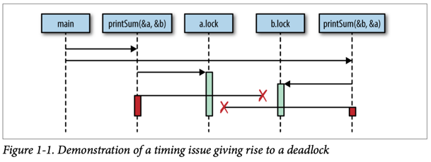

# Глава 1. Введение в конкурентность

---

Конкурентность — интересное понятие, потому что в нашей сфере оно означает разное для разных людей. Помимо слова «конкурентность», вы могли слышать термины «асинхронность», «параллелизм» или «многопоточность». Некоторые считают их синонимами, другие же строго разграничивают их значения. Поскольку мы посвятим конкурентности целую книгу, полезно сначала разобраться, что именно мы подразумеваем под этим термином.

В главе 2 мы подробнее рассмотрим философию конкурентности, но пока примем практическое определение, которое станет основой для нашего понимания.

Когда большинство людей говорят о «конкурентности», они обычно имеют в виду процесс, выполняемый одновременно с одним или несколькими другими процессами. При этом подразумевается, что все эти процессы продвигаются примерно в одно и то же время. Простой аналогией могут быть люди: прямо сейчас вы читаете это предложение, а другие в мире одновременно живут своей жизнью. Они существуют конкурентно по отношению к вам.

Конкурентность — обширная тема в компьютерных науках, и из этого определения вытекает множество аспектов: теория, моделирование конкурентности, корректность логики, практические проблемы и даже теоретическая физика! В книге мы затронем некоторые смежные темы, но сосредоточимся в основном на практических вопросах, связанных с конкурентностью в контексте Go. А именно: как Go моделирует конкурентность, какие проблемы возникают из этой модели и как можно комбинировать её примитивы для решения задач.

В этой главе мы в общих чертах рассмотрим, почему конкурентность стала столь важной темой в компьютерных науках, почему она сложна и требует тщательного изучения, а главное — как, несмотря на эти трудности, Go позволяет делать программы понятнее и быстрее благодаря своим примитивам конкурентности.

Как и в любом исследовании, начнём с истории. Давайте сначала разберёмся, почему конкурентность приобрела такое важное значение.

## Закон Мура, веб-масштабируемость и проблемы, в которых мы оказались

В 1965 году Гордон Мур опубликовал трёхстраничную статью, в которой предсказал консолидацию рынка электроники вокруг интегральных схем и удвоение количества компонентов в схемах каждый год на протяжении как минимум десятилетия. В 1975 году он скорректировал своё предсказание, утверждая, что количество компонентов на интегральной схеме будет удваиваться каждые два года. Это предсказание оставалось верным вплоть до недавнего времени — примерно до 2012 года.

Несколько компаний предвидели замедление темпов роста, предусмотренного законом Мура, и начали исследовать альтернативные способы повышения вычислительной мощности. Как говорится, необходимость — мать изобретений, и именно таким образом были созданы многоядерные процессоры.

Это выглядело как умное решение проблемы ограничения закона Мура, однако вскоре компьютерные учёные столкнулись с ограничениями другого закона: закона Амдала, названного в честь архитектора компьютеров Джина Амдала.

Закон Амдала описывает потенциальный прирост производительности при параллельном решении задачи. Проще говоря, он утверждает, что этот прирост ограничен скоростью работы программы, которую нельзя распараллелить

### Пример 1: Программа с графическим интерфейсом

Представьте приложение с GUI: пользователь видит интерфейс, нажимает кнопки, и что-то происходит. Здесь критическая часть конвейера — взаимодействие с человеком — строго последовательна. Сколько бы ядер вы ни добавили, программа всё равно будет ограничена скоростью реакции пользователя.

### Пример 2: Вычисление цифр числа π

Благодаря spigot-алгоритмам, эта задача относится к «заведомо параллельным» (англ. embarrassingly parallel). Это технический термин (да, звучит странно), означающий, что задачу легко разбить на независимые подзадачи. Здесь добавление ядер значительно ускорит вычисления, а сложность сместится к агрегации результатов.

Закон Амдала помогает понять разницу между такими задачами и решить, стоит ли распараллеливание усилий.

Для заведомо параллельных задач рекомендуется горизонтальное масштабирование: запуск копий программы на дополнительных CPU или машинах для сокращения времени выполнения. Такие задачи идеально подходят для этого подхода, так как их легко разбить на части для распределённой обработки.

В начале 2000-х горизонтальное масштабирование упростилось благодаря облачным вычислениям. Хотя термин появился ещё в 1970-х, именно тогда он стал мейнстримом. Облака предложили новый масштаб: вместо ручного управления серверами разработчики получили доступ к пулам ресурсов, которые динамически выделялись под задачи. Машины стали «эфемерными», настраиваемыми под конкретные нагрузки и задачи, и часто размещались в дата-центрах сторонних компаний.

Это породило новую парадигму мышления: теперь у разработчиков был дешёвый доступ к огромным вычислительным мощностям. Решения могли охватывать сотни машин и географических регионов, делая технологии, ранее доступные только гигантам вроде Google, достоянием всех.

Однако облака принесли и проблемы:

- Оркестрация ресурсов
- Обмен данными между инстансами
- Агрегация и хранение результатов.

Но сложнее всего оказалось правильно смоделировать конкурентный код. Распределённость системы усугубила типичные проблемы параллелизма. Успешное решение этих задач породило новый стандарт — web scale.
Web-scale-программы — это, среди прочего, заведомо параллельные системы, способные обрабатывать сотни тысяч запросов в секунду за счёт добавления инстансов. Это обеспечило:

- Бесшовные обновления,
- Гибкую масштабируемость,
- Геораспределённость.

Но также добавило сложностей в понимании кода и отказоустойчивости.

И вот мы оказываемся в этом мире — мире многоядерных процессоров, облачных вычислений, веб-масштабируемости и задач, которые могут быть как распараллелены, так и нет. Современный разработчик зачастую чувствует себя несколько подавленным. Эстафетная палочка передана нам, и теперь именно мы должны решать задачи в рамках тех аппаратных ограничений, которые имеем.

В 2005 году Херб Саттер написал знаковую статью для Dr. Dobb's под названием «Бесплатный обед закончен: фундаментальный поворот к конкурентности в программном обеспечении». Название оказалось пророческим. В конце статьи Саттер делает важное заявление:

«Нам отчаянно необходима более высокоуровневая модель конкурентности, чем та, что предлагают современные языки программирования»
Чтобы понять, почему Саттер использует такие сильные выражения, нужно разобраться, почему конкурентность так сложно реализовать правильно.

## Почему конкурентность это сложно?

Работа с конкурентным кодом печально известна своей сложностью. Обычно требуется несколько итераций, чтобы заставить его работать как задумано. Но даже тогда нередки случаи, когда ошибки остаются незамеченными годами, пока изменение условий (возросшая нагрузка на диск, больше пользователей в системе и т.д.) не вызовет проявление ранее скрытого бага. Кстати, для примеров кода в этой книге я привлек максимальное количество рецензентов, чтобы минимизировать такие проблемы.

К счастью, все разработчики сталкиваются с одинаковыми проблемами при работе с конкурентным кодом. Благодаря этому знатоки computer science смогли классифицировать типичные проблемы, что позволяет нам обсуждать причины их возникновения и способы решения.

Давайте рассмотрим основные проблемы, которые делают работу с конкурентным кодом одновременно сложной и интересной:

## Состояние гонки (Race Conditions)

Состояние гонки возникает, когда две или более операций должны выполняться в строго определённом порядке, но программа не гарантирует соблюдение этого порядка выполнения.

Чаще всего это проявляется в так называемой "гонке данных" (data race), когда одна конкурентная операция пытается прочитать переменную, в то время как в какой-то неопределённый момент времени другая конкурентная операция пытается записать значение в эту же переменную.

Приведём простой пример:
```go
var data int
go func() {
    data++
}()
if data == 0 {
    fmt.Printf("the value is %v.\n", data)
}
```

В Go для параллельного выполнения функций используется ключевое слово go, которое создает так называемую горутину (подробнее в разделе "Горутины").

Рассмотрим пример, где строки 3 и 5 пытаются получить доступ к переменной data без гарантии порядка выполнения. Возможные сценарии выполнения:

- Ничего не выводится - строка 3 выполнилась до строки 5
- Выводится "the value is 0" - строки 5-6 выполнились до строки 3
- Выводится "the value is 1" - строка 5 выполнилась до 3, но 3 выполнилась до 6

## Почему возникают гонки данных? (race conditions)

Как вы можете видеть, всего несколько строк неправильного кода могут внести огромную нестабильность
в вашу программу.

В большинстве случаев гонки данных возникают, потому что разработчики думают о
коде последовательно. Они предполагают, что поскольку строка кода находится перед другой,
она будет запущена первой. Они предполагают, что вышеприведенная горутина будет запланирована и выполнена
до того, как переменная data будет прочитана в операторе if.

При написании параллельного кода вам нужно тщательно перебирать возможные
сценарии. Если вы не используете некоторые из методов, которые мы рассмотрим далее в книге,
у вас нет гарантий, что ваш код будет запущен в том порядке, в котором он указан в исходном
коде.

Иногда я нахожу полезным представить, что между вызываемыми операциями проходит большой период.
Представьте, что между вызовом горутины и ее выполнением пройдет час. Как тогда поведет себя оставшаяся часть кода?
А что, если бы между успешным выполнением горутины и достижением программой оператора if
прошел час?
Мне помогает такой подход, потому что для компьютера масштаб может быть
другим, но смысл от этого не теряется.
Но такая мысль приводит разработчика в ловушку разбрасывания sleep по всему коду. Как им кажется, это решает проблемы с параллелизмом. Давайте попробуем это в предыдущей программе:

```go
var data int
go func() { data++ }()
time.Sleep(1*time.Second) // This is bad!
if data == 0 {
    fmt.Printf("the value is %v.\n" data)
}
```

Решили ли мы нашу гонку данных? Нет. На самом деле, все три результата все еще могут возникнуть из этой программы, просто это становится все менее вероятным. Чем дольше мы спим между вызовом нашей горутины и проверкой значения данных, тем ближе наша программа становится к достижению корректности, но эта вероятность асимптотически приближается к логической корректности; она никогда не будет логически корректной.
В дополнение к этому, мы теперь внесли неэффективность в наш алгоритм. Теперь нам нужно спать одну секунду, чтобы повысить вероятность того, что мы не увидим нашу гонку данных. Если бы мы использовали правильные инструменты, нам, возможно, вообще не пришлось бы ждать, или ожидание могло бы составлять всего
микросекунду.
Вывод здесь в том, что вы всегда должны стремиться к логической корректности. 

Внедрение time.Sleep() в ваш код может быть удобным способом отладки параллельных программ, но это не решение.

Состояние гонки — один из самых коварных типов ошибок параллелизма, потому что они
могут не проявляться до тех пор, пока код не будет запущен в производство. Они
обычно вызваны изменением среды, в которой выполняется код, или
беспрецедентным событием. В этих случаях код, кажется, ведет себя правильно,
но на самом деле существует просто очень высокая вероятность того, что операции будут выполнены в
порядке. Рано или поздно программа будет иметь непредвиденные последствия.

## Атомарность

Когда что-то считается атомарным или имеет свойство атомарности, это
означает, что в контексте, в котором оно работает, оно неделимо или непрерываемо.

Так что же это на самом деле означает, и почему это важно знать при работе с
параллельным кодом?

Первое, что очень важно, — это слово «контекст». Что-то может быть атомарным
в одном контексте, но не в другом. Операции, которые являются атомарными в контексте вашего
процесса, могут не быть атомарными в контексте операционной системы; операции, которые являются
атомарными в контексте операционной системы, могут не быть атомарными в контексте вашей
машины; и операции, которые являются атомарными в контексте вашей
машины, могут не быть атомарными в контексте вашего приложения. Другими словами,
атомарность операции может меняться в зависимости от текущей определенной области действия.
Этот факт может работать как за, так и против вас!

Когда вы думаете об атомарности, очень часто первое, что вам нужно сделать, это определить
контекст или область действия, в которой операция будет считаться атомарной. Все
следует из этого.

---
### Интересный факт

В 2006 году игровая компания Blizzard успешно подала в суд на MDY Industries на
6 000 000 долларов США за создание программы под названием «Glider», которая автоматически
играла в их игру World of Warcraft без вмешательства пользователя. Такие типы программ обычно называют «ботами» (сокращение от robots).
В то время в World of Warcraft была античит-программа под названием «Warden», которая
запускалась в любое время, когда вы играли в игру. Помимо прочего, Warden сканировал
память хост-машины и запускал эвристику для поиска программ,
которые, по-видимому, использовались для мошенничества.
Glider успешно избежал этой проверки, воспользовавшись концепцией атомарного
контекста. Warden считал сканирование памяти на машине атомарной операцией, но Glider использовал аппаратные прерывания, чтобы скрыть себя до начала этого сканирования! Сканирование памяти Уорденом было атомарным в контексте процесса, но не в контексте операционной системы.

---

Теперь давайте рассмотрим термины «неделимый» и «непрерываемый». Эти термины означают, что
в контексте, который вы определили, что-то, что является атомарным, произойдет полностью,
без того, чтобы что-либо происходило в этом контексте одновременно. Это все еще труднопроизносимо, поэтому
давайте рассмотрим пример:
```go
i++
```

Это такой простой пример, какой только можно придумать, и тем не менее он легко демонстрирует концепцию атомарности. Он может выглядеть атомарным, но краткий анализ показывает несколько операций:
- Извлечь значение i.
- Увеличить значение i.
- Сохранение значения i.

Хотя каждая из этих операций по отдельности является атомарной, комбинация этих трех может
не быть таковой, в зависимости от вашего контекста. Это раскрывает интересное свойство атомарных операций: их объединение не обязательно приводит к более крупной атомарной операции. Сделать операцию атомарной зависит от того, в каком контексте вы хотите, чтобы она была атомарной. Если ваш контекст — это программа без параллельных процессов, то этот код является
атомарным в этом контексте. Если ваш контекст — это goroutine, которая не раскрывает i
другим goroutine, то этот код является атомарным.

Так почему же нас это волнует? Атомарность важна, потому что если что-то является атомарным, то неявно
оно безопасно в параллельных контекстах. Это позволяет нам составлять логически правильные программы и, как мы увидим позже, может даже служить способом оптимизации параллельных программ.

Большинство операторов не являются атомарными, не говоря уже о функциях, методах и программах.
Если атомарность является ключом к составлению логически правильных программ, а большинство операторов не являются
атомарными, как нам согласовать эти два оператора? Мы углубимся в это позже, но
говоря короче, мы можем форсировать атомарность, используя различные методы. 
Суть данного искусства - определить, какие области вашего кода должны быть атомарными и на каком уровне
детализации. Некоторые из этих проблем мы обсудим в следующем разделе.

## Синхронизация доступа к памяти.

Допустим, у нас есть гонка данных: два параллельных процесса пытаются получить доступ к
одной и той же области памяти, и способ, которым они получают доступ к памяти, не является атомарным. Наш
предыдущий пример простой гонки данных будет работать хорошо с несколькими модификациями:

```go
var data int
go func() { data++}()
if data == 0 {
fmt.Println("the value is 0.")
} else {
fmt.Printf("the value is %v.\n", data)
}
```

Мы добавили здесь предложение else, чтобы независимо от значения данных мы всегда
получали какой-то вывод. Помните, что, как написано, есть гонка данных, и вывод программы будет полностью недетерминированным.

На самом деле, есть название для раздела вашей программы, которому нужен исключительный доступ к
общему ресурсу. Это называется критической секцией(критическим разделом). В этом примере у нас есть три критических секции:

- Наша goroutine, которая увеличивает переменные data.
- Наш оператор if, который проверяет, равно ли значение data нулю.
- Наш оператор fmt.Printf, который извлекает значение data для вывода.

Существуют различные способы защиты критических секций вашей программы, и у Go есть несколько
лучших идей, как с этим справиться, но один из способов решения этой проблемы — синхронизировать доступ к памяти между вашими критическими разделами. Давайте посмотрим, как это
выглядит. 

Следующий код не является идиоматическим Go (и я не предлагаю вам пытаться решать ваши
проблемы гонки данных таким образом), но он очень просто демонстрирует синхронизацию доступа к памяти. Если какие-либо типы, функции или методы в этом примере вам незнакомы, это нормально. Сосредоточьтесь на концепции синхронизации доступа к памяти, следуя выноскам.

```go
var memoryAccess sync.Mutex // 1
var value int
go func() {
    memoryAccess.Lock() // 2
    value++
    memoryAccess.Unlock() // 3
}()
memoryAccess.Lock() // 4
if value == 0 {
    fmt.Printf("the value is %v.\n", value)
} else {
    fmt.Printf("the value is %v.\n", value)
}
memoryAccess.Unlock() // 5
```
1) Здесь мы добавляем переменную, которая позволит нашему коду синхронизировать доступ к памяти переменной data. Мы подробно рассмотрим тип sync.Mutex в разделе «Пакет sync».
2) Здесь мы объявляем, что пока мы не объявим иное, наша goroutine должна иметь
исключительный доступ к этой памяти.
3) Здесь мы объявляем, что goroutine закончила работу с этой памятью.
4) Здесь мы снова объявляем, что следующие условные операторы должны иметь
исключительный доступ к памяти переменной data.
5) Здесь мы объявляем, что мы снова закончили работу с этой памятью.

В этом примере мы создали соглашение, которому должны следовать разработчики. В любое время, когда разработчики хотят получить доступ к памяти переменной данных, они должны сначала вызвать Lock, а когда закончат, они должны вызвать Unlock. Код между этими двумя операторами может
предположить, что у него есть исключительный доступ к данным; мы успешно синхронизировали доступ к
памяти. Также обратите внимание, что если разработчики не следуют этому соглашению, у нас нет гарантии исключительного доступа! Мы вернемся к этой идее в разделе «Ограничение».

Вы могли заметить, что хотя мы решили нашу гонку данных, мы на самом деле не решили наше состояние гонки! Порядок операций в этой программе по-прежнему недетерминирован; мы просто немного сузили область недетерминизма. В этом примере либо горутина выполнится первой, либо оба наших блока if и else. Мы по-прежнему
не знаем, что произойдет первым при любом заданном выполнении этой программы. Позже мы рассмотрим инструменты для правильного решения подобных проблем.

На первый взгляд это кажется довольно простым: если вы обнаружили, что у вас есть критические разделы, добавьте точки
для синхронизации доступа к памяти! Легко, не так ли? Ну... в некотором роде.

Это правда, что вы можете решить некоторые проблемы, синхронизировав доступ к памяти,
но, как мы только что увидели, это не решает гонки данных или логическую корректность. Кроме того, это также может создавать проблемы с обслуживанием и производительностью.

Обратите внимание, что ранее мы упоминали, что создали соглашение для объявления нам
необходимо исключительное право доступа к некоторой памяти. Соглашения хороши, но их также легко
игнорировать, особенно в разработке программного обеспечения, где требования бизнеса иногда перевешивают благоразумие. Синхронизируя доступ к памяти таким образом,
вы рассчитываете, что все другие разработчики будут следовать этому соглашению сейчас и в будущем. Это довольно сложная задача. К счастью, далее в этой книге мы также рассмотрим
некоторые способы, которыми мы можем помочь нашим коллегам добиться большего успеха.

Таким образом синхронизация доступа к памяти также имеет последствия для производительности. Мы сохраним ньюансы для дальнейшего изучения пакета синхронизации в разделе «Пакет синхронизации», но вызовы Lock, которые вы видите, могут замедлить нашу программу. Каждый раз, когда мы выполняем одну из этих операций, наша программа останавливается на некоторое время. Это поднимает два вопроса:
- Мои критические разделы входят и выходят из них повторно?
- Какого размера должны быть мои критические разделы?

Ответить на эти два вопроса в контексте вашей программы — это искусство, и это добавляет сложности в синхронизацию доступа к памяти.
Синхронизация доступа к памяти также имеет некоторые общие проблемы с другими методами моделирования параллельных задач, и мы обсудим их в следующем разделе.

## Deadlocks, Livelocks, and Starvation. Взаимоблокировки, блокировки в режиме реального времени и голодание

В предыдущих разделах обсуждалось корректное выполнение программы, поскольку, если
возникающие проблемы решаются правильно, ваша программа никогда не даст неверного ответа.

К сожалению, даже если вы успешно справитесь с этими классами проблем, есть еще один
класс проблем, с которыми нужно бороться: взаимоблокировки, блокировки в режиме реального времени и голодание. 
Все эти проблемы влияют на гарантию того, что ваша программа всегда выполняет что-то полезное. Если с ними не справиться должным образом, ваша программа может войти в состояние, в котором она вообще перестанет функционировать.

### Deadlock(Взаимоблокировка)

Взаимоблокированная программа — это программа, в которой все параллельные процессы ждут друг друга. В этом состоянии программа никогда не восстановится без внешнего вмешательства.

Если это звучит страшно, то так оно и есть! Go runtime пытается выполнить свою часть работы и
обнаружит некоторые взаимоблокировки (все горутины должны быть заблокированы или «спящими»), но это не
сильно поможет вам предотвратить взаимоблокировки.

Чтобы помочь закрепить, что такое взаимоблокировка, давайте сначала рассмотрим пример. Опять же, пока игнорируйте
любые типы, функции, методы или пакеты, которые вы не знаете, и просто следуйте
выноскам кода

```go
type value struct {
    mu sync.Mutex
    value int
}

var wg sync.WaitGroup
printSum := func(v1, v2 *value) {
    defer wg.Done()
    v1.mu.Lock() // 1
    defer v1.mu.Unlock() // 2
	
    time.Sleep(2*time.Second) //3
    v2.mu.Lock()
    defer v2.mu.Unlock()
	
    fmt.Printf("sum=%v\n", v1.value + v2.value)
}

var a, b value
wg.Add(2)
go printSum(&a, &b)
go printSum(&b, &a)
wg.Wait()
```

1) Здесь мы пытаемся войти в критическую секцию для входящего значения.
2) Здесь мы используем оператор defer для выхода из критической секции до возврата printSum.
3) Здесь мы спим в течение определенного периода времени, чтобы имитировать работу (и вызвать взаимоблокировку).

4) Если бы вы попытались запустить этот код, вы, вероятно, увидели бы:
фатальная ошибка: все горутины спят — взаимоблокировка!
Почему? Если вы посмотрите внимательно, вы увидите проблему синхронизации в этом коде. Ниже приведено графическое представление того, что происходит. Прямоугольники представляют функции, горизонтальные
линии — вызовы этих функций, а вертикальные
полосы — время жизни функции в начале
графика (рисунок 1-1).



По сути, мы создали две шестеренки, которые не могут вращаться вместе: наш первый вызов print
Sum блокирует a, а затем пытается заблокировать b, но в то же время наш второй вызов print
Sum заблокировал b и попытался заблокировать a. Обе горутины бесконечно ждут друг
друга.

---
### Irony

Чтобы упростить этот пример, я использую time.Sleep для запуска взаимоблокировки. Однако, это вводит состояние гонки! Можете ли вы его найти?
Логически «идеальная» взаимоблокировка потребует правильной синхронизации.(На самом деле у нас нет гарантии, в каком порядке будут запущены горутины или сколько времени им потребуется для запуска.
Возможно, хотя и маловероятно, что одна горутина может получить и снять обе блокировки до начала работы другой,
тем самым избежав deadlock-а!)

---

Кажется довольно очевидным, почему возникает эта взаимоблокировка, когда мы представляем ее графически,
но мы бы выиграли от более строгого определения. 

Оказывается, есть
несколько условий, которые должны присутствовать для возникновения взаимоблокировок, и в 1971 году Эдгар Коффман перечислил эти условия в своей статье. Эти условия теперь известны как
Условия Коффмана и являются основой для методов, которые помогают обнаруживать, предотвращать и
исправлять взаимоблокировки.

Условия Коффмана следующие:
- Взаимное исключение. Параллельный процесс имеет исключительные права на ресурс в любой момент времени.
- Условие ожидания. Параллельный процесс должен одновременно удерживать ресурс и ожидать
дополнительный ресурс.
- Нет вытеснения. Ресурс, удерживаемый параллельным процессом, может быть освобожден только этим процессом,
поэтому он удовлетворяет этому условию.
- Круговое ожидание. Конкурентный процесс (P1) должен ожидать цепочку других конкурентных процессов (P2), которые в свою очередь ждут его (P1), поэтому он удовлетворяет этому последнему условию

Давайте рассмотрим нашу придуманную программу и определим, соответствует ли она всем четырем условиям:
1. Функция printSum требует исключительных прав как на a, так и на b, поэтому она
   выполняет это условие.
2. Поскольку printSum удерживает либо a, либо b и ожидает второго, она
   выполняет это условие.
3. Мы не дали возможности нашим горутинам быть вытесненными.
4. Наш первый вызов printSum ожидает нашего второго вызова, и наоборот.

Да, у нас определенно есть взаимоблокировка.

Эти законы также позволяют нам предотвращать взаимоблокировки. Если мы гарантируем, что хотя бы одно из этих
условий не выполняется, мы можем предотвратить возникновение взаимоблокировок. К сожалению, на практике эти условия может быть трудно рассуждать, и, следовательно, их трудно предотвратить. Интернет усеян вопросами от разработчиков, таких как вы и я, которые задаются вопросом,
почему фрагмент кода взаимоблокируется. Обычно это довольно очевидно, когда кто-то указывает на это, но часто это требует еще одной пары глаз. Мы поговорим о том, почему это так, в разделе «Определение безопасности параллелизма».

## Livelock
Livelock — это программы, которые активно выполняют параллельные операции, но эти
операции ничего не делают для продвижения состояния программы вперед.

Вы когда-нибудь были в коридоре, идя к другому человеку? Она отходит в одну
сторону, чтобы пропустить вас, но вы только что сделали то же самое. Поэтому вы отходите в другую сторону, но
она тоже сделала то же самое. Представьте, что это продолжается вечно, и вы поймете livelock.

Давайте напишем код, который поможет продемонстрировать этот сценарий. Сначала мы настроим
несколько вспомогательных функций, которые упростят пример. Чтобы получить работающий
пример, в коде здесь используется несколько тем, которые мы еще не рассмотрели. Я не советую
пытаться понять его подробно, пока вы не освоите пакет синхронизации. Вместо этого я рекомендую следовать выноскам кода, чтобы понять основные моменты, а затем обратить внимание на второй блок кода, который содержит
суть примера.

```go
cadence := sync.NewCond(&sync.Mutex{})
go func() {
   for range time.Tick(1*time.Millisecond) {
    cadence.Broadcast()
   }
}()

takeStep := func() {
   cadence.L.Lock()
   cadence.Wait()
   cadence.L.Unlock()
}

tryDir := func(dirName string, dir *int32, out *bytes.Buffer) bool { // 1
   fmt.Fprintf(out, " %v", dirName)
   atomic.AddInt32(dir, 1) // 2
   takeStep() // 3
   if atomic.LoadInt32(dir) == 1 {
      fmt.Fprint(out, ". Success!")
      return true
   }
   takeStep()
   atomic.AddInt32(dir, -1) // 4
   return false
}

var left, right int32
tryLeft := func(out *bytes.Buffer) bool { return tryDir("left", &left, out) }
tryRight := func(out *bytes.Buffer) bool { return tryDir("right", &right, out) }
```

1) tryDir позволяет человеку попытаться двигаться в направлении и возвращает, были ли они успешными. Каждое направление представлено как количество людей, пытающихся двигаться в этом направлении, dir.
2) Сначала мы объявляем о своем намерении двигаться в направлении, увеличивая это направление на единицу. Мы подробно обсудим атомарный пакет в Главе 3. На данный момент все, что вам нужно знать, это то, что операции этого пакета являются атомарными.
3) Чтобы пример продемонстрировал оперативную блокировку, каждый человек должен двигаться с одинаковой скоростью, или каденсом. takeStep имитирует постоянный каденс между всеми участниками.
4) Здесь человек понимает, что он не может двигаться в этом направлении, и сдается. Мы указываем на это, уменьшая это направление на единицу.

```go
walk := func(walking *sync.WaitGroup, name string) {
   var out bytes.Buffer
   defer func() { fmt.Println(out.String()) }()
   defer walking.Done()
   
   fmt.Fprintf(&out, "%v is trying to scoot:", name)
   
   for i := 0; i < 5; i++ { // 1
      if tryLeft(&out) || tryRight(&out) { // 2
       return
      }
   }
   
   fmt.Fprintf(&out, "\n%v tosses her hands up in exasperation!", name)
}

var peopleInHallway sync.WaitGroup //3
peopleInHallway.Add(2)

go walk(&peopleInHallway, "Alice")
go walk(&peopleInHallway, "Barbara")

peopleInHallway.Wait()
```

1) Я установил искусственный предел на количество попыток, чтобы эта программа
завершилась. В программе, которая имеет оперативную блокировку, такого предела может не быть, поэтому
это проблема!
2) Сначала человек попытается сделать шаг влево, а если это не удается, он попытается сделать шаг
вправо.
3) Эта переменная предоставляет программе возможность ждать, пока оба человека
либо не смогут обойти друг друга, либо сдадутся.

Программа выведет:  
Alice is trying to scoot: left right left right left right left right left right   
Alice tosses her hands up in exasperation!  
Barbara is trying to scoot: left right left right left right left right
left right  
Barbara tosses her hands up in exasperation!

Вы можете видеть, что Алиса и Барбара продолжают мешать друг другу, прежде чем окончательно
сдаться.
Этот пример демонстрирует очень распространенную причину написания лайвлоков: два или более
одновременных процесса пытаются предотвратить тупик без координации. Если
люди в коридоре договорились друг с другом, что только один человек будет двигаться,
не было бы лайвлока: один человек стоял бы на месте, другой
двигался бы в другую сторону, и они продолжали бы идти.

По моему мнению, livelock сложнее обнаружить, чем deadlock, просто потому,
что может показаться, что программа выполняет работу. 

Если бы лайвлокированная программа работала на
вашей машине, и вы посмотрели на загрузку ЦП, чтобы определить, делает ли она что-нибудь, вы могли бы подумать, что это так. В зависимости от лайвлока она могла бы даже испускать другие сигналы, которые заставили бы вас думать, что она выполняет работу. И все же все это время ваша программа играла бы в вечную игру в коридорную перетасовку.
Livelocks — это подмножество более обширного набора проблем, называемых голоданием. Мы рассмотрим это далее.

## Starvation (Голодание)

Голодание — это любая ситуация, когда параллельный процесс не может получить все ресурсы, необходимые для выполнения работы.
Когда мы обсуждали блокировки, ресурс, которого не хватало каждой горутине, был
совместной блокировкой. Блокировки требуют отдельного обсуждения от голодания, потому что при блокировке все параллельные процессы одинаково голодают, и никакая работа не выполняется.
В более широком смысле, голодание обычно подразумевает, что есть один или несколько жадных параллельных процессов, которые несправедливо мешают одному или нескольким параллельным процессам
выполнять работу максимально эффективно или, может быть, вообще.
Вот пример программы с жадной горутиной и вежливой горутиной:

```go
var wg sync.WaitGroup
var sharedLock sync.Mutex
const runtime = 1*time.Second

greedyWorker := func() {
   defer wg.Done()
   var count int
   for begin := time.Now(); time.Since(begin) <= runtime; {
      sharedLock.Lock()
      time.Sleep(3*time.Nanosecond)
      sharedLock.Unlock()
      count++
   }
   fmt.Printf("Greedy worker was able to execute %v work loops\n", count)
}

politeWorker := func() {
   defer wg.Done()
   var count int
   for begin := time.Now(); time.Since(begin) <= runtime; {
      sharedLock.Lock()
      time.Sleep(1*time.Nanosecond)
      sharedLock.Unlock()
	  
      sharedLock.Lock()
      time.Sleep(1*time.Nanosecond)
      sharedLock.Unlock()
	  
      sharedLock.Lock()
      time.Sleep(1*time.Nanosecond)
      sharedLock.Unlock()
	  
      count++
   }
   fmt.Printf("Polite worker was able to execute %v work loops.\n", count)
}

wg.Add(2)
go greedyWorker()
go politeWorker()
wg.Wait()
```

Результат выполнения данной программы:  
Polite worker was able to execute 289777 work loops.  
Greedy worker was able to execute 471287 work loops

Жадный работник жадно удерживает общую блокировку на протяжении всего своего рабочего цикла, тогда как вежливый работник пытается заблокировать только тогда, когда это необходимо. Оба работника
выполняют одинаковый объем имитируемой работы (спя в течение трех наносекунд), но, как вы
можете видеть, за одинаковое количество времени жадный работник выполнил почти вдвое больше работы!

Если мы предположим, что у обоих работников критический раздел одинакового размера, вместо того, чтобы сделать вывод, что алгоритм жадного работника более эффективен (или что вызовы Lock и Unlock медленные — это не так), мы вместо этого придем к выводу, что жадный работник без необходимости расширил свое удержание общей блокировки за пределы своего критического раздела и мешает (через голодание) goroutine вежливого работника выполнять работу
эффективно.

Обратите внимание на нашу технику здесь для определения голодания: метрику. Голод является
хорошим аргументом для записи и выборки метрик. Один из способов обнаружить и решить проблему голодания — это записывать время выполнения работы, а затем определять,
настолько ли высока ваша скорость работы, как вы ожидаете.

---
### Поиск баланса

Стоит отметить, что предыдущий пример кода также может служить примером
производительности последствий синхронизации доступа к памяти. Поскольку синхронизация доступа к памяти обходится дорого, может быть выгодно расширить нашу
блокировку за пределы наших критических разделов. С другой стороны, делая это — как мы видели — мы
рискуем лишить другие параллельные процессы возможности.
Если вы используете синхронизацию доступа к памяти, вам придется найти баланс между
предпочтением грубой синхронизации для производительности и мелкой синхронизации для справедливости. Когда придет время настраивать производительность вашего приложения,
для начала я настоятельно рекомендую вам ограничить синхронизацию доступа к памяти только
критическими разделами; если синхронизация станет проблемой производительности, вы всегда можете расширить область действия. Гораздо сложнее пойти другим путем.
---

Итак, голодание может привести к тому, что ваша программа будет вести себя неэффективно или неправильно. Предыдущий
пример демонстрирует неэффективность, но если у вас есть параллельный процесс, который настолько
жаден, что полностью мешает другому параллельному процессу выполнять
работу, у вас на руках более серьезная проблема.
Мы также должны рассмотреть случай, когда голодание происходит извне процесса Go. Имейте в виду, что голодание может также применяться к ЦП, памяти, дескрипторам файлов,
подключениям к базе данных: любой общий ресурс, является кандидатом на голодание.

## Определение безопасности параллелизма

Определение безопасности параллелизма
Наконец, мы подошли к самому сложному аспекту разработки параллельного кода, к тому,
что лежит в основе всех остальных проблем: люди.    За каждой строкой кода стоит как минимум один
человек.

Как мы обнаружили, параллельный код сложен по множеству причин. Если вы разработчик и пытаетесь решить все эти проблемы, внедряя новую функциональность или исправляя ошибки в своей программе, может быть действительно сложно определить,
что делать правильно.
Если вы начинаете с чистого листа и вам нужно создать разумный способ моделирования
проблемного пространства, и задействован параллелизм, может быть сложно найти правильный уровень
абстракции. Как вы раскрываете параллелизм вызывающим? Какие методы вы
используете для создания решения, которое легко использовать и изменять? Каков правильный уровень
параллелизма для этой проблемы? Хотя есть способы структурированного мышления об этих проблемах, это остается искусством.

Как разработчик, взаимодействующий с существующим кодом, не всегда очевидно, какой код использует параллелизм, и как безопасно использовать код. Возьмем эту сигнатуру функции:
```go
// CalculatePi вычисляет цифры числа Pi между начальной и конечной
// позицией.
func CalculatePi(begin, end int64, pi *Pi)
```
Вычисление числа Pi с большой точностью лучше всего выполнять параллельно, но
этот пример вызывает много вопросов:
- Как мне это сделать с помощью этой функции?
- Я отвечаю за создание нескольких одновременных вызовов этой функции?
- Похоже, что все экземпляры функции будут работать непосредственно с экземпляром Pi, адрес которого я передаю; отвечаю ли я за синхронизацию доступа
к этой памяти, или тип Pi справляется с этим за меня?

Одна функция поднимает все эти вопросы. Представьте себе программу любого среднего размера, и
вы можете начать понимать сложности, которые может создавать параллелизм.

Комментарии могут творить чудеса здесь. Что, если бы функция CalculatePi была бы написана так:

```go
// CalculatePi calculates digits of Pi between the begin and end
// place.
//
// Internally, CalculatePi will create FLOOR((end-begin)/2) concurrent
// processes which recursively call CalculatePi. Synchronization of
// writes to pi are handled internally by the Pi struct.
func CalculatePi(begin, end int64, pi *Pi)
```

Теперь мы понимаем, что можем вызывать функцию просто и не беспокоиться о параллелизме или синхронизации. Важно, что комментарий охватывает следующие аспекты:
- Кто отвечает за параллелизм?
- Как проблемное пространство отображается на примитивы параллелизма?
- Кто отвечает за синхронизацию?

При раскрытии функций, методов и переменных в проблемных пространствах, которые включают параллелизм, сделайте своим коллегам и себе в будущем одолжение: отвлекитесь в сторону многословных комментариев и постарайтесь охватить эти три аспекта.

Также учтите, что, возможно, неоднозначность в этой функции предполагает, что мы неправильно ее смоделировали. Может быть, вместо этого нам следует использовать функциональный подход и убедиться, что наша функция не имеет побочных эффектов:
```go
func CalculatePi(begin, end int64) []uint
```
Одна только сигнатура этой функции снимает любые вопросы синхронизации, но все еще оставляет вопрос о том, используется ли параллелизм. Мы можем изменить сигнатуру
снова, чтобы выдать еще один сигнал о том, что происходит:
```go
func CalculatePi(begin, end int64) <-chan uint
```

Здесь мы видим первое использование того, что называется каналом. По причинам, которые мы рассмотрим позже в разделе «Каналы» на странице 64, это предполагает, что CalculatePi будет иметь по крайней мере
одну горутину и что нам не следует беспокоиться о создании своей собственной.
Эти изменения затем имеют последствия для производительности, которые необходимо
учесть, и мы возвращаемся к проблеме баланса ясности и производительности.

Ясность важна, потому что мы хотим сделать так, чтобы люди, работающие с этим кодом в будущем, поступали правильно,
а производительность важна по очевидным причинам. Эти два понятия не являются взаимоисключающими, но их трудно смешивать.
Теперь рассмотрим эти трудности в общении и попытаемся масштабировать их до проектов размером с команду.

Ого, это проблема...

Хорошей новостью является то, что Go добился прогресса в упрощении решения подобных проблем. Сам язык способствует читаемости и простоте. То, как он поощряет написание вашего параллельного кода, поощряет корректность, компонуемость и масштабируемость. Фактически, то, как Go обрабатывает параллелизм, может помочь более четко выразить проблемные области! Давайте рассмотрим, почему это так.

